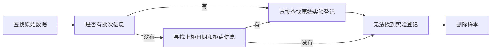
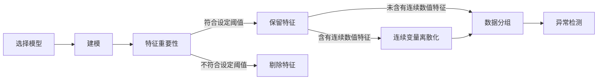
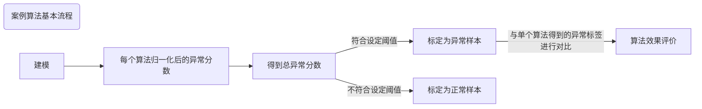
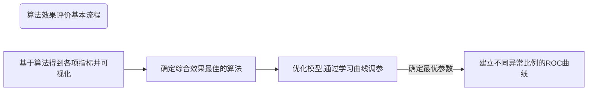

<center><font face='黑体' color='blue' size=5>数据挖掘和机器学习在锂离子电池工业领域的应用</font></center>

<p align='right'><font face='黑体' color='black' size=5>——吴睿滨</font></p>


[TOC]

# 导言

## i. 何为数据挖掘？

### i.i. 数据挖掘概述

- 数据挖掘是一个用数据发现问题、解决问题的专业领域。

- 通常通过对数据的探索、处理、分析或建模实现。

- 把信息转化为价值，要经历信息、数据、知识、价值四个层面，数据挖掘就是中间的重要环节，是从数据中发现知识的过程。   

  
  
  <center><a name='图i.1'>数据挖掘</a></center>
  
  

### i.ii. 数据挖掘过程

- 简单地可以分为：数据收集、数据预处理、数据探索分析、模型应用、评估、知识展示等。
- 具体地划分的话，每个过程又能分为多个分支，如数据预处理其实可以再细分为数据清洗、数据探索分析、数据变换等。如果再继续细分，数据探索分析其实还可以再细分为分布分析、异常值处理，缺失值处理，数据变换可以再细分为数据类型转换，数据量纲处理等。可以说数据挖掘作为一个学术领域，横跨多个学科，涵盖了统计学、数学、机器学习和计算机技术等，应用在比如金融、商业分析、工业等的各个行业领域。

## ii. 何为机器学习？

### ii.i. 机器学习概述

- 机器学习是一门多领域交叉学科，涉及概率论、统计学、线性代数、计算机数学等多门学科，专门研究计算机怎样模拟或实现人类的学习行为，以获取新的知识或技能，重新组织已有的知识结构使之不断改善自身的性能。机器学习是人工智能（Artificial Intelligence）的一个子集，同时它也是人工智能的核心，是使计算机具有智能的根本途径。（引用自：百度百科）

- 机器学习（machine learning, ML）根据不同的划分策略可以有不同的分类，比如以学习目的来划分，就可以简单分为：分类、回归、关联等。如果以学习方式来划分，可以分为：监督学习，半监督学习，无监督学习，强化学习。以应用层面来划分，机器学习可以应用在计算机视觉（Computer Vision, CV）、自然语言处理（Nature language processing, NLP）、数据挖掘（DataMining）等。当然如果以具体模型来划分，那就更为繁杂了。

  


<center><a name='图2'>机器学习应用领域</a></center>

### ii.ii. 机器学习过程

- 机器学习从高度抽象的角度看，其实可以分解为三大要素：模型（model)、策略（strategy）、算法（algorithm）。
- 从上面的要素出发，机器学习的过程实际上就是在实施这三个要素的过程：构建模型、确定策略、应用算法。但这种说法过于抽象，也损失不少细节。从应用层面上讲，其实机器学习是数据挖掘的一个工具或者某种意义上也可以理解为一个子集，它的实施过程也同数据挖掘一样：原材料获取（数据收集）—> 材料处理加工（数据清洗、数据预处理、特征工程）—> 材料性能分析（统计分析、建模分析）—> 结果评价—> 结果展示和应用。
- 

## iii. 数据挖掘，机器学习和人工智能

- 数据挖掘是从现有的信息中提取数据的模式和模型，即精选出最重要的信息，以用于未来机器学习和AI的数据使用。数据挖掘本质上是机器学习和人工智能的基础，前者为后两者提供数据支撑。机器学习是人工智能很重要的一部分，前者是后者的子集，同时机器学习也是人工智能的一种实现（以面向对象的角度理解，前者也是后者的对象实例）。理论上人工智能几乎包括了所有机器能做的内容，当然也包括机器学习全部内容和部分数据挖掘的内容。
- 数据挖掘也会使用大量机器学习的算法，但是其特定的环境和目的和机器学习不太一样。
- 这三者的区别主要是目的不同，其手段(算法，模型)有很大的重叠，所以容易混淆。


<center><a name='图3'>人工智能涵盖领域</a></center>

## iii. 电池背后的数据应用逻辑

### iii.i. 数据指标可量化


- 从1799年伏特发明电池至今，电池技术走过了200年的岁月，应用在电池设计、制造、测试等各个阶段的数据标准逐步完善，大部分性能和指标实现了量化。锂离子电池从被发明至今，也已经走过30多个年头，除了继承电池原有的数据标准（材料性能指标、电性能指标、安全性能指标、力学性能指标……）外，又有了自己独特的发展。以工艺参数为例，得益于制造和检测装备的升级进步，我们能对各个工艺指标进行量化设计和监控。而成熟的数据标准和可量化意味着体系更容易提取数学模式，也更容易被数学模型解释，这也让数据挖掘和机器学习这个方面可以有所作为。

### iii.ii. 内联性强，关系复杂


- 经验和各种物理、化学公式告诉我们，电池各个工艺构成，使用参数，环境参数等影响因素会对电池的最终性能指标会有着显著影响。比如，以电化学角度来理解：从电流—电势方程<sup>(1)</sup>(在离子扩散较快时，反应界面浓度与溶液本体浓度基本相等，方程演变为Bulter-Volmer方程）来看，凡是能影响界面面积A、反应速率k<sub>0</sub>、界面浓度C(0,t)、电极电势E、平衡电势E<sub>eq</sub>、体系温度T等的因素都会对电池最终电性能产生影响。
  $$
  \Large
  i=nAFk_0[\,C_{Ox}(0,t)e^{-\alpha nf \Delta (E-E_eq)}-C_{Rd}(0,t)e^{(1-\alpha)nf\Delta (E-E_eq)}\,\tag1]\\
  \begin{align}
  &n:反应电子数\\
  &A:电极/溶液界面面积\\
  &F：法拉第常数\\
  &k_0:标准反应速率\\
  &C_{Ox}:反应界面氧化态物质浓度\\
  &C_{Rd}:反应界面氧化态物质浓度\\
  &\alpha:传递系数，势垒对称系数\\
  &E:电极电势\\
  &E_{eq}:平衡电势\\
  &f=F/RT
  \end{align}
  $$
  
  可问题不仅止于此，往下深究你会发现，反应界面面积跟电池结构设计，电解液分布，正负极活性物质颗粒特性状态等相关；标准反应速率又与参与反应的正负极材料特性、电解液特性（由阿伦尼乌斯方程<sup>(2)</sup>知道，不同材料体系的活化能Ea不同，前因子A也不同）等因素紧密相连；
  
  
  $$
  \begin{align}
  &\Large k=Ae^{\frac{-E_a}{RT}\tag2}\\
  &k:反应速率\\
  &A:前因子\\
  &E_a:活化能\\
  &R:摩尔气体常数\\
  &T:绝对温度
  &\end{align}
  $$
  界面浓度被液相传质过程（主要是扩散过程），电解液特性，正负极颗粒特性这些过程因素控制；电极电势直接与材料体系，内阻分布，电池结构设计，荷电状态等因素相关......随着深入分析，你会发现，这完全是一个几近无限复杂的问题，影响最终结果的变量因素错综复杂，大部分的影响关系都无法用有限的数学方程确定，甚至很多都无法量化（比如材料特性就很难完全量化）。就像下面的动态关系图所展示的那样，各种因素相互影响：
  
  <iframe src='pyecharts/关系图.html' height='520'></iframe>
  
  在高维特征空间内的数据分析，传统工具显得比较吃力，比如要了解多维特征空间的数据分布情况以及作解释性分析，传统的SAS软件（比如最常见的EXCEL，minitab, origin等，还有学习成本较高，面向数据专家的SAS，SPSS等）要不是力不从心，要不然就是对统计学知识要求太高。而高维空间的数据问题恰恰是机器学习的强项，机器学习不仅可以依靠模型得出较为准确的输出，也能一定程度为结果提供高维空间下的解释性分析（深度学习除外）。

### 从数据到应用

- 过往的电池设计是以历史经验为基础（其实就是技术人员的个人经验），固定大部分的特定变量组合（即不作为变量分析），针对特定问题进行有限变量（大部分是1-2维变量）分析，进而得出在这变量空间内的局部较优解，然后不断地优化，迭代上述步骤。这也是最普遍，最常见的做法。举个例子说明，我们从物理直觉上，可以判断出电池的使用寿命(cycle life)肯定与材料组成、工艺参数直接相关，这种相关性却无法被简单定量化表示，而要通过不断的变量组合、实验试错，但考虑到成本，效率，时效等原因，我们单次只能选取一到两个变量做对比实验，比如正极材料，电解液这两个变量组合，那么其它变量就被固化下来，如负极，隔膜等，等到有新的实验需求，然后在以同样的手段，更新迭代实验，进而得到符合我们预期的变量组合。这种做法本身是没有问题的，只是会有两个问题产生：
    1. 实验数据没有被充分利用，假设目前有两组实验数据，a实验所采用的变量组合是$X^1$，$X^1$是n维特征空间里的一个向量，$ X^1=[x_1^1，x_2^1,x_3^1,...x^1_n] $,

       $X^2$是n维特征空间里的另一个向量，$ X^2=[x_1^2，x_2^2,x_3^2,...x^2_n] $。如果两个实验想要对比得出直观的结论，起码要将变量控制在越少越好。通常需要将n维空间压缩到低维空间，这个过程

    2. 实验结果只能收敛于特定空间的局部较优解，很难获得全局较优解。


- 比如举个例子，当前作锂离子电池设计时，要控制最终的电阻，其实很容易利用各个组成的数据指标来实现，比如电池的电阻就可以近似看成各个电池构成组件的电阻线性与各组件的接触电阻之和<sup>(2)</sup>，而各部件的电阻和接触电阻其实也可以由其内禀的电阻率和几何尺寸得出。换句话说，电池内阻的影响因素遍布整个变量空间，而非单一变量控制。当然这个例子是电池系统中相对简单的线性模型。
  $$
  \begin{align}
  &\large IR=\sum_{i}^n IR_i\,+\sum_j^kIR_{j}\tag{3}	\\
  &R_i：resistance \;of\; component\\
  &R_j:  contact\; resistancef \; of contacted\; components\; \\
  &n:the\;numbers \;of \;Components;\\
  &k:the\; numbers\;of\;contacted \;components
  \end{align}
  $$

  

  关系复杂，指的是，任一指标的最终

  像这种有着明确物理模式的数据应用还有很多，但其它内联强但暂时没有明确的物理解释的数据组合其实从数学挖掘角度来看也能提供一定的分析视角。比如，我们从物理直觉上，可以判断出电池的使用寿命(cycle life)肯定与材料组成、工艺参数直接相关，但这种相关性却无法被简单定量化表示，而是通过不断的变量组合、实验试错，
  
- 相对于制造技术的发展，锂电池的数据挖掘工作其实还有很大的空间可以拓展。

### 锂离子电池制造一致性要求

- 锂离子电池数据离散性指标往往意味着特征数据和标签数据

### 数据维度大，人力

### 电池研制测试周期长，时效性问题突出

### 电池构成体系复杂，变量组合巨大,

## 文中出现的名词解释

1. <mark>特征</mark>：自变量，比如电解液种类，测试温度这些工艺变量，它是数据挖掘和机器学习的输入部分（Input);
2. <mark>标签</mark>：因变量，比如我们要预测的电池寿命，某一阶段的电池容量等，它是数据挖掘和机器学习的输出部分（Output);
3. <mark>变量</mark>：自变量和因变量的总称，由具体语境判断是特征还是标签。
4. <mark>样本</mark>：数据集里拥有完整特征和标签的最小组成，即一个电芯的数据集合。
5. <mark>因素</mark>：方差分析的研究变量，可以理解成特征，例如，电池测试温度、充电电流等。
6. <mark>水平/处理条件</mark>：因素中的内容（不同离散取值）称为水平，例如，25℃、40℃等温度取值就是温度因素的水平，也称处理条件。
7. <mark>控制变量</mark>：方差分析里的自变量。
8. <mark>训练集</mark>：机器学习中，训练集数据用来估计模型，本文常用X_train表示训练集中的特征数据，Y_train表示训练集中的标签数据。训练集对于设计人员是已知的。
9. <mark>验证集</mark>:机器学习中，验证集数据用来确定网络结构或者控制模型复杂程度的参数。验证集对于设计人员是已知的。
10. <mark>测试集</mark>：机器学习中，测试集数据最终选择最优的模型的性能如何，本文常用X_test表示测试集中的特征数据，Y_test表示测试集中的标签数据。X_test对于设计人员是已知的，Y_test对于设计人员是未知的，**是要预测的部分**。

## 文中默认的单位量纲

1. <mark>电池容量</mark>：mAh
2. <mark>温度</mark>：℃ （注：公式里出现温度为热力学温度，即开尔文温度，默认单位：K）
3. <mark>电流</mark>：A 
4. <mark>电阻</mark>：Ω
5. <mark>电压</mark>：V 
6. <mark>隔膜相关厚度</mark>：μm 
7. <mark>隔膜相关长度、宽度</mark>: cm 
8. <mark>充电后搁置时间</mark>: min 
9. <mark>放电后搁置时间</mark>: s
10. <mark>循环寿命</mark>: 次

注：出于数据样本特征名称和标签名称一致性考虑，故本文中部分数值和图表不显示单位，默认单位参照上述标准。除非特殊说明，否则本文中出现的数值对应的单位量纲均以上述为准。

## 文中部分编辑处理

- 由于数据挖掘和机器学习在应用过程中会输出大量的图表，所以本文只选取关键图表进行编码，其余介绍型图片且未被引用的图表将不编码，只标识图表名称。图表编码规则为： ”图“ + 1级标题序号 + 图序号 + 具体图名称，例如 <a href="#图3.1">图3.1 电池不同组成材料在样本空间上的分布</a>，即是第3章内容第一张图表。同时由于便于编辑操作，并没有对图表进行单位标注，默认单位可以参考<a href='#文中默认的单位量纲'>文中默认的单位量纲</a>这一章节。

- 为了能更好将实现过程和结果数据展示出来，文中会出现数据处理过程中的源代码，并以灰色内嵌框呈现，如下例所示：

  ```python
  # 井号后为注释部分。
  print('我是例子。')
  # 结果
  我是例子。
  ```

- 出于对于不同浏览器的兼容性考虑，段落开头不会进行缩进处理，段落之间会空出一行来分隔。无序列表和有序列表则会按嵌套缩进。下面是列表样式举例：

  无序列表举例：

    ●   ……

  ​        ○ ……

  ​                ■  ……

  有序列表举例：

  1. ……

       α. ……

  

- 本文主要部分是由markdown标记语言和html标记语言混合编辑，公式和部分特殊格式采用LATEX语法编辑，但因为精力和技术所限，没有对不同终端进行适配，所以在有些输出终端可能会出现页面布局混乱的可能。建议在电脑显示终端阅读，浏览器推荐使用Chrome。


# 1.项目安排

## 1.1 项目目的


## 1.2 项目流程


# 2. 数据收集、清洗

# 3. 探索性数据分析/数据预处理（上）

## 3.1 概述

EDA(Exploratory Data Analysis)-探索性数据分析是指对已有的数据（ 特别是调查或观察得来的原始数据 ）在尽量少的先验假定下进行探索通过作图、制表、方程拟合、计算特征量等手段探索数据的结构和规律的一种数据分析方法，是从数据中检测，纠正或删除损坏，不准确或不适用于模型的记录的过程 。作用是让人能够了解变量之间的相互关系以及变量与预测值之间的关系，然后进行相应的数据处理，让数据适应模型，匹配模型的需求，使得数据集进行机器学习或深度学习时，获得较好的效果。EDA过程其实就是机器学习里的数据预处理（Data Preprocessing）过程，只是叫法不同罢了。EDA过程可能面对的问题有：数据类型不同，比如有的是文字，有的是数字，有的含时间序列，有的连续，有的间断。也可能，数据的质量不行，有噪声，有异常，有缺失，数据出错，量纲不一，有重复，数据是偏态，数据量太大或太小 。本质上讲，EDA过程就是处理这些问题的过程。

## 3.2 流程

如果说数据收集、清洗是数据科学工作中最费时的工作，那么EDA过程应该就是数据挖掘或者机器学习中最细致的工作，它的成败好坏直接决定了数据挖掘和机器学习的结果。就如常言，算法决定了结果的下限，数据质量才决定了模型的上限（鉴于行文篇幅合理安排的考虑，缺失值分析和异常检测将安排在下一章节<a href='探索性数据分析/数据预处理（下）'>探索性数据分析/数据预处理（下）</a>里面）。


<center><a name='图3'>EDA流程图</a></center>

## 3.3 查看数据信息


### 3.3.1 数据理解

#### 3.3.1.1 字段总数

利用pandas.columns，pandas.shape命令直接查看数据情况，结果如下：

```python
# 查看数据信息
data.columns
Index(['times', 'capacity', '循环次数表', 'all_capacity', '上柜日期', '设备号', '行号', '列号', '日期条件列', '批次条件列', '试产单号/批次号', '型号', '容量mAh', '工步', '电解液', '正极材料', '负极材料', '隔膜纸', '2ex百分比', '分容容量', '首次容量', '单次放电容量', '异常升高次数', '异常升高信息', '异常断点次数', '异常断点信息', '温度', '充电倍率', '循环寿命', 't500', 't1000', 't1500','t2000', 't2500', 't3000', 't3500', 't4000', 't4500', 't5000', 't5500','t6000', 't6500', 't7000', 't7500', 't8000', 't8500', 't9000', 't9500','t10000', 't10500', 't11000', 't11500', 't12000', 't12500', 't13000','t13500', 't14000', 't14500', 't15000'],dtype='object')
# 查看数据维度
data.shape
(2659, 59)
```

在这里，对上述字段名称进行一些解释，方便大家理解特征的涵义。'times'、 'capacity'、 '循环次数表'、'all_capacity' 这四个特征，分别是在数据收集阶段，从原始数据收集的关于电池大循环（全充放循环）在周期中的分布数组、关于电池大循环容量（全充放循环，即电池经历若干次循环后的实际容量）在容量中的分布数组、电池在500次循环间隔取得的最为接近的大循环序号数组、电池在500次循环间隔取得的最为接近的大循环对应容量数组。可能这么说有点不好理解，不过没关系，这对接下来的操作和解释没有影响，因为这四列严格上来讲不是特征列，只是在程序设计阶段，方便操作而设计，最终也不会用在建模中，大家可以不用太关注。'2ex百分比'是指电池以2倍工作放电容量的工步占工作循环的百分比。t500是指循环次数最为接近500次循环的大循环容量（其实就是经历过500次循环后电池的实际容量，只不过电池测试设计时，技术人员并没有特意在500，1000等这样的间隔点设置全充放工步，这里是取最为接近500间隔的数值，方便分析），同理 t1000、t1500等也是如此。’工步‘是指从数据文件中提取的工步信息，’充电倍率‘是指从工艺登记（循环登记表）文件中所提取的工步信息，两者理论上是一致的。’循环寿命‘是指电池达到设定寿命时所经历的循环次数，对于不同型号的电池，设定寿命标准不同（比如LFP10370C2-200mAh就是以165mAh容量为限，亦或者触发测试程序的电压下限)。从数据维度上看，总共2659行（即2659个样本），59列（28个特征列，即特征维度为28维；31个标签列，即标签维度为31维，但对于每个样本并没有一定有31个输出，比如有些电芯在8000次循环就到寿命或结束测试了，后面的循环数据就没有了）。

#### 3.3.1.2 初步特征选择

其实特征选择是属于后续<a href="#特征工程">特征工程</a>的一部分，主要作用是寻找对模型有较高影响的特征，摒弃对模型没有影响，甚至是降低模型精度的特征，从而降低数据维度，减少开销，提高模型表现。之所以在EDA阶段就进行特征选择，其实主要是出于结果可视化的考虑，因为如果有太多特征列，就会导致查看统计信息时比较不直观，同时也是便于缺失值分析和异常值分析的降维考虑。特征选择后的结果如下：

```python
Index(['电解液', '正极材料', '负极材料', '隔膜纸', '2ex百分比', '单次放电容量', '充电倍率', '温度','分容容量','首次容量', '循环寿命', 't500', 't1000', 't1500', 't2000', 't2500', 't3000','t3500', 't4000', 't4500', 't5000', 't5500', 't6000', 't6500', 't7000','t7500', 't8000', 't8500', 't9000', 't9500', 't10000', 't10500','t11000', 't11500', 't12000', 't12500', 't13000', 't13500', 't14000','t14500', 't15000'],dtype='object')
```

之所以做这样的选择，具体原因会在[<a href="#特征工程">特征工程</a>](#特征工程)的章节详细解释。这里简略说一下，留下的特征组合是分为两部分，一部分是电池的工艺特征部分['电解液', '正极材料', '负极材料', '隔膜纸']，另一部分是电池的测试工艺特征部分['2ex百分比', '单次放电容量', '充电倍率', '温度', '分容容量', '首次容量']。剩下的['循环寿命', 't500', 't1000'……]是属于标签部分，是我们模型要预测的输出（output)，不是特征(input)。**经过初步特征选择后的样本维度为（2659，41），样本维度有了一定的降低，这对于减少模型复杂度和计算开销有一定的帮助。同时，后续过程中，会根据实际需要，进行特征的变换、构造、选择等操作，这会导致数据维度的变化。**

#### 3.3.1.3 查看数据类型

不同的数据类型有着不同的处理方式，一般数据根据信息构成可以分为：

 - 定量数据：指的是一些数值，用于衡量某件东西的数量，根据数值的取值，大部分为连续变量数据。
 - 定性数据：指的是一些类别，用于描述某件东西的性质，定性数据是离散变量数据。

实际的数据类型会比较复杂，下面的分类有一定的借鉴意义：

| 数据类型                                                     | 数据名称                                                     | 数学含义                                                     | 描述                                                         | 举例                                                         | 可用操作                                                     |
| :----------------------------------------------------------- | ------------------------------------------------------------ | ------------------------------------------------------------ | ------------------------------------------------------------ | ------------------------------------------------------------ | ------------------------------------------------------------ |
| <div style="width: 50pt">离散定性                                                 </div> | <div style="width: 50pt">名义                                                  </div> | <div style="width: 50pt">=，$\neq$                                                      </div> | <div style="width: 200pt">名义变量就是不同的名字，用来告诉我们，这两个数据是否相同</div> | <div style="width: 50pt">邮编，性别，工号                                                 </div> | <div style="width: 75pt">众数，信息熵，相关性分析，卡方检验                                      </div> |
| 离散定性                                                     | 有序                                                         | <，>                                                         | 有序变量为数据的相对大小提供信息，告诉我们数据的顺序，但数据之间的大小间隔不具有固定意义，因此有序变量不能加减 | 学历，硬度                                                   | 中位数，分位数，非参分析，符号检验                           |
| 连续定量                                                     | 有距                                                         | +，-                                                         | 有距变量之间的间隔是有固定意义的，可以加减，比如同一单位量纲 | 摄氏度温度                                                   | 均值，标准差，皮尔逊相关分析，t检验，F检验                   |
| 连续定量                                                     | 比率                                                         | *，/                                                         | 比变量之间的间隔和比例本身都是有意义的，既可减又可乘除       | 电流，质量                                                   | 几何平均，调和平均，百分数，变化量                           |

用pandas.info()命令查看数据类型，结果如下：

```python
 #   Column    Non-Null Count  Dtype  
---  ------    --------------  -----  
 0   电解液       2656 non-null   object 
 1   正极材料      2656 non-null   object 
 2   负极材料      2656 non-null   object 
 3   隔膜纸       2656 non-null   object 
 4   2ex百分比    2659 non-null   float64
 5   单次放电容量    2659 non-null   int64  
 6   充电倍率      2656 non-null   object 
 7   温度        2659 non-null   object 
 8   分容容量      2659 non-null   float64
 9   首次容量      2659 non-null   float64
 10  循环寿命      1551 non-null   float64
 11  t500      2659 non-null   float64
 ……
```

可以看出'电解液'，'正极材料'，'负极材料'，'隔膜纸'，’充电倍率‘，’温度‘  这几个特征是文本类别，是定性的离散变量，其余的特征和标签都为定量的连续变量。

#### 3.3.2 获取各统计量

利用pandas.describe()查看各统计量，包括个数、平均值、标准差、四分位值、最大最小值等统计量信息，这些信息可以帮助我们更好地判断数据的分布情况、异常情况，进而为下一步的分析提供依据。这边截取一部分结果展示：

```python
data.describe().iloc[:,0:7]
```

|       |   2ex百分比 | 单次放电容量 |    分容容量 |    首次容量 |     循环寿命 |        t500 |       t1000 |
| ----: | ----------: | -----------: | ----------: | ----------: | -----------: | ----------: | ----------: |
| count | 2659.000000 |  2659.000000 | 2659.000000 | 2659.000000 |  1551.000000 | 2659.000000 | 2658.000000 |
|  mean |    1.076073 |    82.009026 |  217.226859 |  217.231056 |  7618.856867 |  214.039030 |  210.520614 |
|   std |    0.130721 |     1.126295 |   11.191466 |   10.905870 |  5004.821288 |   11.586694 |   12.638039 |
|   min |    1.004000 |    59.000000 |  168.792889 |  176.083000 |   694.000000 |  170.119528 |  171.000000 |
|   25% |    1.050000 |    82.000000 |  208.524014 |  209.628319 |  2427.000000 |  208.008500 |  205.389424 |
|   50% |    1.050000 |    82.000000 |  220.394639 |  220.300000 |  7291.000000 |  217.374194 |  214.512194 |
|   75% |    1.050000 |    82.000000 |  225.335917 |  224.915917 | 11596.000000 |  221.908083 |  218.939438 |
|   max |    2.000000 |    83.000000 |  240.674167 |  239.923806 | 20291.000000 |  237.746944 |  235.058444 |

#### BONUS: 统计信息输出

可以利用第三库实现统计信息的文本化，并输出为网页文件，方便查阅。如果有兴趣可以打开[data_report.html](reference/data_report.html)，查看详细统计信息。但由于数据信息量较大，生成的网页文件较大，对于有些终端（手机等便携设备）可能无法打开，或显示不完整（例如图例文字缺少对中文支持）。分析系统会自动将数据文件的各个离散变量做频数、极值、排序、缺失值等统计分析并绘制条形图，会对连续变量做极值、缺失值、零值、平均值等统计分析并绘制直方图。同时，分析系统会对各变量进行相关性分析（Pearson相关系数、Spearman相关系数、Kendall相关系数等）、绘制成热力图、变量分布等操作，效果参照下截图：


## 3.4 数据特征分析

### 3.4.1 分布分析

数据的分布情况可以直接反应它的集中趋势和散布情况，这是理解数据和其背后规律的绝佳切入点。分布类型可分为离散分布和常用连续分布两类。常见的分布种类有：正太分布(高斯分布)、均匀分布、伯努利分布、泊松分布等。一般生产与科学实验中很多随机变量的概率分布都可以近似地用正态分布来描述。

#### 3.4.1.1 离散变量分布情况

本项目中的离散变量主要是电池的工艺材料参数，即电解液种类、正负极种类等，由于实验样本天然的偏态分布（实验设计总倾向于优化纵深的方向），对离散变量进行分布分析，有助于我们理解样本构成，各特征的主体构成、各特征的独立分布和联合分布情况。


<center><a name='图3.1'>图3.1 电池不同组成材料在样本空间上的分布</a></center>	


由于静态图表太过于拥挤，影响显示效果。为此制作了下面动态视图，动态视图可以通过鼠标或者底部滑轨进行柱状图的偏移和缩放，同时也提供了图片下载，折线图转换等功能，特别是加入数据视图显示，方便阅读原始数据。可以点击图表右侧的工具栏进行选择。(建议使用Chrome浏览器)


<iframe src='pyecharts/不同材料柱状图1.html' width="200" height="2800"></iframe>


<iframe src='pyecharts/各离散特征组成1.html' width="150" height="1050"></iframe>


从上述柱状图和饼图可以看出，本次实验程序自动抓取的数据样本中，电解液主要是TC-E269-F4和SS-ZZWB011两种，正极材料主要以P2为主，负极材料主要是CP5和CP5-H，隔膜主要恩捷高孔（9+3)\*33/32.5和W-SCOPE高孔（9+3)\*32.5为主，2ex百分比主要是1.05，温度几乎都集中在25℃和40℃两个温度上。各特征的主体分布符合之前的电池实验设计上，这也部分说明了当前我司的实验设计也是朝着优化这几个关键特征取值的方向。不过，这样偏态的特征分布对于后续的机器学习会产生不小的麻烦，比如后续要涉及到的的[异常检测](#异常检测)（Outlier Detection)中，很多算法是基于特征的空间距离、密度、聚类，这就会导致频数较少的特征所构成的样本也容易被划为异常类，虽然这种异常类属于natural outlier(自然产生的离群点)，即合理但偏离样本群体的异常类（非人为因素导致的异常），会跟其它non-natural outlier(真正的人为异常点)交织在一起，让算法无法区分，降低算法精度，提高检测成本。

#### 3.4.1.2 连续变量分布情况

##### 3.4.1.2.1 单变量分析

###### 3.4.1.2.1.1 特征变量分析

在本项目的工艺参数特征中，其实完全由电芯自身性能决定而非人为设计的连续型变量特征只有 ‘分容容量’ 和 ‘首次容量’ 两个，其它如单次放电容量，充、放点搁置时间等均为人为设计的实验参数。所以对这两个变量的分析，可以为我们提供一些关于电池的性能解释。

<center>
<div >

</div>
</center>
<center>

从上方的频数直方图和核密度曲线（经过平滑处理）可以看出，这两个变量都近似出现双峰分布的情况，两个峰值中心大体出现在200 （对应的样本分布记为<mark>N~200~</mark>）和220（对应的样本分布记为<mark>N~220~</mark>）位置。处于N~200~分布的电池样本要比N~220~分布来得少，从目标预期上讲，大部分情况下，我们都希望样本的分容容量能大于200（标准容量200mAh，设计时会留有一定的余量）。这样的分布情况能较好地体现LFP10370C2-200这款电池在这两个特征上的集中和离散情况，也就是大部分实验组合在分容容量和首次容量这两个特征上的取值，在以200和220为均值中心，呈现近似双正态分布，符合中心极限定理的预期。这对于实验设计者来说，可以起到一定的帮助。这种分布其实也隐含地告诉我们，可以通过对特定分布的特征组合进行分析，进而找出关键影响特征。为了比较两个特征的差异情况，可以做偏度和峰度分析。

```python
print('分容容量的偏度是{:.4f}，峰度是{:.4f}'.format(data['分容容量'].skew(), data['分容容量'].kurt()))
print('首次容量的偏度是{:.4f}，峰度是{:.4f}'.format(data['首次容量'].skew(), data['首次容量'].kurt()))
分容容量的偏度是-0.7928，峰度是0.0854
首次容量的偏度是-0.7291，峰度是-0.2874
```

偏度是衡量随机变量概率分布的不对称性，是相对于平均值不对称程度的度量。有以下特性：

> 偏度的取值范围为(-∞,+∞)。
>
> 当偏度<0时，概率分布图左偏。
>
> 当偏度=0时，表示数据相对均匀的分布在平均值两侧，但不一定是绝对的对称分布。
>
> 当偏度>0时，概率分布图右偏。

从结果上看，两个特征的偏度很接近，说明两个特征变量的左偏程度比较接近。

峰度可以用来度量随机变量概率分布的陡峭程度，是概率密度在均值处峰值高低的特征。有以下特性：

> 峰度的取值范围为[-2,+∞)（作偏移处理，即超值峰度）。
>
> 完全服从正态分布的数据的峰度值为 0，峰度值越大，概率分布图越高尖，峰度值越小，越矮胖。

从结果上看，两个特征的峰度也极为接近，都接近于0，说明这两组特征是比较理想的正态分布。

###### 3.4.1.2.1.2 标签变量分析

因为本次项目中的标签均为连续型数值变量，所以可以直接对其进行分布分析，结果如下：

<center>
    <div>
        
    </div>
</center>

从循环寿命的分布上看，有很大部分是落在了小于5000次的范围里，近似于尾长型分布，这个情况也是符合实验规律的，毕竟电池实验本身就是不断研究精进、试错的过程。有少部分电池样本的循环寿命接近20000次。这些异常优秀的样本也可以作为重点信息进行研究。而非常有趣的一点是，对于电池在循环500次、1000次后的容量，也是跟分容容量和首次容量一样均是双中心的正态分布。对于分容容量和首次容量应该跟电池在循环中的容量有着很强的正相关型，这也符合理论经验。当然随着循环次数的进行，有些样本会提前掉队，达到寿命，所以整体上将，随着t500、t1000……标签逐渐递增，后面标签对应的样本数量会逐渐减少。另外如果想了解完整的标签分布情况，可以查看[data_report.html](reference/data_report.html)。

###### 3.4.1.2.1.3 其它分析工具

当然，如果想要查看特征对应的分布情况，还可以采用箱线图，小提琴图等形式，这两个图在后面的<a herf='#异常检测'>异常检测</a>和其它数据分析中也会有较多的应用：

<center>
    <div>
        
    </div>


箱形图绘制须使用常用的统计量，能提供有关数据位置和分散情况的关键信息，尤其在比较不同的母体数据时更可表现其差异。箱形图的绘制主要包含六个数据节点，需要先将数据从大到小进行排列，然后分别计算出它的上边缘，上四分位数，中位数，下四分位数，下边缘，上下边缘外围则是异常值（像图中所示分容容量低于下四分位的点），后面在异常检测中会经常使用。

小提琴图是用来展示多组数据的分布状态以及概率密度。这种图表结合了箱形图和密度图的特征，主要用来显示数据的分布形状。跟箱形图类似，但是在密度层面展示更好。在数据量非常大不方便一个一个展示的时候小提琴图特别适用。小提琴图其实是箱线图与核密度图的结合，箱线图展示了分位数的位置，小提琴图则展示了任意位置的密度，通过小提琴图可以知道哪些位置的密度较高。小提琴中白点是中位数，黑色盒型的范围是下四分位点到上四分位点，细黑线表示须。外部形状即为核密度估计（在概率论中用来估计未知的密度函数，属于非参数检验方法之一）。

从分容容量的箱型图可以看出，所有样本的平均值大约220，而小提琴图则进一步告诉我们N~200~和N~220~两个分布中心和对应的密度：以N~220~为分布中心的样本密度要<b><mark>大于</mark></b>以N~200~为分布中心的样本密度。

当然，我们也可以在单一图像将多个连续变量（同一单位量纲）同时表示出来，比如可以对将它们放在一张箱形图里，这样可以帮助我们更好地了解多个连续变量各自的分布情况（不是联合分布），如下图所示:

<div align='center'>
    
</div>

从上面的多变量箱线图可以看出，随着实验循环次数的增加，电芯容量的分布均值逐渐减少，这符合电池容量损耗规律。

##### 3.4.1.2.2 多变量分析

单纯在单变量上理解数据显然不能全面地理解分析数据，我们需要寻找变量间的关系。当然这种关系可以是离散变量+连续变量，或者连续变量+连续变量，又或者是离散变量+离散变量（本次项目，离散变量大多是预设的工艺参数、材料参数等，大多数情况下可以理解离散变量之间线性无关，无需做离散变量间的分布分析和相关性分析），具体分析方法由变量类型决定。在数据量很大的情况下，数据可视化是最好的途径。分析连续变量之间的关系，我们可以直接观察变量间的散点图，当然因为样本数量比较多，我们也可以采用其它可视化工具。

###### 3.4.1.2.2.1 二维变量分析

<b><a id='案例1 各工艺特征对循环寿命的二元分布'>案例1 各工艺特征对循环寿命的二元分布</a></b>

影响电池寿命的两类重要因素，除了材料因素之外，就是电池的使用环境，比如温度，充放电电流、充放电后搁置时间等，下面选温度、充电电流、充电后搁置时间、放电后搁置时间这四个工艺特征，看一下它们各自对电池最终寿命的分布情况有着怎样的影响。下面是这几种因素条件下的循环寿命分布增强箱型图（关于如何理解增强箱型图，可以点击这篇<a href='https://vita.had.co.nz/papers/letter-value-plot.pdf' target='_blank'> Letter-value plots: Boxplots for large data</a>论文了解）。

<div align='center'>
    
</div>
从温度上看，随着温度提升，循环寿命的分布中心也随之提高，这符合电池理论与实际经验；从充电电流上，对于LFP10370C2-200mAh电池，电池寿命随电流从0.8A-1.6A提升而逐渐升高。而对于充电后搁置时间和放电后搁置时间这两种特征，电池寿命并不呈现与之相同的正/负相关变化，这里面存在两种可能性：

1. LFP10370C2-200mAh这款电池的特性（背后那支无法看清全貌的物理学上帝之手）决定；
2. 样本不均衡，比如这些特征对应的少数样本（如充电后搁置时间里的14分钟这个值所对应的电池样本）刚好本身的电池材料特性就比其它多数样本来的表现不好，所以本来就没有可比性（电池材料都不同了，自然可比性无从谈起）。

对于技术人员，是很欢迎第一种可能的，因为那就意味着又掌握了一种电池规律。所以为了排除第二种可能性，必须将研究范围进行收缩，挑选那些样本材料相同，但测试参数不同的样本集合来进行研究，由于篇幅限制，只挑选充电后搁置时间这个特征具体过程如下：

step1: 首先先看一下，充电后搁置时间这个特征各个离散变量出现的频数。

```python
# 查看不同充电后搁置时间的样本数量
for i in [0.5,3.5,7.0,14.0]:
    n = data[(data["充电后搁置时间"]==i) & (data["循环寿命"].notna())]["充电后搁置时间"].count()
    print('充电后搁置时间为{}的样本数量为:{}'.format(i,n))
# 结果
充电后搁置时间为0.5的样本数量为:1330
充电后搁置时间为3.5的样本数量为:4
充电后搁置时间为7.0的样本数量为:203
充电后搁置时间为14.0的样本数量为:11
```

<div align='center'>
    
</div> 

很不幸的是，3.5分钟对应的样本数量太少，无法形成有效样本集合。那我们退而求次，看一下，0.5，7，14分钟充电后搁置时间对电池寿命的影响。

step2: 对数据样本进行分组，挑选目标样本。

```python
# 先根据材料进行分组
grouped_com = data.groupby(['电解液','正极材料','负极材料','隔膜纸'])
grouped_index = grouped_com.count()['分容容量'].sort_values(ascending=False).index
# 选出同时含有0.5,7,14分钟充电后搁置时间的样本数据
def tar(grouped_index):
    lis_index = []
    lis_df = []
    for i in grouped_index:
        data_single_group = grouped_com.get_group(i)[
            ['电解液','正极材料','负极材料','隔膜纸','温度','2ex百分比','充电后搁置时间','放电后搁置时间','循环寿命']]
        if (0.5 in data_single_group['充电后搁置时间'].to_list()) &\
            (7.0 in data_single_group['充电后搁置时间'].to_list()) &\
            (14.0 in data_single_group['充电后搁置时间'].to_list()): 
            lis_df.append(data_single_group)
            lis_index.append(i)
        else:
            pass
    return pd.concat(lis_df),lis_index
data_tar = tar(grouped_index)
data_tar
# 结果
          电解液 正极材料   负极材料     隔膜纸    温度 2ex百分比 充电后搁置时间 放电后搁置时间  
 422   TC-E269-F4   P2    CP5  恩捷高孔(9+3)*33  25   1.004      0.5     10.0   NaN
 423   TC-E269-F4   P2    CP5  恩捷高孔(9+3)*33  25   1.004      0.5     10.0   NaN
 424   TC-E269-F4   P2    CP5  恩捷高孔(9+3)*33  25   1.004      0.5     10.0   NaN
 425   TC-E269-F4   P2    CP5  恩捷高孔(9+3)*33  25   1.004      0.5     10.0   NaN
 426   TC-E269-F4   P2    CP5  恩捷高孔(9+3)*33  40   1.004      0.5     10.0   NaN
 ...          ...  ...    ...           ...  ..     ...      ...      ...   ...
  [317 rows x 9 columns],
 [('TC-E269-F4', 'P2', 'CP5', '恩捷高孔(9+3)*33'),
  ('TC-E269-F4', 'P2', 'CP5-H', '恩捷高孔(9+3)*33')])
```

从结果上，充电后搁置时间同时含有0.5，7，14这三个值的材料组合只有下面两组 :

- 'TC-E269-F4', 'P2', 'CP5', '恩捷高孔(9+3)\*33'
- 'TC-E269-F4', 'P2', 'CP5-H', '恩捷高孔(9+3)*33'     

step3: 对目标样本组进行二元变量分析，即分析充电后搁置时间对电池循环寿命的影响。

<div align='center'>
    
</div>

从上面的分类箱型图可以看出：

1. 在0.5分钟充电后搁置时间下，循环寿命在所有组别里表现最好；40℃相比于25℃，循环寿命的分布中心略微提高；
2. 在7分钟充电后搁置时间下，循环寿命比0.5分钟时急剧下降，40℃相比于25℃，循环寿命的分布中心提高明显；
3. 电池样本在充电后搁置时间为7分钟和14分钟时，循环寿命没有显著区别。

同样的分析手法，也可以应用于其它材料组合上，限于篇幅和行文重点不在于某个具体案例，所以没有过多展开讨论。

<b><a id='案例2 分容容量与首次容量的二元分布'>案例2 分容容量与首次容量的二元分布</a></b>

由于整个样本特征和标签维度太大（59维），不能一一展示任意两个变量的分布情况（数据维度有60维，就有$C_{60}^2$=1770种分组）。实际在作分析时，会有目的性选取实验设计者关注的部分。比如下面这个例子就是分容容量和首次容量的二维分布情况。下面各图按顺序依次是带频数色谱的二元直方图，带密度色谱的二元核密度图，带箱型图的二元直方图，带小提琴图的二元直方图，带直方图的二元散点图。

<div align='center'>
    
</div>

从这几个图可以清晰地看出，这两个连续变量除了各自保留原有的N~200~和N~220~分布中心外，分容容量和首次容量在二元分布上呈现显著的线性相关（近似于y=kx，且k接近1，图像中的绿线）。


<b><a id='案例3 分容容量与循环寿命的二元分布'>案例3 分容容量与循环寿命的二元分布</a></b>

同样，为了探寻特征和标签之间的关系，我们也可以对分容容量和循环寿命变量做二元分布分析：

<div align='center'>
    
</div>


从上面的分布图中，出现了两个分布中心，对应的分容容量分布中心大致在200和220附近，对应的循环寿命分布中心大致在2000和10000附近且在2000分布的样本密度要大于10000的样品密度。<b><mark>其实这样的分布情况就意味着，对于大多数样本，当分容容量在200左右时，最终寿命落在小于5000的范围的概率会非常大；当分容容量在220附近及大于220时，最终寿命落在10000附近及以上的概率会比较大！这是一个非常有用的统计学结论，比如可以用在循环寿命预测上，对于实验设计人员如果只要知道电池的分容容量，就可以对电池最终寿命有一个概率判断。</mark></b>那么具体概率是多少呢？这是可以通过对原数据进行计算得出，为了简单操作，我们假设以210为分容容量阈值，循环寿命以7300为阈值来计算：

A为分容容量的完备事件组，分容容量小于210mAh记为A~0~，分容容量大于等于210mAh记为A~1~；

B为循环寿命的完备事件组，循环寿命小于7300记为B~0~，循环寿命大于等于7300记为B~1~；

P(A~i~，B~i~)为两事件的联合概率，计算如下：

```python
# 分容容量小于210，循环寿命小于7300的联合概率
A0B0 = data[(data['分容容量']<210) & (data['循环寿命']<7300) & (data['循环寿命'].notna())].shape[0]
P0= A0B0/data[data['循环寿命'].notna()].shape[0]
# 结果：32.24%

# 分容容量大于210，循环寿命大于7300的联合概率
A1B1 = data[(data['分容容量']>=210) & (data['循环寿命']>=7300) & (data['循环寿命'].notna())].shape[0]
P1= A1B1/data[data['循环寿命'].notna()].shape[0]
# 结果：48.16%
```

联合概率只给出了目标样本在样本总体中的概率情况，我们更希望得到给出特定分容容量条件下，循环寿命是否小于7300的条件概率。

P( B~i~ | A~i~)为在A~i~发生的前提下，B~i~发生的条件概率，则 $ P( B~i~ \,|\, A~i~)\,=\,\frac{P( B~i~ \,,\, A~i~)}{P( A~i~ )}$, 具体计算如下：

```python
# 分容容量小于210,循环寿命小于7300的条件概率
A0 = data[(data['分容容量']<210) & (data['循环寿命'].notna())].shape[0]/data[data['循环寿命'].notna()].shape[0]
PA0= P0/A0
# 结果：94.70%

# 分容容量大于等于210,循环寿命大于等于7300的条件概率
A1 = data[(data['分容容量']>=210) & (data['循环寿命'].notna())].shape[0]/data[data['循环寿命'].notna()].shape[0]
PA1= P1/A1
# 结果：73.02%
```

如果假设该样本集合能较好地反映真实总体情况，即以最大似然估计来看，可以推出以下结论：

1. <b><mark>当如果一个电芯的分容容量小于210mAh, 那么这个电芯在经历循环寿命测试后，有94.70%的概率其循环寿命会小于7300。</mark></b>

2. <b><mark>当如果一个电芯的分容容量大于等于210mAh, 那么这个电芯在经历循环寿命测试后，有73.02%的概率其循环寿命会大于等于7300。</mark></b>

当然上述结论没有考虑各个电芯的材料和工步差异，对于不同材料组合和工步，其条件概率会不同。但是从整体上看，样本的条件概率会符合上述结论。

同样地，我们可以计算出，已知首次容量条件下，循环寿命是否小于7300的条件概率，并将结果跟上面结果合并，做成表格，如下：

| 容量、寿命取值                | 联合概率$ P( B~i~ \,,\, A~i~)$ | 条件概率$ P( B~i~ \,|\, A~i~)$ |
| ----------------------------- | ------------------------------ | ------------------------------ |
| 分容容量< 210mAh，寿命<7300   | 32.24%                         | 94.70%                         |
| 分容容量>= 210mAh，寿命>=7300 | 48.16%                         | 73.02%                         |
| 首次容量< 210mAh，寿命<7300   | 33.27%                         | 93.99%                         |
| 首次容量>= 210mAh，寿命>=7300 | 47.84%                         | 72.53%                         |

<b><mark>从结果上看，已知分容容量或首次容量条件下，判断循环寿命是否小于7300的条件概率，两者相差效果不大，分容容量的条件下的条件概率略高。上面的分析是简单将各个连续变量分为两组（小于/大于等于设定阈值），如果将组别细分，可以得到更为精细的预测结果。这个例子也说明了分布分析在数据挖掘中的效用。在实际应用中技术人员可以采用精细划分的分容容量来预测循环寿命。</mark></b>


###### 3.4.1.2.2.2 三维及高维变量分析

<b><a id='案例1 分容容量、首次容量与循环寿命的三元分布'>案例1 分容容量、首次容量与循环寿命的三元分布</a></b>		

由于三个变量都为连续变量，从可视化的角度上讲，可以做一个<a id='3D散点图'>3D散点图</a>，看一下大概的分布情况：

<div align='center' >
    
</div>


从上面第一个图可以看出，大体上空间点是聚集成簇的，根据循环寿命的取值，大致可以分为两个部分，同时有少量离群点（潜在异常点）。跟二元分析类似，根据分容容量和首次容量的取值不同，我们可以进一步对散点进行分组，由于样本数量太多，静态3D散点图不太方便直观。下面是动态3D散点图：


<iframe src='pyecharts/scatter3d.html' height="700"></iframe>


动态3D散点图能帮助我们对数据细节有更好地理解。另外我们可以用分解变量，构筑关系子图的方式对数据进行更好地剖析。下面为<a id='配对关系图'>配对关系图</a>，位于对角线的图形是单变量的直方图和核密度曲线图，网格矩阵对角线上方的是两变量之间的散点图，对角线下方的是两变量之间的二元核密度图。

<div align='center'>
    
</div>


从配对关系图很明显地看出，分容容量和首次容量之间强线性关系，两者关于循环寿命的二元核密度图和散点图非常接近。与二元分布的分析类似，但增加了一个维度的变量，我们要对概率公式进行相应改造：

A^0^为分容容量的完备事件组，分容容量小于210mAh记为A~0~^0^，分容容量大于等于210mAh记为A~1~^0^；

A^1^为首次容量的完备事件组，首次容量小于210mAh记为A~0~^1^，首次容量大于等于210mAh记为A~1~^1^；

B为循环寿命的完备事件组，循环寿命小于7300记为B~0~，循环寿命大于等于7300记为B~1~；

P(B~i~，A~i~^0^，A~i~^1^）为三事件的联合概率，P( B~i~ | A~i~^0^，A~i~^1^)为在A~i~^0^，A~i~^1^两者同时发生的前提下，B~i~发生的条件概率

公式如下：
$$
P( B~i~ \,|\, A_i^0,\,A_i^1\,)=\,\frac{P( B~i~ \,,\, A_i^0,\,A_i^1)}{P( A_i^0 ,\,A_i^1)}\quad i\in[\,0,\,1]\tag{3.1}
$$


计算结果如下：

| 分容容量、首次容量、循环寿命取值 | 联合概率P(B~i~，A~i~^0^，A~i~^1^） | 条件概率P(B~i~  \|A~i~^0^，A~i~^1^） |
| -------------------------------- | ---------------------------------- | ------------------------------------ |
| 分容&首次<210mAh，寿命<7300      | 31.85%                             | 89.98%                               |
| 分容&首次>=210mAh，寿命>=7300    | 47.71%                             | 72.33%                               |

<b><a id='案例2 电池材料与分容容量的多元分布'>案例2 电池材料与分容容量的多元分布</a></b>		

从可视化的角度上讲，无法进行三维以上维度空间（在本例中，是电解液，正极材料，负极材料，隔膜纸这四个离散变量，加分容容量一个连续变量）的可视化，人类也无法直观想象出高于三维的维度空间里的数据分布，但是我们可以取巧，因为有四个维度是离散值，我们可以将每个离散值一 一作图，从而起到降维的作用。由于降维后的图片数量太多，这里就不展示了，可以点击<a href='figure/五维空间可视化.png'>链接</a>访问。同时因为选定了负极材料和隔膜纸对分容容的分布影响，我们也可以省略正极材料和电解液部分，可以点击<a href='figure/三变量联合分布.png'>链接</a>访问。


<div >

</div>


因为离散值比较多，直方图看起来不是很直观，大家可以点击查看<a href='figure/四维KDE.png'>核密度曲线</a> 。从上述的结果可以看出，不同种电解液和不同种正极材料在分容容量特征空间上仍然能取得较好的双正态分布，跟之前的分容容量的单变量分布较为一致。而负极材料和隔膜纸在分容容量特征空间上均值中心分布较为离散，且有部分的负极材料种类和隔膜纸种类，在落在N~200~分布的样本数量会比落在N~220~分布的样本数量来的多，这与整体分布相比，呈现较大的异常。那么可能的原因可能有：

1. <b><mark>含有这些负极材料、隔膜的样本太少，刚好这些样本里，这些负极材料、隔膜跟其它正极材料、电解液的特征组合产生了某种奇妙的反应，使其是在分容容量上趋向N~200~分布，我们可以戏称为“遇人不淑”</mark></b>；
2. <b><mark>这些负极材料、隔膜，本身对分容容量的影响就大于其它材料因素，不管与其搭配的样本组合里正极材料、电解液如何变化，分容容量都会趋向落在N~200~附近。这也意味着对分布容量而言，这些样本中，负极材料种类和隔膜种类，是影响N~200~分布的决定因素，我们可以戏称为“天生异禀"。</mark></b>

为此，我们可以对样本在负极材料和隔膜纸上的分组分布进行进一步探索:

```python
grouped_neg = data.groupby(['负极材料'])
grouped_neg.describe()['分容容量']
grouped_sep = data.groupby(['隔膜纸'])
grouped_sep.describe()['分容容量']
```
<div align='center'>
     
</div>
通过进一步的对数据进行分组发现：在负极材料中CP7-M+BAG-8K这种负极材料，样本总数为228，均值为199.3，标准差为3.80。这种情况很可能就是我们刚才分析的第二种可能，即本身"天生异禀"，但是不要轻易下结论，我们还需进一步探究含CP7-M+BAG-8K的特征组合，如果特征组合比较多（即跟多种正极材料、电解液组合），那就可以基本判断CP7-M+BAG-8K这种材料真的是“天生异禀”了。

```python
data_nonan=data.dropna(subset=['分容容量'])
data_nonan

# 查看与CP7-M+BAG-8K搭配的电解液组合
data_nonan[data_nonan['负极材料']=='CP7-M+BAG-8K']['电解液'].unique()
array(['样品SS-ZZWB011', 'SS-ZZWB077', 'SS-ZZWB078', 'SS-ZZWB079',
       'SS-ZZWB080', 'SS-ZZWB081', 'SS-ZZWB082', 'SS-ZZWB083',
       'SS-ZZWB084', 'SS-ZZWB085', 'SS-ZZWB086', 'SS-ZZWB087',
       'SS-ZZWB088', 'SS-ZZWB089', 'SS-ZZWB090', 'SS-ZZWB091',
       'SS-ZZWB092', '量产SS-ZZWB011'], dtype=object)

# 看与CP7-M+BAG-8K搭配的正极材料组合
data_nonan[data_nonan['负极材料']=='CP7-M+BAG-8K']['正极材料'].unique()
array(['P2'], dtype=object)

# 查看与CP7-M+BAG-8K搭配的隔膜纸组合
data_nonan[data_nonan['负极材料']=='CP7-M+BAG-8K']['隔膜纸'].unique()
array(['W-SCOPE高孔9*32.5'], dtype=object) 
```

从结果上看，当负极材料是CP7-M+BAG-8K时，不管何种电解液，样本的分容容量最终还是会落在N~200~附近，电解液搭配不会对N~200~分布产生影响；正极材料P2从图2可以知道，其分布跟整体分容容量分布较为一致，可以排除P2“天生异禀”的可能；剩下隔膜中，只有一种搭配：W-SCOPE高孔9\*32.5， 由图3知道，W-SCOPE高孔9*32.5正好就是我们要排查的潜在“天生异禀”因素，所以我们进一步对其进行分析：

```python
# 查看与W-SCOPE高孔9*32.5搭配的负极材料组合
data_nonan[data_nonan['隔膜纸']=='W-SCOPE高孔9*32.5']['负极材料'].unique()
array(['CP7-M+BAG-8K', 'KC-4'], dtype=object)

# 查看与W-SCOPE高孔9*32.5搭配的电解液组合
data_nonan[data_nonan['隔膜纸']=='W-SCOPE高孔9*32.5']['电解液'].unique()
array(['样品SS-ZZWB011', 'SS-ZZWB077', 'SS-ZZWB078', 'SS-ZZWB079',
       'SS-ZZWB080', 'SS-ZZWB081', 'SS-ZZWB082', 'SS-ZZWB083',
       'SS-ZZWB084', 'SS-ZZWB085', 'SS-ZZWB086', 'SS-ZZWB087',
       'SS-ZZWB088', 'SS-ZZWB089', 'SS-ZZWB090', 'SS-ZZWB091',
       'SS-ZZWB092', '量产SS-ZZWB011'], dtype=object)

# 查看与W-SCOPE高孔9*32.5搭配的正极材料组合
data_nonan[data_nonan['隔膜纸']=='W-SCOPE高孔9*32.5']['正极材料'].unique()
array(['P2'], dtype=object)
```

好吧，分析到这一步，结论已经比较明显了，<b><mark>当负极材料是'CP7-M+BAG-8K'，KC-4'，隔膜是'W-SCOPE高孔9*32.5'时，对于LFP10370C-200mAh电池，分容容量都会落在N~200~分布中心附近。</mark></b>如果要进一步的分析到底是这两种负极材料决定了N~200~分布，还是W-SCOPE高孔9\*32.5决定了N~200~分布，还是它们联合决定了N~200~分布，只需下列措施其中之一即可：

1. 扩充样本里包括的实验组合，引入交叉验证组合；
2. 如果没有现成的交叉验证组合，设计并实施。

由于篇幅原因，没有对其它多变量的联合分布做进一步的分析，但基本流程与上述分析过程一致，如可以对循环寿命这些标签变量做上述分析。


### 3.4.2 相关性分析

相关性分析是指对两个或多个具备相关性的变量元素进行分析，从而衡量两个变量因素的相关密切程度。其实在本文中，相关性分析是分为两个部分展开的：

1. 第一部分是在EDA/数据预处理阶段开展的（即本节内容），主要是先用传统的统计学方法而不是用机器学习算法进行的相关性分析，主要做法包括可视化（诸如此前在分布分析中运用的散点图，核密度图等），计算相关系数（皮尔森相关系数、斯皮尔曼秩相关系数、判定系数等），方差分析等。
2. 第二部分是在<a href='#特征工程'>特征工程</a>里利用机器学习算法进行的相关性分析，包括卡方检验、F检验、互信息等相关性分析算法对特征进行筛选，重要性解释等工作。

本节着重进行上述第一部分的分析。同时在上节<a href='#多变量分析'>多变量分析</a>中为了研究不同变量之间是如何相互影响的，其实已经做了很多相关性分析，比如各种可视化图形，那么这一节主要是对相关系数等数值的研究上。

#### 3.4.2.1 线性相关分析

##### 3.4.2.1.1 皮尔森相关系数

###### 3.4.2.1.1.1 基本概念

在三大相关系数中，spearman和kendall属于等级相关系数亦称为“秩相关系数”，是反映等级相关程度的统计分析指标，主要用排名分序分析中，在本项目中不会应用到。皮尔森（pearson）相关系数是衡量线性关联性的程度，它的一个几何解释是其代表两个变量的取值根据均值集中后构成的向量之间夹角的余弦。从理论上来讲，它只适用于线性的情况，并且隐含着高斯分布的假设，公式如下：
$$
\rho_{X,Y}=\frac{COV(X,Y)}{\sigma_X\sigma_Y}=\frac{E(XY)-E(X)E(Y)}{{\enclose{radical}{E(X^2)-E^2(X)}}{\enclose{radical}{E(Y^2)-E^2(Y)}}}\tag{3.2}
$$
两个连续变量(X,Y)的pearson相关性系数(Px,y)等于它们之间的协方差cov(X,Y)除以它们各自标准差的乘积(σX,σY)。系数的取值总是在-1.0到1.0之间，接近0的变量之间为无相关性，接近1或者-1被称为具有强相关性，具体：

1. 当相关系数为0时，X和Y两变量无关系。
2. 当X的值增大（减小），Y值增大（减小），两个变量为正相关，相关系数在0与1之间。
3. 当X的值增大（减小），Y值减小（增大），两个变量为负相关，相关系数在-1与0之间。

相关系数揭示的是两个连续变量之间的关系，由于数据集里连续变量比较多，不好直观显示，下面是数据里两两连续变量之间的相关系数热力图（HeatMap）：

<div align='center'>
    
</div>


通过上面的相关性系数热力图可以直观地看出，**不同循环次数后的电池容量随着之间的循环间隔的加大，相关性逐渐减弱。**也可以<a href='pyecharts/动态热力图2.html' target='blank'>点击链接</a>的动态热力图会更直观。


###### 3.4.2.1.1.2 案例分析

那么还是以案例来解释比较直观。上节<a href="#案例2 分容容量与首次容量的二元分布">案例2 分容容量与首次容量的二元分布</a>中，我们通过可视化手段知道分容容量与首次容量存在很强的线性相关性，那么具体的相关性就可以用pearson系数来衡量。计算过程如下：

```
# 计算分容容量与首次容量之间的pearson相关系数
covxy = (data['分容容量'] * data['首次容量']).mean()-data['分容容量'].mean()*data['首次容量'].mean()
sigmaxy = ((data['分容容量']*data['分容容量']).mean()- (data['分容容量'].mean()) ** 2) ** 0.5 * \
             ((data['首次容量']*data['首次容量']).mean()- (data['首次容量'].mean()) ** 2) ** 0.5
pxy=covxy/sigmaxy
pxy
# 结果 0.9689334594059054
```

<mark>计算结果显示，分容容量和首次容量的pearson相关系数高达0.9689，这也说明这两个变量之间具有很强的正线性相关，这与图像结果是吻合的。</mark>

再来看一个案例，上节的<a href='#案例3 分容容量与循环寿命的二元分布'>案例3 分容容量与循环寿命的二元分布</a>中，我们用条件概率解释了分容容量与循环寿命之间的关系，那么用皮尔森（pearson）相关系数的结果又如何呢？

```python
# 计算分容容量与循环寿命之间pearson相关系数
data_nonan = data[data['循环寿命'].notna()]
covxy = (data_nonan['分容容量'] * data_nonan['循环寿命']).mean()-data_nonan['分容容量'].mean()*data_nonan['循环寿命'].mean()
sigmaxy = ((data_nonan['分容容量']*data_nonan['分容容量']).mean()- (data_nonan['分容容量'].mean()) ** 2) ** 0.5 * \
             ((data_nonan['循环寿命']*data_nonan['循环寿命']).mean()- (data_nonan['循环寿命'].mean()) ** 2) ** 0.5
pxy=covxy/sigmaxy
pxy
# 结果 0.7059972546695781
```

计算结果显示，分容容量和循环寿命之间的pearson相关系数为0.7059，显示这两个变量之间有一定的正线性相关。

##### 3.4.2.1.2 相关系数与回归系数

###### 3.4.2.1.2.1 相关系数与回归系数的关系

当然，我们也想知道数据里各个连续变量之间的pearson相关系数（以下简称相关系数），从而对各变量之间的相关性作出判断。

```python
lis_p = {}
for i in data.columns[-32:-1]:
    data_nonan = data[data[i].notna()]
    covxy = (data_nonan['分容容量'] * data_nonan[i]).mean()-data_nonan['分容容量'].mean()*data_nonan[i].mean()
    sigmaxy = ((data_nonan['分容容量']*data_nonan['分容容量']).mean()- (data_nonan['分容容量'].mean()) ** 2) ** 0.5 * \
                 ((data_nonan[i]*data_nonan[i]).mean()- (data_nonan[i].mean()) ** 2) ** 0.5
    pxy=covxy/sigmaxy
    lis_p[i] = pxy
    print('分容容量与{0}之间的pearson相关系数为：{1:.6f}'.format(i,pxy))
# 结果
分容容量与循环寿命之间的pearson相关系数为：0.705997
分容容量与t500之间的pearson相关系数为：0.908722
分容容量与t1000之间的pearson相关系数为：0.865651
分容容量与t1500之间的pearson相关系数为：0.825394
分容容量与t2000之间的pearson相关系数为：0.737453
分容容量与t2500之间的pearson相关系数为：0.588964
分容容量与t3000之间的pearson相关系数为：0.420446
分容容量与t3500之间的pearson相关系数为：0.312960
分容容量与t4000之间的pearson相关系数为：0.234606
分容容量与t4500之间的pearson相关系数为：0.165589
分容容量与t5000之间的pearson相关系数为：0.180787
分容容量与t5500之间的pearson相关系数为：0.146572
……
分容容量与t13500之间的pearson相关系数为：-0.138443
分容容量与t14000之间的pearson相关系数为：-0.183502
分容容量与t14500之间的pearson相关系数为：-0.215364
分容容量与t15000之间的pearson相关系数为：-0.155746
```

从结果可以看出，随着循环次数的增加，分容容量与电池容量的线性相关性逐渐减弱，到最后甚至会出现一定负相关性，如何理解这里的变化呢？看一下图像或许能有所启发:

<div align='center'>
    
</div>


上面四张散点图分别代表分容容量和t500，t5000，t10000，t15000的电池容量之间的联合分布，粉色直线是两变量之间的线性拟合回归直线。那么从回归直线的斜率是否能代表pearson相关系数呢？其实是可以的，即可以用回归系数（回归直线斜率）来反映相关系数。至于原因，这就要回到统计学里回归系数和相关系数的定义以及公式来理解。总结来就是：对数据标准化后，一元线性回归的系数就是皮尔逊相关系数，换个说法就是回归系数β乘以X和Y变量的标准差之比结果为相关系数ρ~X,Y~，推导过程如下:

对于一元简单线性回归：
$$
Y=βX+β_0\tag{3.3}
$$
我们知道其回归系数β满足：
$$
\beta=\frac{COV(X,Y)}{VAR(X)}\tag{3.4}
$$
而相关系数ρ~XY~满足：
$$
\rho_{X,Y}=\frac{COV(X,Y)}{\sigma_X\sigma_Y}\tag{3.5}
$$
简单联立方程 (6)、(7) 就可以得出：
$$
ρ_{X,Y}=β\frac{\sigma_X}{\sigma_Y}\tag{3.6}
$$
那么，对上面四张图的变量组进行计算：

```python
# 结果(省略源代码)，其中σx、E(X)分别为分容容量的标准差、均值；σy、E(Y)分别为电池容量的标准差、均值；
# E(XY)为分容容量与电池容量乘积的均值，COV(X,Y)为协方差，β为回归系数，ρxy为相关系数。
经历过t500循环的样本数量为:2659
σx=11.1915, E(X)=217.2269
σy=11.5867, E(Y)=214.0390
E(XY)=46612.8177
COV(X,Y)=E(XY)-E(X)E(Y)=117.791529
β=0.9408
ρxy=0.9087
-----------------------------------------------------------------------------------------
经历过t5000循环的样本数量为:1645
σx=8.3782, E(X)=221.6066
σy=9.4246, E(Y)=202.8496
E(XY)=44967.0913
COV(X,Y)=E(XY)-E(X)E(Y)=14.266443
β=0.2034
ρxy=0.1808
-----------------------------------------------------------------------------------------
经历过t10000循环的样本数量为:1062
σx=8.7862, E(X)=222.4330
σy=10.4840, E(Y)=192.8401
E(XY)=42891.8817
COV(X,Y)=E(XY)-E(X)E(Y)=-2.110506
β=-0.0274
ρxy=-0.0229
-----------------------------------------------------------------------------------------
经历过t15000循环的样本数量为:413
σx=10.6782, E(X)=220.8363
σy=11.1704, E(Y)=186.8070
E(XY)=41235.2385
COV(X,Y)=E(XY)-E(X)E(Y)=-18.532299
β=-0.1629
ρxy=-0.1557
```

结合上述求出的回归系数结果，再对比上面四张带回归直线的散点图，我们可以将相关系数跟回归系数（即回归直线斜率）联系起来。那么为什么要引入回归系数来说明两变量间的关系呢？除了两个系数存在数学转换关系外，还有就要涉及到对数据的理解上来。这里有一个核心的问题：<mark>一个电池分容容量确定后，在特定实验条件下，各个循环阶段的电池容量是否就确定了？</mark>那么对这个问题的不同视角就会产生统计学上的理解差异：

- 看法1：分容容量完全不会对后续的各阶段电池容量产生影响，它们之间相互独立。

- 看法2：分容容量直接决定了后续的各阶段电池容量，分容容量是自变量。
- 看法3：分容容量会对后续的各阶段电池容量产生影响，但还存在其它影响因素；同时分容容量与后续的各阶段电池容量一样，都会受到来自其它因素的影响，即分容容量本身作为自变量、因变量两者身份同时存在的。

在回归中，应变量即Y是随x的改变而改变，而在相关分析时则预设xy相互独立。相关表示两变量间的相互关系，是双方向的。而回归则表示Y随X而变化，这种关系是单方向的。那么在本项目中，我们是将分容容量作为特征（自变量）看待，而各阶段电池容量是作为标签（因变量）看待，自然而然，应该采用回归的角度来理解分容容量和各阶段电池容量之间的关系。但是，这里存在一个误解，即：自变量和因变量的选取是人为设定的，不一定是物理真实的反映。其实就是上面核心问题所提到的，分容容量是否决定后续各阶段电池容量。

- 对于看法1，只能用相关系数来探索XY之间的关系，而不能用回归角度，因为它们之间相互独立，不存在因果关系。

- 对于看法2，要用回归角度来探索XY之间的关系，因为两变量存在天然的因果关系。

- 对于看法3，其实是隐含两者之间会存在一定的相关性，可能是因果相关性，也有可能是非因果相关性，亦或者两者都有，因为我们不是上帝，无法准确知道背后的因果律，所以要结合相关系数与回归系数，综合来看待分容容量与后续各阶段电池容量的关系。

事实上，看法3更符合电池研究的经验结论，所以作者本人在做相关分析时引入了回归系数。<mark>回归系数（斜率）其实表示1个单位的x引起多少个单位的y变化。</mark>还是以上面计算出的数值为例：<mark>样本的分容容量x与经历过500次循环电池容量y的回归系数β为0.9408，这意味着1个单位的分容容量会在经历过500次循环后会影响 (不是决定，因为分容容量是其它影响因素的综合表现 ) 电池容量0.9408个单位的正向变化，就总体平均而言，讨论样本里的LFP10370C2-200mAh电池的平均分容容量为217mAh，则经历500次循环，其电池平均剩余容量（214mAh)里是分容容量贡献的部分为217*0.9408≈204mAh，则截距β~0~=214-204=10mA。换角度来看待这个说法，即在214mAh的平均剩余容量里有204mAh是由分容容量贡献的，而只有10mAh是由非 ’ 分容容量 ‘ 因素贡献的，说明在经历了500次循环后，分容容量这个因素（其实是其它因素综合作用，主要是材料因素和温度，这是因为在分容容量是在测试之初得到的，且在不同测试中，分容阶段的工步其实是比较一致的，所以可以认为材料因素和温度比测试条件因素对分容影响更大，而分容容量只是这些影响因素的表现）是影响电池容量的主导因素。如果电池经历了15000次循环，则β为-0.1629，则电池平均剩余容量（186mAh)里由分容容量贡献的部分为220\*（-0.1629)=-35mAh，则截距β~0~=186-(-35)=221mAh，说明电池在经历15000次循环后分容容量这个’因素‘已经对平均剩余容量无影响甚至负影响（负值的产生其实说明了在t15000的413个电池样本中有些电池样本，在起始分容容量较高的情况下反倒会导致电池容量更快下降或者在起始分容容量较低的情况下反倒会导致电池容量更缓慢下降，这些 ’异常点 ‘ 导致负值的产生，在下面的<a href='解释性分析'>解释性分析</a>中将会提到），而其它因素则占据了主要部分。</mark>

上一个段落的分析其实是不考虑电池样本个体差异的，只考虑样本总体平均情况。对于不同材料的电池、不同测试条件的电池，其结论也会有所变化。同时用回归系数来阐明一个电池自变量对电池容量的影响，本质上是将电池体系看作是简单的线性模型，这其实是做了极大的简化处理的，而现实的电池模型会更加复杂。但不管怎么说，用回归系数来做特征重要性的工作可以为电池研究提供一个数学工具。

那么该如何从解释，随着循环次数的增加，分容容量和电池容量的相关系数或回归系数随之下降呢？如果单纯从数学角度解释，主要是因为两变量的协方差COV(X,Y) 随循环次数的增加而下降，进而导致相关系数ρ~XY~的下降，这点很容易从计算结果中得出。但是，作为技术人员，其实我们更希望能得到物理原理上的解释。下面这个小节<a href='解释性分析'>解释性分析</a>会给出一些视角。

###### 3.4.2.1.2.2 解释性分析

从相关系数的定义分析，相关系数指出：当X的值增大（减小），Y值增大（减小），两变量正相关；当X的值增大（减小），Y值减小（增大），两变量负相关。其实这里的X与Y不是一个标量，而是每个变量组成的向量，即X=(x~1~, x~2~, x~3~, ……x~n~)，Y=(y~1~, y~2~, y~3~, ……y~n~)。

- 如果X, Y两个向量里每个对应方向（一个方向对应一个样本）的数值都能很好地服从正相关约定，那么对于整体来讲，自然表现出强正相关性；

- 如果有些方向上的数值不服从正相关约定，就会导致整体的正相关性下降，这些不服从正相关的样本我们可戏称为 ‘老鼠屎’；当这些不服从正相关的样本多到一定程度，就会使X、Y之间本来有的相关性退化为随机无序状态，自然整体相关性就趋近于0；
- 如果这些 ‘老鼠屎’ 样本数量足够多，且如果这些不服从正相关的样本在X，Y空间里呈现强负相关性，那么就有可能导致X,Y两变量整体呈现负相关。

上述三个过程正好就体现在分容容量与电池容量的相关性结果上（即相关系数从接近1逐步下降到接近于0，之后变为负数反向增加），那要怎么验证上述的说法呢？其实关键的就是怎么找到这些 ‘老鼠屎’。一个办法是从协方差的公式入手：
$$
COV(X,Y)=E((X-\bar{X})(Y-\bar{Y}))\tag{3.7}
$$


如果两个变量的变化趋于一致，也就是说如果其中一个大于自身的期望值，另一个也大于自身的期望值，那么两个变量之间的协方差就是正值；如果两个变量的变化趋势相反，则协方差为负值。那么我们令：

A为分容容量的完备事件组，分容容量x~i~小于分容容量均值$\bar{X}$记为A~0~，x~i~大于等于$\bar{X}$记为A~1~；

B为电池容量的完备事件组，电池容量y~i~小于分容容量均值$\bar{Y}$记为B~0~，x~i~大于等于$\bar{Y}$记为B~1~；

那么对于一个样本而言（为简便操作，这里不考虑相关系数为0的情况），则存在下列几种可能组合计算如下：

| A\B  | B~0~                               | B~1~                               |
| ---- | ---------------------------------- | ---------------------------------- |
| A~0~ | 正相关（ ρ~XY~ > 0 ）              | <mark>负相关</mark>（ ρ~XY~ < 0 ） |
| A~1~ | <mark>负相关</mark>（ ρ~XY~ < 0 ） | 正相关（ ρ~XY~ > 0 )               |

```python
# 找出负相关的电池样本并按绝对值大小排序
std={}
beta={}
mean={}
for i in['分容容量','t500','t5000','t10000','t15000']:
    data_nonan = data[data[i].notna()]
    std[i]=data_nonan[i].std()
    mean[i]=data_nonan[i].mean()
    if i!='分容容量':
        data_nonan['相关性']=(data_nonan['分容容量']<data_nonan['分容容量'].mean()) == (data_nonan[i] < mean[i])
        data_nonan['X-X`']=data_nonan['分容容量']-data_nonan['分容容量'].mean()
        data_nonan['Y-Y`']=data_nonan[i] - mean[i]
        data_nonan['(X-X`)(Y-Y`)']=data_nonan['X-X`']*data_nonan['Y-Y`']
        print(data_nonan[data_nonan['相关性']==False][['分容容量','X-X`',i,'Y-Y`','(X-X`)(Y-Y`)']].sort_values(
              by='(X-X`)(Y-Y`)'))
        print('-'*80)
# 结果
            分容容量       X-X`        t500      Y-Y`  (X-X`)(Y-Y`)
16    204.766028 -12.460831  222.885611  8.846581   -110.235753
1351  199.696417 -17.530442  220.106306  6.067275   -106.362022
1347  199.598694 -17.628165  219.806972  5.767942   -101.678233
...          ...        ...         ...       ...           ...
1243  217.665694   0.438835  214.034083 -0.004947     -0.002171

[225 rows x 5 columns]
--------------------------------------------------------------------------------
            分容容量       X-X`       t5000       Y-Y`  (X-X`)(Y-Y`)
2247  232.800000  11.193377  169.300000 -33.549645   -375.533833
1531  203.568861 -18.037762  218.146278  15.296632   -275.917012
1356  191.950083 -29.656540  211.964833   9.115188   -270.324934
...          ...        ...         ...        ...           ...
1810  221.612056   0.005433  198.706167  -4.143479     -0.022510

[609 rows x 5 columns]
--------------------------------------------------------------------------------
            分容容量       X-X`      t10000       Y-Y`  (X-X`)(Y-Y`)
1616  172.169028 -50.263953  201.716861   8.876788   -446.182439
1516  200.396917 -22.036064  211.060944  18.220871   -401.516275
1519  199.913278 -22.519703  210.069917  17.229843   -388.010946
...          ...        ...         ...        ...           ...
1002  221.900000  -0.532980  192.870278   0.030204     -0.016098

[489 rows x 5 columns]
--------------------------------------------------------------------------------
            分容容量       X-X`      t15000       Y-Y`  (X-X`)(Y-Y`)
1616  172.169028 -48.667318  199.982167  13.175187   -641.201011   <--!!!潜在异常点
1349  196.122806 -24.713540  202.827806  16.020826   -395.931323
1519  199.913278 -20.923068  205.468583  18.661604   -390.458001
...          ...        ...         ...        ...           ...
433   220.878444   0.042099  181.535806  -5.271174     -0.221909

[243 rows x 5 columns]
--------------------------------------------------------------------------------
```

好吧，我们不止找到了那些贡献了负相关性的样本，甚至通过这些样本发现了几个十分可疑的数据异常点，比如ID为1616的样本，分容容量只有172mAh，但在经历了15000次循环后，电池容量竟然反而有199mAh，这个结果从经验直觉上讲几乎是不可能发生的（但不是不可能发生，所以可以人工介入排查其它异常因素，比如工艺参数），那么我们有理由将其划分异常点。其实，通过相关系数来进行<a href='异常检测'>异常检测</a>或一致性检测，是pearson相关系数在机器学习领域的应用之一，关于<a href='异常检测'>异常检测</a>我们将会在下面章节进行详细论述。那为什么，相关系数可以用来进行异常检测呢？其实这是由于**相关系数其实是向量相似度的一种度量**，在数据标准化后，Pearson相关性系数、Cosine相似度、欧式距离的平方可认为是等价的。而异常值检测的最常用方法就是利用相似度（距离相似度、角度相似度、分类相似度……），所以自然而然，相关系数可以用来作为异常检测的算法。在人工智能实际应用中，相关系数还可以用来做协同过滤，用户推荐系统（淘宝、天猫等购物网站的产品推荐，视频网站的影视推荐，百度、google等搜索引擎的搜索推荐等），这些应用其实有一些部分就是基于利用相关系数度量不同对象的相似度，进而进行权重打分。当然相关系数只是作为评价标准之一，它会跟其它的算法一起构筑成复杂的集成算法。

扯得有点远，回到上面的计算结果，我们发现，当循环次数为10000和15000时，对两向量贡献了负相关的样本都是那些分容容量异常小，而循环寿命很长且剩余容量比较高的电池。那么这对电池技术人员其实提供了更多的研究思路：

1. <b><mark>这些电池是否来自同一类材料组合? 如果是，那么就很可能发现了一种材料特性，进而可以进行针对分析，得出某些理化解释和材料特性的经验总结；</mark></b>

2. <b><mark>是否可以利用这种头低尾高（分容容量小，随着测试的进行，电池容量会有上升的过程）的电池特性来进行某类特定用途的电池设计；</mark></b>

3. <b><mark>得出强负相关的样本组合，自然更要了解那些强正相关的样本组合（XY均远高于各自平均值或远低于各自平均值）。这些强正相关的样本组合其实就是在循环测试中表现优秀和头低尾低型电池，这也是实验优化的研究方向。对这些强正相关的样本研究，能为实验的设计进行有力指导。</mark></b>

以上面的第三个研究思路，来进行一些探索：

```python
# 找出强正相关的电池样本并按电池容量绝对值大小排序
std={}
beta={}
mean={}
for i in['分容容量','t500','t5000','t10000','t15000']:
    data_nonan = data[data[i].notna()]
    std[i]=data_nonan[i].std()
    mean[i]=data_nonan[i].mean()
    if i!='分容容量':
        data_nonan['相关性']=(data_nonan['分容容量']<data_nonan['分容容量'].mean()) == (data_nonan[i] < mean[i])
        data_nonan['X-X`']=data_nonan['分容容量']-data_nonan['分容容量'].mean()
        data_nonan['Y-Y`']=data_nonan[i] - mean[i]
        data_nonan['(X-X`)(Y-Y`)']=data_nonan['X-X`']*data_nonan['Y-Y`']
        print(data_nonan[data_nonan['相关性']==True][['材料组','分容容量',i,'(X-X`)(Y-Y`)']].sort_values(
              by=i,ascending=False))
        print('-'*80)
# 结果（为缩减篇幅，只列出t15000的数据）
                                                材料组        分容容量      t15000  \
532                  TC-E269-F4,P2,CP5,恩捷高孔(9+3)*33  226.009444  224.124833  -|
1573  TC-E269-F4,DY-7,CP5-H+ACP-H(5:5),恩捷高孔(9+3)*33  225.345194  208.049806   |
1599               TC-E269-F4,DY-7,CP5,恩捷高孔(9+3)*33  227.679778  207.211333   |<-优秀!
1575  TC-E269-F4,DY-7,CP5-H+ACP-H(5:5),恩捷高孔(9+3)*33  221.996361  205.535944   |
1574  TC-E269-F4,DY-7,CP5-H+ACP-H(5:5),恩捷高孔(9+3)*33  224.115611  205.444944  _|
...                                             ...         ...         ...   
422                  TC-E269-F4,P2,CP5,恩捷高孔(9+3)*33  217.966583  168.149083   
328                TC-E269-F4,P2,CP5-H,恩捷高孔(9+3)*33  220.059222  167.526194   
165                  TC-E269-F4,DY-7,CP5,恩捷高孔9*32.5  215.496500  167.420583   
167                  TC-E269-F4,DY-7,CP5,恩捷高孔9*32.5  214.579222  167.283083   
276                TC-E269-F4,P2,CP5-H,恩捷高孔(9+3)*33  219.916750  167.129528  
```

通过对强正相关的样本研究发现，电池能达到15000次寿命的电解液（上述表格没有显示完全）主要就是TC-E269-F4, 隔膜主要是恩捷高孔(9+3)*33。这个结果也符合现有的生产工艺，<b><mark>说明当前的生产工艺确实在[分容容量，循环寿命]（这里用循环15000次的电池容量作为循环寿命的衡量指标）这个分布空间内取得了较优解（范围仅在已有实验组合内），技术研究没有出现方向性问题</mark></b>。当然这个结论没有考虑测试参数的影响，具体情况还要结合具体的测试参数进行分析，这里就不展开了。

#### 3.4.2.2  方差分析（ANOVA）

本节所要阐述的方差分析，不同于<a href='特征工程'>特征工程</a>章节里所使用的方差分析，主要是实现手段和应用有所不同。本章节将采用传统的统计学假设检验方法来进行方差分析，主要是用来对不同因素水平的差异显著性进行解释，而<a href='特征工程'>特征工程</a>里的方差检验将采用第三方集成算法，重在结果的输出和在<a href='特征选择'>特征选择</a>特征选择的应用上。

##### 3.4.2.2.1 基本概念

方差分析其实不是相关性分析的一种（相关分析是探究连续变量间的关系，方差分析探究的是分类变量和连续变量之间的关系），但它同相关性分析一样都可以对不同变量的关系做出判断解释，所以就把方差分析放在相关分析章节。方差分析主要用于两个及两个以上样本均数差别的显著性检验。

- **原理**

  方差分析的原理通俗的解释就是将试验数据的总离散分解为来源于不同因素的离散，并作出数据估计，从而发现各个因素在总离散中所占的重要程度。有一部分代表随机误差，其余每个部分的变异分别代表了某个影响因素的作用(包括交互作用形成的因素)。通过比较因素所致的变异与随机误差的大小，借助F分布和F统计量做出推断：该因素对因变量的影响是否显著存在。

- **差异来源**

  1. 不可控的随机因素，比如测量误差。

  2. 研究中施加的对结果形成影响的可控因素，比如实验条件的不同。

- **种类**

  常用的方差分析方法包括：单因素方差分析、多因素方差分析、协方差分析、多元方差分析、重复测量方差分析、方差成分分析等。因为行文重点和篇幅所限，本节将进行单因素方差分析。

- **假定条件**

  1. 各处理条件下的样本是随机的。

  2. 各处理条件下的样本是相互独立的，否则可能出现无法解析的输出结果。

  3. 各水平下的样本分布必须为正态分布，这是因为方差分析运用的是F分布，只有服从正态分布的总体才适用F分布进行假设检验，否则，检验结果是没有意义的。

  4. <mark>同一因素不同水平下的样本方差相同，即具有方差齐性。</mark>


###### 3.4.2.2.1.1 实施步骤

0. 样本筛选
1. 方差齐性检验
2. 建立检验假设

​	H0：无差异，多个样本总体均值相等；

​	H1：有显著差异，多个样本总体均值不相等或不全等。

2. 进行F检验，计算检验统计量F值

3. 确定P值并作出推断结果

4. 事后多重比较 

   <div id='单因素方差分析流程'>
   </div>

   ```mermaid
   graph LR
   A[筛选样本] -->B[方差齐性检验]
       B-->|通过| C[检验假设]
       B-->|不通过| D[数值转换]
       C-->E[计算统计量]
       E-->F[结果推断]
       D-->I[方差齐性检验]
       I-->|通过|C[检验假设]
       I-->|不通过| H[非参检验]
       F-->k[多重比较]
       M(单因素方差分析流程)
   ```
   
   

##### 3.4.2.2.2 单因素方差分析

是用来研究一个控制变量的不同水平是否对观测变量产生了显著影响。这里，由于仅研究单个因素对观测变量的影响，因此称为单因素方差分析。比如，分析不同施肥量是否给农作物产量带来显著影响，考察地区差异是否影响妇女的生育率，研究学历对工资收入的影响，药物水平对病症的效果等（特别在医药学领域，单方差分析应用广泛）。这些问题都可以通过单因素方差分析得到答案。单因素方差分析很适合用在可控变量实验的研究上面。下面我就会以LFP10370C2-200mAh电池，<mark>2ex百分比是否对电池容量产生影响来举例说明。</mark>

###### 3.4.2.2.2.1 案例分析

案例目的：**<mark>探究LFP10370C2-200mAh电池循环寿命测试中，2ex百分比是否对经历过5000次循环测试后的电池容量产生显著影响。</mark>**


**准备工作: 筛选目标样本**

因为单因素方差分析必须保证只有一个可控自变量，其它变量必须相同（分容容量和首次容量此时作为因变量看待，即标签变量看待，这个两个变量是可变的），为此必须在原数据筛选出一组特定材料特征、工艺参数的样本组合。

```python
# 先筛选符合要求的组合
grouped_com = data.groupby(['电解液','正极材料','负极材料','隔膜纸','单次放电容量',
                            '充电电流','充电后搁置时间','放电后搁置时间','温度','特殊工步'])
grouped_com.count()['2ex百分比'].sort_values(ascending=False)

# 结果
电解液     正极材料  负极材料          隔膜纸         单次放电容量 充电电流 充电后搁置时间 放电后搁置时间  温度  特殊工步 样本数量   
TC-E269-F4  P2    CP5           恩捷高孔(9+3)*33          82      1.6   0.5      10.0     40  0            35
                                                                                        25  0            32
SS-ZZWB011  P2    EP7-M+PG09SC  恩捷(7+2)*32.5           82      1.6   0.5      10.0     25  0            30
                                                                                        40  0            28
TC-E269-F4  P2    CP5-H         恩捷高孔(9+3)*33          82      1.6   0.5      10.0     25  0            26
                                                                                                     ......
SS-ZZWB086  P2    CP5-H         W-SCOPE(9+2)*33         82      1.6   0.5      10.0     40  0             1
Name: 2ex百分比, Length: 717, dtype: int64    
# 确定目标组，选取目标样本组
index=grouped_com.count()['2ex百分比'].sort_values(ascending=False).index[1]
data_g=grouped_com.get_group(index)
print('样本数量：{}'.format(data_g.shape[0]))
data_g[['电解液','正极材料','负极材料','隔膜纸','单次放电容量',
        '充电电流','充电后搁置时间','放电后搁置时间','温度']].iloc[0,:]
# 结果
样本数量：32
电解液           TC-E269-F4
正极材料                 P2
负极材料                CP5
隔膜纸        恩捷高孔(9+3)*33
单次放电容量             82
充电电流                1.6
充电后搁置时间           0.5
放电后搁置时间           10
温度                   25
```

为了能对目标样本组合 ‘ 2ex百分比 ’ 因素里的不同水平的情况有更多地了解，可以借助条形图和带数据散点的箱型图看一下，不同水平的具体分布，如下：

<div align='center'>
    
</div>

比较令人遗憾的是，除了1.05这个水平之外，其它水平的样本数量均太少，各自只有4个样本。样本的正态分布假设得不到保障（不过因为F检验对正态性的偏离具有一定的稳健性，可以不作过严要求），这样的样本组合很容易在方差分析时被异常值、极端值所影响，且样本代表性不足，无法完全推论到总体均值。但本案例是说明案例，可以不作过多考虑，如果想得到更为精确的结果，必须扩充样本容量，限于行文重点，本案例就以上述样本作为研究对象。

**step0: 方差齐性检验**

- 概念：方差齐性检验是方差分析的基本假定之一，是方差可加性原则应用的一个条件。在方差分析的F检验中，是以各个实验组内总体方差齐性为前提的，因此，应该在方差分析之前，要对各个实验组内的总体方差先进行齐性检验。如果各个实验组内总体方差为齐性，而且经过F检验所得多个样本所属总体平均数差异显著，这时才可以将多个样本所属总体平均数的差异归因于各种实验处理的不同所致；如果各个总体方差不齐，那么经过F检验所得多个样本所属总体平均数差异显著的结果，可能有一部分归因于各个实验组内总体方差不同所致。在进行两组或多组数据进行比较时，各组数据要符合正态分布，各组数据要方差相等（齐性）。如果需要进行方差分析，就要进行方差齐性检验，即若组间方差不齐则不适用方差分析。但可通过对数变换、平方根变换、倒数变换、平方根反正弦变换等方法变换后再进行方差齐性检验，若还不行只能进行非参数检验。

- 过程：方差齐性检验是对两组样本的方差是否相同进行检验，检验思想与均值之间差异性检验（从下面step1开始往后的部分）是一样的。方差齐性检验跟其它统计检验有着相似的流程：检验假设（原假设H~0~，备择假设H~1~) —> 计算统计量—>结果推断。
- 常用的统计方法：Hartley检验、Levene检验、BF检验（Brown-Forsythe检验，改良后的Levene检验，在本案例中因为采用的第三方库中Levene检验默认使用Brown-Forsythe参数取值方法，所以可以认为两者等价）、Bartlett检验、修正的Bartlett检验、Fligner-Killeen检验……，因为重点所限，下面的分析就采用Levene检验、Bartlett检验、Fligner-Killeen检验三种。

1. 原假设H0：无差异，多个样本总体方差相等，即$\sigma_{1}^{2}=\sigma_{2}^{2}=...=\sigma_{n}^{2}$；

   备择假设H1：有显著差异，多个样本总体均值不相等或不全等，即$\sigma_{1}^{2}，\sigma_{2}^{2}，…，\sigma_{n}^{2}$不全相等。

2. **bartlett检验：**

```python
# 计算bartlett统计检验量和p值
dic={}
for i in para: 
    dic[i]=data_g[data_g['2ex百分比']==i]['t5000'].to_list()
stat, p = bartlett(dic[1.004],dic[1.05],dic[1.25],dic[1.5],dic[2.])
print(f'统计检验量={stat}, p={p}')
#结果
统计检验量=6.7052574531428855, p=0.15230826402987863
```

显著性水平α取0.05，从结果上看，p=0.15 >  α=0.05，说明结果更倾向于接受原假设H~0~，即可以认为这些样本的总体方差相等，方差齐性检验通过。bartlett检验的核心思想是通过求取不同组之间的卡方统计量，然后根据卡方统计量的值来判断组间方差是否相等。该方法极度依赖于数据是正态分布，如果数据非正态分布，则的出来的结果偏差很大。本案例的个水平的样本数量太少（除了1.05这个水平），无法推断各样本组是否符合正态分布，所以用bartlett检验的误差较大。Levene检验对于数据正态性要求比bartlett检验来得低，对于正态偏离有一定的鲁棒性，所以我们可以看一下Levene检验：

Levene检验：

```python
# 计算Levene统计检验量和p值
dic={}
for i in para: 
    dic[i]=data_g[data_g['2ex百分比']==i]['t5000'].to_list()
stat, p = levene(dic[1.004],dic[1.05],dic[1.25],dic[1.5],dic[2.])
print(f'统计检验量={stat}, p={p}')
# 结果
统计检验量=0.598875023267307, p=0.6666043603710246
```

显著性水平α取0.05，从结果上看，p=0.66 >>  α=0.05，说明结果更倾向于接受原假设H~0~，即可以认为这些样本的总体方差相等，方差齐性检验通过。虽然Levene检验是一种无统计假定的检验，但还是要求数据是正态分布（虽然可以有一定的偏离），而Fligner-Killeen检验是一种无统计假定，无数据分布要求的方差齐性检验方法，所以虽然Levene检验、Bartlett检验已经给出了足够的证据可以验证数据的方差齐性，但还是可以加上Fligner-Killeen检验，增强说服力，下面就是Fligner-Killeen检验的过程：

**Fligner-Killeen检验：**

```python
# 计算F-K统计检验量和p值
from scipy import stats
dic={}
for i in para: 
    dic[i]=data_g[data_g['2ex百分比']==i]['t5000'].to_list()
stat, p = stats.fligner(dic[1.004],dic[1.05],dic[1.25],dic[1.5],dic[2.])
print(f'统计检验量={stat}, p={p}')
# 结果
统计检验量=2.010902518818831, p=0.7337534859828265
```

显著性水平α取0.05，从结果上看，p=0.73 >>  α=0.05，说明结果更倾向于接受原假设H~0~，即可以认为这些样本的总体方差相等，方差齐性检验通过。

3. **结果推断**

<b><mark>这样通过三种不同的方差齐性检验，我们就可以确定样本数据是具有方差齐性的，可以推断目标样本的总体方差相等，即2ex百分比因素下不同水平的样本符合方差齐性要求，下面就可以作各水平的总体均值是否相等的方差分析。</mark></b>


**step1: 检验假设**

原假设H0：无差异，多个样本总体均值相等，即μ~1~=μ~2~=…=μ~n~；

备择假设H1：有显著差异，多个样本总体均值不相等或不全等，即μ1，μ2，…，μr不全相等。

**step2: 计算组间离差平方和（SSB）、组内离差平方和（SSE）、组间方差（MSB）、组内方差（MSE）、组内自由度、组间自由度等数值**

```python
# 定义
para = data_g['2ex百分比'].unique()
mea = {}
var = {}
fre = {}
# 计算样本总体均值
mea_all = data_g['t5000'].mean()
for p in para:
    # 计算各组组内方差和各组自由度
    var[p] = data_g[data_g['2ex百分比']==p]['t5000'].var()
    fre[p] =data_g[data_g['2ex百分比']==p]['t5000'].shape[0] - 1
    # 各组均值
    mea[p] = data_g[data_g['2ex百分比']==p]['t5000'].mean()
# 计算组内离差平方和、组内自由度、组内方差
sse = sum([var * fre for (var,fre) in zip(var.values(),fre.values())]) / sum(fre.values())  
fre_e = sum(fre.values())
mse = sse / fre_e
# 计算组间离差平方和、组间自由度、组间方差
ssb = sum([(fre+1) * (mea-mea_all) for (mea,fre) in zip(mea.values(),fre.values())])
fre_b = len(para)-1
msb = ssb / fre_b
print('组内离差平方和:  sse={0:.6f}\n\
组内自由度:     dfe={1}\n\
组内方差:       mse={2:.6f}\n\
组间离差平方和:  ssb={3:6f}\n\
组间自由度:     dfb={4}\n\
组间方差:       mse={5:.6f}\n\
总平均和:       μ={6:.6f}'.format(sse,fre_e,mse,ssb,fre_b,msb,mea_all))
# 结果
组内离差平方和:  sse=78.623236
组内自由度:     dfe=27
组内均方:       mse=2.911972
组间离差平方和:  ssb=1249.109576
组间自由度:     dfb=4
组间均方:       msb=312.277394
总平均和:       μ=204.841444
```

**step3: 计算F值、P值**

- F值是F检验的统计量值，F=MSB/MSE,其中MSB=SSB/组间自由度,MSE=SSE/组内自由度。如果单个因素的不同水平对于数据总体没有影响，那么组间方差与组内方差没有显著性差异；如果单个因素的不同水平对于数据总体有影响，组间方差和组内方差就会有显著性的差异。即F值接近1，则说明各组均值间的差异没有统计学意义，若F值远大于1，则说明各组均值间的差异有统计学意义。F可以通过查询F分布临界值表获得。

- p值是指F检验大于所求值时的概率,一般要小于于给定的显著性水平α就说明检验显著。一般显著性水平取α=0.05或α=0.01，本次分析取α=0.05。每一个F值都会对应一个p值，F值越大，p值越小，就越不可能接受假设，也就认为组间的特征差别大。
  -  如果P<0.01，说明是较强的判定结果，拒绝假定的参数取值。
  - 如果0.01<P值<0.05，说明较弱的判定结果，拒接假定的参数取值。
  -  如果P值>0.05，说明结果更倾向于接受假定的参数取值。

计算过程：

```python

# 方法一、手动计算F值、P值
import scipy
F = msb / mse
p = scipy.stats.f.sf(F,fre_b,fre_e)
print('F={} | p={}'.format(F,p))
# 结果：
F=107.23915786648887 | p=3.6701353895298197e-16
# 方法二、引用第三方库一步到位
f, p = stats.f_oneway(data_g[data_g['2ex百分比'] ==1.004]['t5000'],
                      data_g[data_g['2ex百分比'] == 1.05]['t5000'],
                      data_g[data_g['2ex百分比'] == 1.25]['t5000'],
                      data_g[data_g['2ex百分比'] == 1.5]['t5000'],
                      data_g[data_g['2ex百分比'] == 2.]['t5000'])
print('F={} | p={}'.format(f,p))
# 结果：
F=107.23915786648894 | p=3.6701353895297847e-16
```

通过两种方法计算的结果是一样，不过建议手写整个计算代码，增加对公式的理解。

**step4: 结果推断**

**方差分析表**

|       | DF   | Sum of Squares | Mean Square | F Value   | p Value     |
| :---- | ---- | -------------- | ----------- | --------- | ----------- |
| Model | 4    | 1249.10958     | 312.27739   | 107.23916 | 3.67014E-16 |
| Error | 27   | 78.62324       | 2.91197     |           |             |
| Total | 31   | 1327.73281     |             |           |             |

查表F~α~(组间自由度，组间自由度)= F~0.05~(4，27)=4.74。因为F=107 >> 3.47= F~0.05~(4，27)，落在接受域。所以拒绝原假设H0，接受备择假设H1，即不同2ex百分比水平下，t5000均值不全相同。

p=3.6701353895298197✖10^-16^ << 0.05，判定结果较强，2ex百分比的不同分组数据之间有显著区别，即<b><mark>电池使用不同的 ‘2ex百分比’ 参数作循环测试，电池容量在经历5000次循环后会有着显著差异。</mark></b>这也意味着 ‘ 2ex百分比 ’ 这个特征是影响t5000的重要特征，应当在<a href='#特征选择'>特征选择</a>时被保留，关于特征重要性和特征选择的问题，将在下章<a href='#特征工程'>特征工程</a>中更为深入地讨论。

**step5: 多重比较**

多重比较（multiple comparisons）是指方差分析后对各样本平均数间是否有显著差异的假设检验的统称。方差分析只能判断各总体平均数间是否有差异，多重比较可用来进一步确定哪两个平均数间有差异，哪两个平均数间没有差异。方差分析的结果只能检验出三个以上的总体均值是完全相同呢？还是不完全相同？注意是不完全相同，至于是哪个或哪些总体均值与其它总体均值不同则是不能获知的。因此方差分析结束以后还需要做事后多重检验，分析出到底是哪个或哪些总体均值与众不同。回到案例，<mark>多重比较就是为了确定不同 ’2ex百分比‘ 水平测试条件下经历5000次循环测试的电池容量是否存在差异。</mark>

常见的多重比较方法：Turkey法、Dunnett法、Fisher法、Scheffé法……由于篇幅所限，这里就选取Turkey法做演示：

Turkey法

```python
# 计算两两水平之间的统计检验量并分组显示
results=pairwise_tukeyhsd(data_g['t5000'],
                          data_g['2ex百分比'],
                          alpha=0.05)
print(results)
#结果
 Multiple Comparison of Means - Tukey HSD, FWER=0.05  
======================================================
group1 group2 meandiff p-adj   lower    upper   reject
------------------------------------------------------
 1.004   1.05  -2.8123 0.0471  -5.5985  -0.0261   True
 1.004   1.25  -9.1085  0.001 -12.6328  -5.5842   True
 1.004    1.5 -13.8084  0.001 -17.3327 -10.2841   True
 1.004    2.0  -18.973  0.001 -22.4973 -15.4487   True
  1.05   1.25  -6.2962  0.001  -9.0824    -3.51   True
  1.05    1.5 -10.9961  0.001 -13.7823  -8.2099   True
  1.05    2.0 -16.1607  0.001 -18.9469 -13.3745   True
  1.25    1.5  -4.6998 0.0049  -8.2241  -1.1755   True
  1.25    2.0  -9.8645  0.001 -13.3888  -6.3402   True
   1.5    2.0  -5.1646 0.0018  -8.6889  -1.6403   True
------------------------------------------------------
```

<b><mark>从两两比较的结果上看，各水平组之间的p值均小于显著性水平α=0.05，可以拒绝原假设H~0~，接受备择假设H~1~，即可认为任意两组的 ’2ex百分比‘ 水平下，经历5000次循环测试的电池容量均存在统计学差异。换个说法就是不同 ’2ex百分比‘ 都会对经历5000次循环测试的电池容量产生显著影响。但要值得注意的是，1.004水平和1.05水平之间相比于其它两两组别的差异性较低，也就是经过这两个水平‘处理’的电池，在经历5000次循环测试的电池容量差异显著性最低。</mark></b>

##### BONUS：SA软件上的ANOVA分析

之前的案例分析都是通过手写代码实现的（其实很多方法也是引用第三方库，不是完全的基础代码），这样可以更好地理解分析过程，也能对数据异常进行良好的管控。但也存在问题，就是不同统计方法都要手动输入，想要做到集成输入，集成输出比较麻烦，需要进行页面布局的设置，同时可视化部分也相对困难，另外也需要使用者有一定的编程基础。其实目前常见的SA（统计学分析）软件都能很好避开这些问题，虽然在导言里谈到，SA软件不适合高维空间的机器学习，但诸如处理单因素方差分析这类的统计学任务，SA软件还是异常强大的。这里还是以上面的案例来讲解，只不过工具换成了常见简单的SA软件，将会以minitab和Origin（严格来讲，Origin不是专门的SA软件，而是函数绘图软件，只不过它提供比较多的数据分析和统计检验模块）为分析工具。

虽然工具改成了SA软件，但统计检验的<a href ='#单因素方差分析流程'>流程</a>还是一致。

- **minitab**

**准备工作：数据分组**

PS:由于minitab软件对于高维分组的支持较弱，所以不能直接挑选出目标组别（就是固定n-1维数据，对数据进行分组的能力），所以只能通过间接地建立条件列，然后子集化工作表和拆分工作表进行数据分组工作。由于这一步骤操作比较繁琐，具体流程可参考如下视频：

<video width="320" height="240" controls>
  <source src="videos/minitab筛选样本组.mp4" type="video/mp4">
您的浏览器不支持 video 标签。
</video>
**方差齐性检验**

具体流程可参考如下视频：

<video width="320" height="240" controls>
  <source src="videos/方差齐性检验.mp4" type="video/mp4">
</video>

使用minitab的bartlett检验和Levene检验计算得到的结果跟使用手动代码计算的结果一致，均支持H~0~假设。

**方差分析和多重比较**

SA软件将多重比较合并入方差分析步骤，其它流程跟我们用手动代码流程是一样的，具体流程可参考如下视频：

<video width="320" height="240" controls>  <source src="videos/方差分析.mp4" type="video/mp4"> 您的浏览器不支持 video 标签。</video>

使用minitab的方差分析结果跟我们用手动代码计算的结果一致，均支持H~1~假设。使用minitab的Tukey多重检验结果跟手动代码的结果也是一致的，均支持H1假设。

- Origin

**准备工作：数据分组**

Origin的数据分组工作需要一定的软件使用基础，相对minitab会更为复杂，因为其本身是函数绘图软件，几乎所有的数据分析操作都要使用函数完成，虽然新版origin增加了数据筛选模块，降低了操作难度，但很多工作还是要借助函数功能实现。具体流程可参考如下视频：

<video width="320" height="240" controls>  <source src="videos/origin筛选样本组.mp4" type="video/mp4"> 您的浏览器不支持 video 标签。</video>

**方差分析**

Origin里ANOVA分析（方差分析）是将方差齐性检验和多重比较也一起合并在一起，使用起来更加方便，具体流程可参考如下视频：

<video width="320" height="240" controls>  
    <source src="videos/origin方差分析.mp4" type="video/mp4">  
您的浏览器不支持 video 标签。</video>


## 3.5 本章总结

- 在这一章节里，我们介绍了探索性数据分析/数据预处理的大致流程，并利用软件工具对原始数据进行了统计报告汇总。
- 介绍了分布分析在实际案例中的应用，特别是多变量分析里，运用可视化和条件概率以分容容量为先验条件对电池容量进行了条件概率预测，对分容容量的$N_{200}$ 分布做出解释性分析。
- 介绍了相关分析在具体案例中的应用，并利用相关系数、回归系数对电池的分容容量和循环剩余容量之间的关系做出了解释性分析；介绍了方差分析的流程，并利用单因素方差分析方法分析了对‘2ex百分比’ 因素对电池容量是否产生显著影响，同时对手动代码和SA软件结果进行比较。


# 4. 探索性数据分析/数据预处理（下）

上一章节，我们介绍了探索性数据分析/数据预处理的实施流程，并对分布分析、相关分析进行了介绍。这一章节，将对缺失值分析和异常检测这两个步骤进行着重介绍。

## 4.1 缺失值分析

机器学习和数据挖掘中所使用的数据，永远不可能是完美的。很多特征，对于分析和建模来说意义非凡，但对于实际收集数据的人却不是如此，因此数据挖掘之中，常常会有重要的字段缺失值很多，但又不能舍弃字段的情况。因此，数据预处理中非常重要的一项就是处理缺失值。训练数据中的缺失值会降低模型的泛化能力，或者得到一个有偏差的(biased)模型，这是因为我们没有能够准确地分析变量之间的关系。这会导致预测或分类错误。下面是一个例子，左右两边显示了未处理缺失值和处理缺失值的两种情况，它们会得到完全不一样的结论。

<div align='center'>
    
</div>


### 4.1.1 缺失值来源

1. **数据抽取**: 数据抽取过程中的错误容易产生缺失值。但这类产生缺失值错误相对比较容易被发现并被正确的处理过程代替。**以电池循环测试为例，如果测试人员在填写实验信息时，将材料参数漏填，这样的缺失对于实验设计者而言相对比较容易发现纠正**。
2. **数据采集**: 数据采集阶段产生的错误很难被修正，可以将其概括为以下四类：
   - **完全随机缺失（missing completely at random,MCAR）**
     当样本缺失的概率和所有观测值一样时，缺失的产生不依赖于任何不完全变量或完全变量，不影响样本的无偏性。比如在调研过程中，受访者随机的回答问题，**又如在电池循环测试中，中位机因随机扰动出现的某一处数据缺失。**
   - **随机缺失（missing at random,MAR)**
     有时候变量缺失值产生是随机的，并且缺失频率在不同的值之间又是不一样的，即该类数据的缺失依赖于其他完全变量。例如有些情况，在女性样本中年龄和性别的缺失值会比男性的多，**又比如在电池测试中，因为高/低温测试容易导致传感器随机失效进而导致比常温测试的缺失频率要高。**
   - **缺失值依赖于某些未观察到的变量（missing not at random,MNAR)**
     在这种情况下缺失值的产生不是随机的，而是依赖于某些我们未能观察到的(输入)变量。例如：“身体不适”会是某些特别的诊断的原因，但除非我们能把“身体不适”加入输入变量当中，否则就有可能产生“随机”的缺失。**以电池循环测试为例 ，比如有一台中位机因为制造时产生的隐形缺陷，导致其在某一特定条件（比如特定时间点）容易诱发数据缺失，这种隐形缺陷也是很难捕捉的。**
   - **缺失值依赖于缺失值本身，非随机缺失(missing not at random,MNAR)**
     指的是数据的缺失与不完全变量自身的取值有关。比如那些收入很高或者非常低的人通常不会提供自己的收入信息。**在电池测试过程中，如果实验设计人员决定提前中止测试，对于电池后续的容量数据就无法获取，这种缺失就是人为控制的。**

### 4.1.2 缺失值检测

本文所使用的数据在<a href='数据收集、清洗'>数据收集、清洗</a>阶段，自动化程序已经进行了部分校验和缺失值填补工作，这章的缺失值是指那些通过自动化程序进行数据收集、清洗后仍遗留的缺失值部分。下面是查看缺失值的方法：

- 先查看整体情况

```python
# 使用dataframe.info()命令查看整体数据情况
data.info()
# 结果
<class 'pandas.core.frame.DataFrame'>
RangeIndex: 2659 entries, 0 to 2658
Data columns (total 49 columns):
 #   Column    Non-Null Count  Dtype  
---  ------    --------------  -----  
 0   试产单号/批次号  2656 non-null   object 
 1   电解液       2656 non-null   object 
 2   正极材料      2656 non-null   object 
 3   负极材料      2656 non-null   object 
 4   隔膜纸       2656 non-null   object 
 5   隔膜纸品牌     2656 non-null   object 	
 6   是否高孔      2659 non-null   int64  
 7   隔膜基材厚度    2656 non-null   float64
 8   隔膜涂层厚度    2656 non-null   float64
 9   2ex百分比    2659 non-null   float64
 10  单次放电容量    2659 non-null   int64  
 11  充电电流      2659 non-null   float64
 12  充电后搁置时间   2656 non-null   float64
 13  放电后搁置时间   2656 non-null   float64
 14  温度        2659 non-null   int64  
 ......
 
```

从数据结构上看，有2659个样本（行），那么如果各列非空元素数量小于2659，即证明该列中存在缺失值，如电解液只有2656个非空元素，则证明有3个缺失值，但这样的操作不直观，还得人为计算。其实可以用函数直接求解各列缺失值。

- 各列缺失值统计

```python
# 直接函数求解缺失值统计
missing_col = data.columns[data.isnull().any()]
data[missing_col].isna().sum()
# 结果
试产单号/批次号       3
电解液            3
正极材料           3
负极材料           3
隔膜纸            3
隔膜纸品牌          3
隔膜基材厚度         3
隔膜涂层厚度         3
充电后搁置时间        3
放电后搁置时间        3
循环寿命        1108
t1000          1
t1500         28
t2000        220
t2500        409
......
t14500      2172
t15000      2246
```

可以看到特征列中每列都有3个缺失值，那就很有可能这这些缺失值来自相同的3个样本。另外随着循环次数的增加，标签列的缺失值逐渐增多，这也很好理解，因为很多电池在实验过程中间已经达到寿命，实验停止，自然没有后面的数据，这些标签列的缺失值是正常的，不用处理。那么下一步我们来验证特征列的3个缺失值是否来自相同的3个样本：

- 检验缺失的样本编号

```python
# 寻找各特征列的缺失值样本编号并显示
for i in missing_col[0:10]:
    print('{}特征列的缺失值样本编号为{}'.format(i,data[data[i].isna()].index.to_list()))
# 结果
试产单号/批次号特征列的缺失值样本编号为:
[1431, 1551, 1565]
电解液特征列的缺失值样本编号为:
[1431, 1551, 1565]
正极材料特征列的缺失值样本编号为:
[1431, 1551, 1565]
负极材料特征列的缺失值样本编号为:
[1431, 1551, 1565]
隔膜纸特征列的缺失值样本编号为:
[1431, 1551, 1565]
隔膜纸品牌特征列的缺失值样本编号为:
[1431, 1551, 1565]
隔膜基材厚度特征列的缺失值样本编号为:
[1431, 1551, 1565]
隔膜涂层厚度特征列的缺失值样本编号为:
[1431, 1551, 1565]
充电后搁置时间特征列的缺失值样本编号为:
[1431, 1551, 1565]
放电后搁置时间特征列的缺失值样本编号为:
[1431, 1551, 1565]
```

从结果可以看出，这些缺失值确实来自相同的3个样本。那么接下来就是对这些缺失值进行处理。

### 4.1.3 缺失值处理

对缺失值的处理，主要是考虑缺失值本身的数量和对后续建模的影响。主要包括：

**缺失率比较低但重要性高：**可以通过经验或知识估计。

**少量缺失且重要性不高：**考虑**不处理**或**删除缺失数据**或者**采用均值、中位数、众数、同类均值简单填充。**

**当缺失值对模型影响比较大，存在比较多的不缺失数据的情况下：**可以采用**模型预测**或者**插值**的方式。

**当缺失值过多时：**可以对缺失值进行**编码操作**，即将缺失值看作一种特征水平。

**一般缺失值处理流程：**对每个字段都计算其缺失值比例，然后按照缺失比例和字段重要性，分别制定策略，可用下图表示：

<div align='center'>
    
</div>
#### 4.1.3.1 人工填充

在本案例中，只有3个样本有缺失值，我们大可以直接删除这3个样本或者直接查找原始实验数据，查找对比同一实验批次的电芯实验信息，然后进行缺失值人工填补，思路如下：



通过人工查找，我们获取了缺失信息，并进行数据录入:

```python
# 根据查到的信息填补缺失值
data.loc[1431,missing_col[0:10]] = data[(data['试产单号/批次号']=='20070812-4') & 
                                       (data['特殊工步']=='BTP:07046')][missing_col[0:10]].iloc[0].values
data.loc[1431,'是否高孔'] = data[(data['试产单号/批次号']=='20070812-4') & 
                                       (data['特殊工步']=='BTP:07046')]['是否高孔'].iloc[0]
data.loc[1551,missing_col[0:10]] = data[(data['试产单号/批次号']=='20070812-5') & 
                                       (data['特殊工步']=='BTP:07046')][missing_col[0:10]].iloc[0].values
data.loc[1551,'是否高孔'] = data[(data['试产单号/批次号']=='20070812-5') & 
                                       (data['特殊工步']=='BTP:07046')]['是否高孔'].iloc[0]
data.loc[1565,missing_col[0:10]] = data[(data['试产单号/批次号']=='20071427-1') & 
                                       (data['特殊工步']=='BTP:07046')][missing_col[0:10]].iloc[0].values
data.loc[1565,'是否高孔'] = data[(data['试产单号/批次号']=='20071427-1') & 
                                       (data['特殊工步']=='BTP:07046')]['是否高孔'].iloc[0]

# 检验缺失值
for i in missing_col[0:10]:
    print('{}特征列的缺失值样本编号为:{}'.format(i,data[data[i].isna()].index.to_list()))
# 缺失值填充结果
试产单号/批次号	电解液	正极材料	负极材料	隔膜纸	隔膜纸品牌	隔膜基材厚度	隔膜涂层厚度	充电后搁置时间	放电后搁置时间
1431	20070812-4	TC-E269-F5	P2S	CP5-H	W-SCOPE高孔(9+3)*32.75	W-SCOPE	9.0	3.0	0.5	10.0
1551	20070812-5	SS-ZZWB011	P2S	CP5-H	W-SCOPE高孔(9+3)*32.75	W-SCOPE	9.0	3.0	0.5	10.0
1565	20071427-1	TC-E269-F4	DY-7	CP5	恩捷高孔(9+3)*33	恩捷	9.0	3.0	0.5	10.0   
```

通过人工介入，我们完成了这3个样本的缺失值填补工作。实际在大规模数据处理时，如果缺失率很低（像本案例缺失率=3/2659≈0.1%），一般是直接删除缺失样本的，特别是大数据环境下（比如互联网上收集的数据，都是以TB、PB级数据容量），这主要考虑的是人力成本和时间成本。但作为面向工业生产、实验领域，更看重的数据质量和可靠性，所以采取人力调查、人力填充这样的缺失值处理方式。

#### 4.1.3.2 特殊值填充

如果将缺失值看作一种特征水平，带入后面的建模过程，即为特殊值填充，**一般这种填充方式适合文本型特征，不适合数值型特征**，因为不同的数值特征取值范围，单位量纲一般不同。还是以本项目的原始数据为例，方法如下：

```python
# step1:筛选文本特征
tar_col = missing_col[data[missing_col].dtypes=='object']
tar_col
# 文本特征
Index(['试产单号/批次号', '电解液', '正极材料', '负极材料', '隔膜纸', '隔膜纸品牌'], dtype='object')
# step2:用‘unkown'填充缺失值
data[tar_col] = data[tar_col].fillna('unkown')
# 结果
data.loc[[1431,1551,1565],tar_col]
	试产单号/批次号 电解液 正极材料 负极材料	隔膜纸	隔膜纸品牌
1431	unkown	unkown	unkown	unkown	unkown	unkown
1551	unkown	unkown	unkown	unkown	unkown	unkown
1565	unkown	unkown	unkown	unkown	unkown	unkown
```

**以特殊值填充缺失值，实际上为每个特征新增加了一个特征取值，后面如果特征进行<a href='独热编码/哑变量'>独热编码/哑变量</a>操作时，将会增加数据维度，每对一个特征使用特殊值填补，将会额外增加一个数据维度，本例中总共为6个特征引入特殊值填充，总共将会增加6个数据维度。如果对过多的特征引入特殊值，将有可能增加后期建模成本和运算开销。同时，特殊值填充没有考虑不同缺失值之间的差异，势必会降低模型精度。**

#### 4.1.3.3 统计量填充

统计量填充实质上也是一种特殊值填充，但因为增加了统计学背景，所以相对会有一定解释性。常见用来填充缺失值的统计量有：**平均值、中位数、众数**等。统计量填充一般适合数值型特征，对文本型特征不太适合（众数填充除外）。

还是以本项目数据作为统计量填充的例子，我们来对比一下，不同的统计量填充缺失值后的差异，过程如下:

```python
# step1:筛选数值特征
tar_col = missing_col[data[missing_col].dtypes!='object'][:-30]
tar_col
# 数值特征
Index(['隔膜基材厚度', '隔膜涂层厚度', '充电后搁置时间', '放电后搁置时间'], dtype='object')
# step2:计算不同统计量
data1=data[tar_col].agg(['mean','median'])
data2=data[tar_col].agg('mode')
data3=pd.concat([data1,data2])
data3.index=['平均值','中位数','众数']
data3
# 结果
	隔膜基材厚度	隔膜涂层厚度	充电后搁置时间	放电后搁置时间
平均值	8.608434	2.137801	1.388554	12.304217
中位数	9.000000	3.000000	0.500000	10.000000
众数	9.000000	3.000000	0.500000	10.000000
```

从结果上，这4个特征的中位数跟众数是一致的，而平均值因为对数据进行除法计算进而产生小数位。**一般对于连续性数值特征，可以采用平均值和中位数，而众数不适合；而对于离散型数值特征，特征一般是分类特征，一般采用中位数或众数，平均值不适合。与人工填充的真实缺失值进行对比，<mark>发现采用中位数和众数填充，结果与真实数据一致，这说明这两种方法是具有一定可取性的，特别是针对具有倾斜分布的数据，即某一水平（或某一区间）数值占据整体比例较大的情况。</mark>**

实际操作可以参照如下策略：

**平均值**：对于数据符合均匀分布，用该变量的均值填补缺失值。
**中位数**：对于数据存在倾斜分布的情况，采用中位数、众数填补缺失值。
**众数**：离散特征可使用众数进行填充缺失值

#### 4.1.3.4 相似填充

上面的统计量填充策略是不考虑各个样本组合的，这样即使采用了统计量填充，正确率还是偏低。为此我们可以采用同组别填充的方式，具体来说，**就是根据一致的分组，如果落在相同的组别里，就用这个组别的众数、均值、中位数填充。**相似填充相对来说没什么特别难以操作的地方，但会受到样本数量的限制，特别是如果没有n维同组别数据，只能退而求其次用（n-1)维数据，如果还没有再继续降维寻找相同组别样本。因为操作相对简单，这里就不做案例解析了。

#### 4.1.3.5 插值法填充

插值法的核心在于寻找拟合数据，拟合是通过其他特征建模来填补，包括线性插值法，多重插补法，热平台插补，拉格朗日插值，牛顿插值等。下面将以线性插值法进行案例分析。

- **线性插值法**

使用插值法可以计算缺失值的估计值，所谓的插值法就是通过两点（x0，y0），（x1，y1）估计中间点的值。假设 y=f(x)是一条直线，通过已知的两点来计算函数 f(x)，然后只要知道 x 就能求出 y，以此方法来估计缺失值，这种假定数据是线性变化并填补缺失值的方法就叫做线性插值法。因为此次案例的缺失值属于文本型特征和离散型分类特征，而线性插值法适用的是连续型变量，用线性插值法并不合适。不过，我们可以人为的制造数据缺失，并使用线性插值法观察效果。同时因为特征变量只有分容容量和首次容量是连续型变量，且相邻样本之间并无逻辑的顺序，所以采用标签变量来做线性插值法演示，即对**电池循环容量进行线性插值法**。又因为同一样本不同的循环次数后电池容量之间存在时间序列关系，所以线性插值方向为行方向。具体过程如下：

```python
# 随机挑选3个样本
rng = np.random.RandomState(0)
missing_row = rng.randint(data.shape[0],size=3)
missing_row
# 样本ID
array([2607, 1653,  835])
# 从每个样本的标签变量随机挑选1列
col_lis=[]
for c in missing_row:
    rng = np.random.RandomState(0)
    col_lis.append(rng.randint(len(data.iloc[c][data.iloc[c].notna()].
                                   index[20:-1]),size=1))
col_lis=np.array(col_lis)+20
# 设置缺失值
for i in range(len(missing_row)):
    print('替换前的值：\n')
    print(data.iloc[missing_row[i],col_lis[i]-1:col_lis[i]+2])
    data.iloc[missing_row[i],col_lis[i]]=np.nan
    print('替换成缺失值：\n')
    print(data.iloc[missing_row[i],col_lis[i]-1:col_lis[i]+2])
# 结果
替换前的值:
t6500    200.283389
t7000      198.5375
t7500    197.429278
Name: 2607, dtype: object
替换成缺失值:
t6500    200.283389
t7000           NaN
t7500    197.429278
Name: 2607, dtype: object
替换前的值:
t2500    209.286694
t3000    206.942306
t3500    204.382778
Name: 1653, dtype: object
替换成缺失值:
t2500    209.286694
t3000           NaN
t3500    204.382778
Name: 1653, dtype: object
替换前的值:
t500     202.6
t1000    199.3
t1500    194.0
Name: 835, dtype: object
替换成缺失值:
t500     202.6
t1000      NaN
t1500    194.0
Name: 835, dtype: object
```

这样我们就从ID为[2607, 1653,  835]的三个样本里在循环容量里随机设置了3个缺失值，接下来我们就要用线性插值法，求出拟合出的线性插值：

```python
# 线性插值并输出
for i in range(len(missing_row)):
    print('线性插值处理后:')
    print(data.iloc[:,19:].iloc[missing_row[i]].interpolate(method='linear').
          iloc[col_lis[i]-20:col_lis[i]-17])   
# 结果
线性插值处理后:
t6500    200.283389
t7000    198.856333
t7500    197.429278
Name: 2607, dtype: float64
线性插值处理后:
t2500    209.286694
t3000    206.834736
t3500    204.382778
Name: 1653, dtype: float64
线性插值处理后:
t500     202.6
t1000    198.3
t1500    194.0
Name: 835, dtype: float64    
```

下表是关于线性插值拟合的数据与原始数据的对比，可以发现对于**<mark>循环测试的电池（只针对LFP10370C2-200mAh，且不适用低温测试），电池容量在相邻区间（本案例是相隔500次循环）内采用线性插值，跟实际结果相差能控制在1%以内。说明即使在全寿命循环中，电池容量不是线性变化，但在一定相邻区间内（至少间隔不少于500次循环）可以近似为线性模型。</mark>**

| 样本ID | 原数据     | 线性插值拟合的数据 | 相差  |
| ------ | ---------- | ------------------ | ----- |
| 2607   | 198.5375   | 198.856333         | 0.2%  |
| 1653   | 206.942306 | 206.834736         | 0.05% |
| 835    | 199.3      | 198.3              | 0.5%  |

**当然，插值法（包括线性插值法）比较明显的缺陷就是，必须要求数值前后的数据是具有一定的序列关系的（比如案例中，电池容量是随着循环次数的递增而逐渐变化的），同时缺失值位置不能处于序列两端和数值突变位置（隐含要求连续性数值在缺失值附近是可导的），这些条件会限制插值法的实际应用。**

#### 4.1.3.6 使用模型预测缺失值

- **原理**

使用待填充字段作为标签（预测结果，因变量），没有缺失的数据作为特征（训练数据，自变量），建立分类/回归模型，对待填充的缺失字段进行预测并进行填充，利用预测模型对缺失值进行估计的方法。采用模型预测，结果根据算法的不同，会产生不同的解释，相比单纯统计量填充会更具解释性，但也会存在下列问题：

1. 模型估计值通常会比实际值更加整齐(well-behaved)
2. 如果变量间并没有关系，那么模型的预测值可能是不准确的

- **方法**

可以使用常规回归，如线性回归、ANOVA，logistic回归等方法进行预测（上面的线性插值就是线性模型预测的结果），也可以使用复杂回归，如树模型（如<a href='决策树'>决策树</a>、<a href='随机森林'>随机森林</a>等）、<a href='KNN'>KNN</a>（K最近邻）等机器学习算法。本案例将采用**随机森林**模型对缺失值进行预测。

#### **案例分析：随机森林预测缺失值**

**案例目的：利用随机森林预测样本缺失值中的负极材料类型**

注：原始数据中3个样本的缺失值不单只有负极材料（详情请查看之前的<a href='缺失值检测'>缺失值检测</a>)，还有其它材料组和测试条件，之所以只选择用负极材料作为预测标签，主要是有以下两个原因：

1、作为文本型数据，负极材料共有11种取值，经过独热编码操作后将产生11维数据，即额外产生10个维度的数据，对于负极材料缺失的样本，相当于缺失了11维数据。这种情况下，采用模型预测的准确性将大大降低。如果再加上电解液（28个取值，28维独热编码）、负极材料（7个取值，7维独热编码）……这将使模型几乎无法应用，因为对于多特征缺失问题，模型是采用逐一建模的方式（可以参照下面的<a href='#question'>建模过程</a>)，如果缺失维度太高，比如n维，假设每一维的预测准确率为p~i~，则n维准确率为：
$$
p_{acc}=\prod_{i=1}^{n}p_{i}\tag{4.1} \\
n：缺失维度总数
$$

假设模型表现很好，缺失维度为50，单次预测准确率保证 p~i~ 稳定在0.95左右，那么总的准确率p~acc~=(0.95)^50^≈7.7%，如果缺失维度为11，那么总的准确率<a id ='准确率'>p~acc~=(0.95)^11^≈56.9%</a>。**可见缺失数据维度越多，总体准确率越低**，况且也很难保证每个维度的模型准确度能达到0.95

2、**计算开销太大，数据维度太高**，比如50维，那么相当于建立50个随机森林模型，而每个随机森林模型又包含成百上千个决策树模型，这样的计算开销太大，对计算机算力要求很高。以笔者目前使用的计算机来看，没有办法支撑起这样的运算。

- **原理**

任何分类、回归都是从特征矩阵中学习，然后求解离散型、连续型标签y的过程，之所以能够实现这个过程，是因为算法认为，特征矩阵和标签之前存在着某种联系。<mark>**实际上，标签和特征是可以相互转换的，比如当我们想要预测电池在循环5000次后的剩余容量时，此时的电池容量就是标签y，而电池的材料特征和测试条件就是特征x；当然也可以反过来，如果想要预测电池的负极材料，那么负极材料就是标签y，电池各阶段的容量、寿命、其它材料组合和测试条件就是特征x。**</mark>

对于一个有n个特征的数据来说，其中某一特征T有缺失值，我们就把特征T当作标签，其他的n-1个特征和原本的标签组成新的特征矩阵。那对于T来说，它没有缺失的部分，就是我们的测试集，这部分数据既有标签也有特征；而它缺失的部分，只有特征没有标签，就是我们需要预测的部分，也就是测试集。即：

- 特征T不缺失的值对应的其他n-1个特征 + 本来的标签：X_train（训练集中特征部分数据，已知）	

- 特征T不缺失的值：Y_train（训练集中标签部分数据，已知）；

- 特征T缺失的值对应的其他n-1个特征 + 本来的标签：X_test（测试集中特征部分数据，已知）；

- 特征T缺失的值：未知，我们需要预测的Y_test（测试集中标签部分数据，未知，本案例中即是**待预测缺失值**）。

这种做法，对于某一个特征大量缺失，其他特征却很完整的情况，非常适用。

<a id='question'>那如果数据中除了特征T之外，其他特征也有缺失值怎么办？</a>

答案是遍历所有的特征，从缺失最少的开始进行填补（因为填补缺失最少的特征所需要的准确信息最少）。填补一个特征时，先将其他特征的缺失值用0代替，每完成一次回归预测，就将预测值放到原本的特征矩阵中，再继续填补下一个特征。每一次填补完毕，有缺失值的特征会减少一个，所以每次循环后，需要用0来填补的特征就越来越少。当进行到最后一个特征时（这个特征应该是所有特征中缺失值最多的），已经没有任何的其他特征需要用0来进行填补了，而我们已经使用回归为其他特征填补了大量有效信息，可以用来填补缺失最多的特征。遍历所有的特征后，数据就完整，不再有缺失值了。

在本案例中因为只选取负极材料作为预测值，虽然经过独热编码后的负极材料维度为11维，但本质上这11维数据只是标记了负极材料这一个特征，我们可以采用将这11维数据同时作为预测标签的方式进行建模，即采用多标签输出建模。具体过程如下（限于篇幅，代码已经经过极大地简略，实际操作过程更为复杂）：

**step1： 建模**

```python
# 选择需要的特征和标签
data=data[['电解液', '正极材料', '隔膜纸品牌',  '是否高孔', '隔膜基材厚度','隔膜涂层厚度', '2ex百分比', '单次放电容量', '充电电流', '充电后搁置时间', '放电后搁置时间', '温度','特殊工步', '负极材料','分容容量', '首次容量', '循环寿命', 't500', 't1000', 't1500', 't2000','t2500', 't3000', 't3500', 't4000', 't4500', 't5000', 't5500', 't6000', 't6500', 't7000', 't7500', 't8000', 't8500', 't9000', 't9500', 't10000','t10500', 't11000', 't11500', 't12000', 't12500', 't13000', 't13500','t14000', 't14500', 't15000']]
# 查看数据维度
data.shape
(2659, 47)
# 对分类特征进行独热编码
data_fullcode=pd.get_dummies(data)
# 查看编码后的数据维度
data_code.shape
(2659, 102)
# 分割训练集、测试集数据
train = data_fullcode.drop(labels=[1431,1551,1565],axis=0)
x_train = train.iloc[:,:-11]
y_train = train.iloc[:,-11:]
test = data_fullcode.iloc[[1431,1551,1565],:]
x_test = test.iloc[:,:-11]
y_test = test.iloc[:,-11:]

# 为每个样本建立一个随机森林模型
ind = data.columns.get_indexer(['t5000','t15000'])
ind
for i in [1431,1551,1565]:
    data_dropna = data_fullcode.dropna(subset=[i],how='any',axis=1)
    data_dropna = data_fullcode.drop(labels=data.columns[ind[0]:ind[1]+1],axis=1)
    data_dropna = data_dropna.dropna(how='any',axis=0)
    train = data_dropna.drop(labels=[1431,1551,1565],axis=0)
    train.columns.insert(-12,'循环寿命')
    train['循环寿命']=data_fullcode.loc[train.index,'循环寿命']
    print('训练集维度：{}'.format(data_dropna.shape))
    x_train = train.iloc[:,:-11]
    y_train = train.iloc[:,-11:]
    test = data_dropna.loc[i,:]
    x_test = test.iloc[:-11].to_numpy().reshape(1,-1)
    y_test = test.iloc[-11:].to_numpy().reshape(1,-1)
    rfr = RandomForestClassifier(random_state=i, n_estimators=2000, n_jobs=-1)
    rfr.fit(x_train, y_train)
    y_pred = rfr.predict(x_test)
    argmax = y_pred.argmax()
    print('样本编号为{}的负极材料预测值为：'.format(i))
    print(y_pred,'即：',(y_train.columns[argmax] if argmax else '无法预测负极材料'))
    print('样本编号为{}的负极材料实际为：',data.loc[i,'负极材料'])
    print('-'*80)

# 预测结果
样本编号为1431的训练集维度：(957, 81)
样本编号为1431的负极材料预测值为：
[[0 0 1 0 0 0 0 0 0 0 0]] 即： 负极材料_CP5-H
样本编号为1431的负极材料实际为：CP5-H
--------------------------------------------------------------------------------
样本编号为1551的训练集维度：(957, 81)
样本编号为1551的负极材料预测值为：
[[0 0 1 0 0 0 0 0 0 0 0]] 即： 负极材料_CP5-H
样本编号为1551的负极材料实际为：CP5-H
--------------------------------------------------------------------------------
样本编号为1565的训练集维度：(957, 81)
样本编号为1565的负极材料预测值为：
[[0 0 0 0 0 0 0 0 0 0 0]] 即： 无法预测负极材料
样本编号为1565的负极材料实际为：CP5
--------------------------------------------------------------------------------
```

从结果上看，前两个样本的缺失值都预测准确，但第三个样本的却预测错误（或者可以说无法预测）。那会不会是模型参数没设置好，导致模型预测精度不足呢？为此，我们可以进行调参：

**step2：调参**

上面的模型是没有调整参数的，正确率只有2/3≈0.67，那这样的情况到底是模型本身精度就不行，还是预测样本不适配模型呢？我们可以先看一下，模型采用10折<a href='交叉验证'>交叉验证</a>（可点击链接查看交叉验证概念）时的预测准确率如何：

```python
# 使用10折交叉验证并绘图
rfr_s = cross_val_score(rfr,data_dropna.iloc[:,:-11],data_dropna.iloc[:,-11:],cv=10)
fig, ax = plt.subplots(figsize=(10, 6))
plt.plot(range(1,11),rfr_s,label = "RandomForest")
plt.text(0.3,0.2,'平均得分：{}'.format(np.mean(rfr_s)),transform=ax.transAxes,fontsize=12)
plt.xticks(fontsize=12)
plt.xlabel('交叉验证',fontsize=12)
plt.yticks(fontsize=12)
plt.ylabel('预测准确率',fontsize=12)
plt.legend(fontsize=12)
plt.show()
```

<div align='center'>
    
</div>


从图像可以看出，未调参前的模型在10折交叉验证中，预测准确率最高有80%左右，最低甚至小于30%，平均预测准确率只有57.1%。这样的模型精度肯定无法满足我们填充缺失值的要求。那么下一步，我们可以进行调参处理，通过调整参数，使模型的准确率有所提升。

因为<a href='随机森林'>随机森林</a>是以决策树为基评估器的集成算法，其算法参数也继承了决策树的参数，同时集成算法本身也有参数，以及应用中的其他过程也会引进各种参数。粗略下来，起码有20种参数。如果采用逐一调参的方法，既费时又不能保证取得最优解。所以我们可以利用算法自带的网格搜索方法进行参数的优化寻找，同时为降低计算开销，只选取了重要的5个参数参与网格搜索（至于为什么选择这个5个参数的具体原因可以查看后面<a href='随机森林'>随机森林</a>章节内容）。

```python
# 网格搜索寻找合适参数
parameters = {'criterion':("gini","entropy")
              ,'n_estimators':[*range(100,500,100)]
              ,"max_depth":[*range(1,10)]
              ,'min_samples_leaf':[*range(1,10)]
              ,'min_impurity_decrease':[*np.linspace(0,0.5,5)]
             }
GS = GridSearchCV(rfr, parameters, cv=10)
GS.fit(x_train,y_train)
GS.best_params_
GS.best_score_
# 网格搜索寻找出的最合适参数
{'criterion': 'entropy',
 'max_depth': 9,
 'min_impurity_decrease': 0.0,
 'min_samples_leaf': 1,
 'n_estimators': 100}
# 使用网格搜索得到的参数后，模型的平均预测准确率
0.5692872807017544
```

从网格搜索的结果来看，即使在较大范围得到的局部最优模型，其模型准确率也只有<mark>**56.9%，结果与没有调参之前相差无几，说明模型本身预测准确率上限就比较低。凑巧的是，这个<a href='#准确率'>准确率</a>与案例开头以单个标签准确率为95%计算出的总准确率是几乎一致的，这说明对于11维输出标签的该案例数据，采用随机森林算法在单个维度能得到比较高的预测准确率，但累乘后的总体准确率，模型无法取得理想准确率。**</mark>

抛开模型整体表现不论，我们想知道采用调参后的模型是否能准确预测本案例，结果如下（省略源代码）：

```python
# 调参后的随机森林模型预测的缺失值结果
样本编号为1431的训练集维度：(957, 81)
样本编号为1431的负极材料预测值为：
[[0 0 1 0 0 0 0 0 0 0 0]] 即： 负极材料_CP5-H
样本编号为1431的负极材料实际为：CP5-H
--------------------------------------------------------------------------------
样本编号为1551的训练集维度：(957, 81)
样本编号为1551的负极材料预测值为：
[[0 0 1 0 0 0 0 0 0 0 0]] 即： 负极材料_CP5-H
样本编号为1551的负极材料实际为：CP5-H
--------------------------------------------------------------------------------
样本编号为1565的训练集维度：(957, 81)
样本编号为1565的负极材料预测值为：
[[0 0 0 0 0 0 0 0 0 0 0]] 即： 无法预测负极材料
样本编号为1565的负极材料实际为：CP5
--------------------------------------------------------------------------------
```

令人遗憾的是，即使只看3个样本的预测结果，调参后的模型与调参前的模型是一样的，也一样无法预测第三个样本的负极材料种类。

那么该怎么构建预测准确率比较高的模型呢？一个思路就是减少标签维度，从上面的公式10和结果可以看出，**11维标签的预测准确率比单个维度的预测群准率来得低得多。如果不对负极材料这个标签进行独热编码，只进行负极材料这个标签进行分类数值编码（即11个负极材料，其对应的编码为1-11之间的整数），这个标签的维度不会增加，但模型会从<mark>2分类多标签问题转换为多分类单标签问题</mark>，这样就能减小输出维度，进而提升模型整体预测准确率。**

**ste1:分类数值编码**

```python
# 对负极材料特征进行分类数值编码
le = LabelEncoder()
label = le.fit_transform(data['负极材料'])
le.classes_
data['负极材料'] 
# 编码结果
0       1
1       1
2       1
       ..
2654    1
2657    8
2658    8
Name: 负极材料, Length: 2659, dtype: int32
# 对其它文本型特征进行分类编码
data['特殊工步']=data['特殊工步'].map(lambda x: '无' if x==0 else x)
data[['电解液','正极材料','隔膜纸品牌','特殊工步']]=OrdinalEncoder().fit_transform(data[['电解液','正极材料','隔膜纸品牌','特殊工步']])
data[['电解液','正极材料','隔膜纸品牌','特殊工步']] 
# 编码结果

       电解液	正极材料  隔膜纸品牌	特殊工步
0	    21.0    3.0	     2.0	7.0
1	    21.0	3.0	     2.0	7.0
...	...	...	...	...
2657	19.0	4.0	     1.0	7.0
2658	19.0	4.0	     1.0	7.0
            
```

**step2: 建模**

因为源码比较复杂和篇幅很长，所以就不作展示，结果如下：

```python
# 采用分类数值编码的随机森林预测结果
训练集维度：(957, 26)
负极材料预测值为：
['CP5-H' 'CP5-H' 'CP5-H']
负极材料实际值为：
['CP5-H' 'CP5-H' 'CP5']
```

<div align='center'>
    
</div>
<b><mark>单纯从3个样本的缺失值预测结果来看，第三个样本的预测结果还是错误的，但相比于之前的模型，起码有了预测结果，而不是无法预测。对于模型整体，采用10折交叉检验的平均得分也能达到81.9%，相比于之前的57.1%，也有了长足的进步。</mark></b>当然这个结果还是没有调参的情况下得到的，我们还是利用网格搜索技术进行参数寻找，过程如下：

```python
# 源代码省略，结果如下
GS.best_params_
{'criterion': 'entropy',
 'max_depth': 9,
 'min_impurity_decrease': 0.0,
 'min_samples_leaf': 1,
 'n_estimators': 100}
GS.best_score_
0.8272039473684212
```

从结果上，调参后的模型预测准确率达到82.7%，比未调参前的结果提升有限。那再看一下，实际预测结果如何：

```python
# 预测结果
训练集维度：(957, 26)
负极材料预测值为：
[2 2 1] 
['CP5-H' 'CP5-H' 'CP5']
负极材料实际值为：
['CP5-H' 'CP5-H' 'CP5']
```

结果发现，虽然整体预测准确率未比调参前有明显提升，但在实际预测3个样本缺失值时，<mark>**预测值均是正确的，这说明了利用随机森林模型预测缺失值的方法是可行的**。</mark>

- **思考**

那为什么即使采用分类数值编码模型整体准确率还是不高？又为什么采用分类数值编码会比采用独热编码的准确率提升不少呢？由于这涉及到随机森林（实际是决策树）的算法原理和样本构成问题，这边就不详细解释，只做简单地分析。

针对第一个问题，即为什么模型（包括采用独热编码和分类数值编码的模型，也包括调参前和调参后的模型）准确率不高，原因如下：

1. <b><mark>随机森林是由决策树弱评估器组成的bagging算法，其模型上限是受到决策树算法原理限制的。对于特征分类多，样本数量相对较少的模型，如本案例中957个样本，特征维度空间远大于20，单个特征的取值水平又比较多，如光一个电解液就有20多种，实际组成的决策树分支节点就会很多（可以理解，1组或几组特征水平组合，比如 [电解液F4，正极材料P2……温度25℃] 就有可能是一个分支节点），这样组成的决策树分支深度（就是分支层数）就会很多，而分到叶节点上的样本数量就会很少，导致模型泛化能力就很差，同时很容易受到叶节点上个别 ‘异常样本’ 的污染（因为叶节点上样本少，模型会尽量记住这些少量样本的特征，进而很可能将背景噪声和错误都学习进模型里）。而这一点可以从网格搜索的结果可以看出，在参数列表里，不管是采用独热编码或者是采用分类数值编码的随机森林模型，其网格搜索的最终参数都是一样的，其中max_depth（即决策树深度）都为9，而min_samples_leaf（即叶节点最小样本数量）都为1，这证明了为了保证比较好的拟合，决策树必须将特征信息划分到1个样本数量。这其实就说明对于特征水平数量，样本数量是远远不足的，即原始数据无法提供足够的样本学习数据让随机森林获得较高泛化能力。简单总结一句话，就是样本太少，特征数目太多，样本代表性不足，模型泛化能力就不足，自然单棵树的准确率就不足。</mark></b>实际上看一下这957样本，总共的特征组合数量就一目了然了：

```python
# 特征分组
grouped_com = data_dropna.groupby(['电解液','正极材料','负极材料','隔膜纸品牌','是否高孔',
                                   '隔膜基材厚度','隔膜涂层厚度','单次放电容量','充电电流',
                                   '充电后搁置时间','放电后搁置时间','温度','特殊工步'])
grouped_com.count()['2ex百分比'].sort_values(ascending=False)
#结果
电解液 正极材料 负极材料 隔膜纸品牌 是否高孔 隔膜基材厚度 隔膜涂层厚度 单次放电容量 …………    温度 特殊工步 样本数量
21.0  4.0   1     2.0    1     9       3       82      1.6   0.5      10       40  7.0     28
0.0   4.0   8     2.0    0     7       2       82      1.6   0.5      10       40  7.0     23
......
                                                                                         
19.0  4.0   6     3.0    0     7       2       82      1.6   0.5      10       40  3.0      1
14.0  4.0   1     2.0    1     9       0       82      1.6   0.5      10       40  7.0      1
Name: 2ex百分比, Length: 318, dtype: int64
```

从结果看，957个训练样本就有318种分组，平均每组特征组合的样本数量才3个，而实际上由于样本不均衡（有些特征组合样本数量多，比如生产工艺的特征组合；有些很少，比如只做过一次实验的样本组合）加剧了在很多叶节点的样本数量不足。**综合这些因素就导致了单棵决策树的模型泛化能力差，精度自然就差**。同时由于随机森林的每棵决策树所使用的样本是从这957样本里随机抽样的，不是所有样本都会拿去建模，样本数量自然更是小于957，**这就加剧了样本数量不足导致的模型泛化能力不足的问题**。

2. 由于随机森林属于集成算法中的bagging算法，而bagging算法的投票机制（本案例为分类随机森林，即从森林中每棵决策树选取最优结果）是受到森林每棵树结果影响的，假设对于某类特征组合g，森林中每棵树都无法构建有效叶节点（特征组合的样本数量太少，比如只有1个），那么bagging投票的选择的结果也是无法反应这个特征组合的信息的，自然预测准确率也低。

解决这种特征组合多而样本数量少的问题，有两个思路：**1、<a href='特征选择'>特征选择</a>；2、扩充样本**。这里就不详细讲了，有兴趣的可以查看下面的<a href='特征工程章节'>特征工程</a>章节。

针对第二个问题，即为什么模型采用分类数值编码会比采用独热编码的准确率提升不少?

1. **其实原因在解答第一个问题的时候就已经提到了，分类数值编码不产生额外维度，独热编码会产生额外数据维度，即采用分类数值编码的特征组合数量要远远小于采用独热编码的特征组合数量，自然因为特征组合的样本数量不足导致的泛化能力较差的程度就比较轻。**

2. 因为决策树采用**信息熵、基尼系数**等这些信息度量作为衡量不同分类间的指标，跟采用距离度量的算法（逻辑回归、支持向量机、神经网络……）不同，对于模型中特征数值是不需要进行归一化和标准化操作的，所以分类编码更适合（毕竟不用产生额外维度）。


## 4.2 异常检测

### 4.2.1 基本概念

**定义**

- **异常检测**（又称outlier detection、anomaly detection）是一种重要的数据挖掘方法，它可以找到与“主要数据分布”不同的异常值（deviant from the general data distribution），可以识别与正常数据不同的数据，与预期行为差异大的数据。比如从信用卡交易中找出诈骗案例，从正常的网络数据流中找出入侵，异常检测有着非常广泛的商业应用价值。同时它也被用于机器学习任务中的预处理（preprocessing），防止因为少量异常点存在而导致的训练或预测失败。对于项目所涉及到锂电池制造领域，**异常检测可以用来对电池异常指标进行检测，比如寿命异常，容量异常等**。


**分类**

异常检测在不同的语境下，可以分为两种：

- **离群点检测:** 训练数据包含离群点,即远离其它内围点，此时的异常检测会拟合出训练数据中内围点聚集的区域，忽略有偏离的观测值。简单地说，就是从总体中寻找内部的异常值。
- **新奇点检测:** 训练数据未被离群点污染，此时的异常检测就是判断新观测值是否为异常点。简单地说，就是对总体外的数据是否在总体中属于异常点进行检测。

离群点检测也被称之为**无监督异常检测**; 而新奇点检测被称之为**半监督异常检测**。

根据数据特征数量的多少又可以将异常检测区分为**单变量（univariate）**和**多变量（multivariate）**异常检测问题，但由于客观世界的复杂性，绝大多数情况下我们面对的都是多变量问题。

**应用**

- 金融欺诈，如信用卡欺诈，信用评级等。
- 工业生产异常检测，比如本章节案例中对循环测试中电池容量异常的检测。
- 故障异常检测，如大规模设备节点中的异常检测。
- 网络流里的异常（网络入侵）。
- 医学病例的检测、筛选。

 异常检测主要用于样本中少数类事件的检测，

**基本假设**

异常检测需要满足两个基本的假设：

- 异常在整个数据集中发生频率是很小的，即异常样本不能是多数类，必须是少数类，不然就无法检测；
- 异常数据的特征显著区别于正常数据；

**异常点来源**

异常值产生的具体原因有：

- **数据录入错误**：数据采集过程中的录入错误，比如填写实验登记时将材料填错。
- **测量错误**：比如电芯测试柜的传感器异常。
- **实验误差**：比如电池测试环境温度由于空调故障造成的异常进而导致电池数据异常。
- **有意的异常**：在个别实验设计时，故意采用极端条件测试，如极低/高温、非常长的充放电搁置时间等。这样产生的数据对于同类条件实验不是异常值，但对于总体实验样本却是异常值。
- **数据处理误差**：如在数据导出阶段，由于不同实验数据的单位不一致却又放在同一单位量纲下进行比较，此时就会产生异常数据。
- **自然异常（Natural Outlier）**：这些离群点是真实的而不是由其他错误产生的。

不管在什么情形下碰到异常值，理想的处理方法都是找到产生异常值的原因，异常值的处理方法也依赖于异常值产生的原因。异常值产生的原因可以分为两大类：

1. **非自然条件的异常 / Non-Natural：**在本例中，非自然产生的异常主要有：<mark>**数据录入异常、测量错误、实验误差等。这类异常会影响结论的正确性，所以必须在建模之前予以检测纠正**</mark>。
2. **自然产生的异常 / Natural：**在本案例中，自然异常主要有：<b><mark>实验材料组合本身导致电池性能偏离正常值、实验参数的设置导致的电池性能偏离正常值。这类异常其实有利于实验设计的，研究这类异常产生的背后原因，掌握规律和丰富实验经验，并在以后的实验设计中加以运用。所以这类异常本身就是一种‘’好的异常‘’ 。</mark></b>


**异常值的影响**

异常值会显著地改变数据分析和统计建模的结果

- 增加了错误的误差，降低了统计检验的效果(power of statistical tests)
- 如果异常值不是随机分布的，会降低Normality
- 异常值会对数据集本身的性质产生影响
- 异常值会影响回归分析，ANOVA以及其他统计模型的基本假设


**异常检测任务分类**

**有监督**：训练集的正例和反例均有标签。这种情况比较少，**即已知正常数据分布、异常数据分布的情况下，去寻找异常**。

**半监督**：在训练集中只有单一类别（正常实例）的实例，没有异常实例参与训练，新奇点检测就是半监督检测，**即已知正常数据分布、未知异常数据分布的情况下，去寻找异常。**

**无监督**：很多情况下，异常检测都是无监督的，训练集无标签的，离群点检测就是无监督检测，**即未知正常数据分布、未知异常数据分布的情况下，去寻找异常。**


<a id='异常检测分类'>**异常检测算法分类**</a>

异常检测算法有很多种，按照算法思路大致可以分为以下四类：

- 基于统计学的算法：例如之前相关分析运用<a href='#解释性分析'>相关系数</a>进行的异常检测，还有箱线图中的四分位法，质量控制里的3σ法、公差法等。
- 基于邻近度、密度的算法：k-NN（k近邻）算法、LOF（局部离群因子）算法等。
- 基于聚类的算法：基于集群（簇）的检测，如DBSCAN等聚类算法，以及LOF的优化算法。
- 基于分类的算法：如决策树，贝叶斯网络、Isolation Forest（孤立森林）等。

<div align='center'>
    
</div>


### 4.2.2 单变量异常检测

单变量异常检测是异常检测最为基本的一种应用，相比于多变量的异常检测，其实施难度、复杂度、成本花销都比较小，但在实际的工业领域却是应用比较多的一种检测。例如，流水线上电池端电压的异常检测，变量只有电压一个，只要设定好控制上下限，剩下的就可以交给机器自动完成测量判断。这种设置好质量控制限的检测属于有监督检测，相对来说，这方面的内容属于品质管控范畴，跟本文的语境含义不同。我们下面将要讨论的单变量异常检测属于无监督、半监督异常检测，即不知道异常分布而去寻找异常点的过程。**因为异常分布未知（即异常具体定义未知），而不同算法对异常的定义不尽相同，异常理解也依赖于具体的实际问题（比如某低温电池的容量在同工艺下是正常值，但跟常温下的电池容量相比就是异常值），所以就会出现算法检测异常的结果出现差异分化。**下面将以具体案例来进行讲解。

#### 4.2.2.1 案例分析：电池寿命异常检测

在电池性能中，循环寿命是非常重要的一个指标。不同变量组合的电池，循环寿命也有着不一样的分布。**那么设想一个业务场景：有一颗已知工艺参数和测试条件的电池，经过循环测试后的寿命也已知，那作为技术人员怎么判断这颗电池的循环寿命是不是异常值？**

憨厚的技术人员甲说：“那不简单，直接找出跟这块电池同样工艺、同样测试条件的电池寿命数据，比较一下不就知道了吗！”

呆萌的技术人员乙说：“那要怎么对比呢？样本数量要多少呢？判断标准又怎么定呢？”

甲：“ 样本数量就取手头跟这颗电池同样条件的电池数据，至于对比方法就采用3σ控制，如果这颗电池落入总样本的3σ控制限外，就判定是异常。”

乙：“ 可我们手头的数据之前都没有系统整理啊，况且实验数据那么多，单要找到跟这颗电池一样的条件的数据就要分不同的文件查找，可数据文件那么多，这得找多久啊？”

甲：“ 这......."

乙：”还有，怎么保证之前的数据是纯净的？也许，之前的数据里本来就有很多异常值，那计算出的3σ值肯定也不合理啊。“

甲：”这......."

上面的情景大家是否深有体会?其实，这里面涉及到异常检测的几个核心问题：<mark>**异常评判标准、检测成本（例子中寻找原始数据的时间成本、人力成本和计算成本）、结果可靠性。**</mark>

接下来，我将会应用不同的算法（即异常评判标准）对**LFP10370C2-200mAh电池进行循环寿命异常检测**，并讨论各种算法的检测成本、可靠性等优缺点。

实验样本还是选取本项目收集到的电池数据样本。

##### 4.2.2.1.1 基于特征重要性的数据分组

显然，如果不分组而直接对数据中的循环寿命寻找异常值是不合适的，**因为不同的材料组合、测试条件组合，电池的循环寿命存在显著的差异。**比如拿0℃测试条件下的电池跟25℃电池的循环寿命组成一组来寻找异常值显然是不合适的，所以，在单变量的异常检测前还是要对数据进行分组。但如果将每个特征都作为分组依据，那将分出很多组样本数量很小的组合（就像<a href='#随机森立预测缺失值'>随机森立预测缺失值</a>章节中计算的样本组合数量那样，样本总数957，样本组合却有318种之多），这样单个组合的样本数量太少，样本的正态分布得不到保障，算法也会受个别异常点很大的影响，异常值检测显然是会有问题的。那怎么解决这个问题呢？其实也很简单，**减少参与分组的特征数量，放宽分组标准**。那要怎么保证减少分组数量的同时保障分组的合理性呢？**其实这涉及到 <a href='#特征选择'>特征选择</a>中特征重要性的问题，举个例子，假设通过某些特定的算法计算出各个特征对于循环寿命的重要性分数和排名，如排名第一的是电解液，其特征重要性为0.05，而排名第十的是‘2ex百分比‘，数值为0.001，那么我们当然可以舍弃掉 ‘2ex百分比’这个特征，只取排名靠前的几个特征来做分组。因为这意味着对于电池的循环寿命而言，电解液对循环寿命的影响远高于 '2ex百分比'，’2ex百分比‘对循环寿命的影响是可以忽略的，即可以不参与分组**（当然这只是随便的举例，实际情况不见得是如此）。好吧，那么正常的分组流程就要分生变化，具体如下：




**step1：选择模型**

因为本案例特征中分类特征占据主要部分，如果采用距离度量的算法，就要对这些变量进行独热编码处理，会额外增加非常多的特征维度，跟我们减少分组特征数量的想法相背离。那比较好的选择就是采用信息度量的模型，比如决策树、随机森林等。简单起见，就选用**决策树模型**。

**step2：建模，筛选特征**

```python
# 对特征进行分类数值编码
oe=OrdinalEncoder()
data[['电解液','正极材料','负极材料','隔膜纸','特殊工步']]=oe.fit_transform(data[['电解液','正极材料','负极材料','隔膜纸','特殊工步']])
data.dropna(subset=['循环寿命'],inplace=True)
# 分割训练集和测试集，建立决策树模型
xtrain,xtest,ytrain,ytest = train_test_split(data.iloc[:,:-1],data.iloc[:,-1])
rgr=tree.DecisionTreeRegressor(random_state=0)
rgr.fit(xtrain,ytrain)
score=rgr.score(xtest,ytest)
# 得到模型评分结果score（score值是线性回归的R平方值）
0.8947158295271704
# 得到特征重要性并排名
lis=[*zip(data.columns[:-1],rgr.feature_importances_)]
ord=sorted(lis,key=lambda x:x[1],reverse=True)
# 结果
[('首次容量', 0.5623051353837523),
 ('正极材料', 0.12030717548570205),
 ('负极材料', 0.09486085366562567),
 ('隔膜纸', 0.0634849784159944),
 ('充电后搁置时间', 0.04970072998117188),
 ('电解液', 0.03304229819548782),
 ('温度', 0.02778732238543841),
 ('分容容量', 0.01780163249194731),
 ('特殊工步', 0.013558709492314637),
 ('放电后搁置时间', 0.007418026867104696),
 ('2ex百分比', 0.004639405776731557),
 ('充电电流', 0.0029060595477287277),
 ('单次放电容量', 0.002187672311000505)]
```

<b><mark>从结果上看，首次容量特征对循环寿命的影响对于最为明显，而正极材料、负极材料、隔膜纸、充电后搁置时间、电解液、温度……的影响则逐渐降低。</mark></b>同样的，为保障结果可靠，我们可以对参数进行网格搜索：

```python
# 网格搜索
parameters = {'splitter':('best','random') 
              ,"max_depth":[*range(1,10)]
              ,'min_samples_leaf':[*range(1,50,5)]
              ,'min_impurity_decrease':[*np.linspace(0,0.5,5)] 
             }
rgr=tree.DecisionTreeRegressor(random_state=0)
rgrcv=GridSearchCV(rgr,parameters,cv=10)
rgrcv.fit(xtrain,ytrain) 
rgrcv.best_params_ 
rgrcv.best_score_
rgrbest=rgrcv.best_estimator_
rgrbest.fit(xtrain,ytrain)
scorebest=rgrbest.score(xtest,ytest)
# 得到特征重要性并排名
[('首次容量', 0.5879855070135457),
 ('正极材料', 0.12748124892307872),
 ('负极材料', 0.09392744921577624),
 ('隔膜纸', 0.06642474453720043),
 ('充电后搁置时间', 0.052731286009161854),
 ('温度', 0.02447788107558011),
 ('电解液', 0.014121847120938686),
 ('特殊工步', 0.013552396524402613),
 ('放电后搁置时间', 0.008033643216860653),
 ('分容容量', 0.00603617034685985),
 ('充电电流', 0.003019728382045844),
 ('2ex百分比', 0.0022080976345494126),
 ('单次放电容量', 0.0)]
```

得到的结果与未调参前的模型结果几乎一致，特征重要性排名也是类似（仅仅只是温度和电解液调换了位置）。<b><mark>那么就说明，对于电池的循环寿命，首次容量、正极材料、负极材料、隔膜纸、充电后搁置时间、电解液、温度确实是最为重要的影响特征。</mark></b>下面的特征重要性动态漏斗图更为直观地展现出特征重要性的相对大小和排名，可以点击具体特征查看特征重要性数值。


<iframe src='pyecharts/特征重要性排名1.html' height='450'></iframe>

**step3：数据分组**

为了保障数据分组后的合理性，也同时保障数据分组后的各组数据不至于太少。我们就选择前7个重要特征作为分组依据，又因为首次容量为连续性变量无法参与分组，必须对其进行离散化操作，选择对其进行分箱处理，则分组过程如下：

```python
# 数据解码
data[['电解液','正极材料','负极材料','隔膜纸','特殊工步']]=oe.inverse_transform(data[['电解液','正极材料','负极材料','隔膜纸','特殊工步']])
# 首次容量特征分箱，采用等宽分箱，分为3箱
X = data['首次容量'].values.reshape(-1,1) 
kbd = KBinsDiscretizer(n_bins=3, encode='ordinal', strategy='uniform')
data_kbd= data.copy()
data_kbd['首次容量']=kbd.fit_transform(X)
data_kbd['首次容量']
# 数据分组
grouped_com = data_kbd.groupby(['电解液','正极材料','负极材料','隔膜纸',
                                '充电后搁置时间','温度','首次容量'])
grouped_com.count()['循环寿命'].sort_values(ascending=False)
# 分组结果
电解液         正极材料  负极材料          隔膜纸      电后搁置时间    温度 首次容量  样本数量
TC-E269-F4  P2    CP5-H         恩捷高孔(9+3)*33          7.0      40  2.0     39
                  CP5           恩捷高孔(9+3)*33          7.0      25  2.0     37
                  CP5-H         恩捷高孔(9+3)*33          7.0      25  2.0     27
                                                                           ......
SS-ZZWB083  P2S   CP5-H         W-SCOPE高孔(9+3)*32.75   0.5      25  2.0      1
            P2    ZH-T7H        日本东丽DGI(7+2)*32.75    0.5      40  1.0      1
SS-ZZWB086  P2    CP5           恩捷高孔9*32.5            0.5      25  1.0      1
Name: 循环寿命, Length: 500, dtype: int64
```

通过上面的操作，我们就得到了关于循环寿命的各组电池样本，接下来我们就要使用不同方法检测样本中的异常值。


##### 4.2.2.1.1 基于统计学的算法

统计学方法对数据的正常性做出假定。它们假定正常的数据对象由一个统计模型产生，而不遵守该模型的数据是异常点。**统计学方法的有效性高度依赖于对给定数据所做的统计模型假定是否成立**。

###### 4.2.2.1.1.1 3σ原则

若数据存在正态分布，在 3σ原则下，异常值为一组测定值中与平均值的偏差超过3倍标准差的值。如果数据服从正态分布，距离平均值3σ之外的值出现的概率为P(|x - μ| > 3σ) < 0.003，属于极个别的小概率事件，即判定其为异常值。

<div align='center'>
    
</div>

了解了3σ原则的内容，下面就开始对异常值进行检测。上一小节<a hrfe='#基于特征重要性的数据分组'>基于特征重要性的数据分组</a>中我们已经对循环寿命进行了数据分组工作，接下来我们就以分组结果中样本数量最多的一组进行3σ法的异常值检测，具体过程如下：

```python
# 分组名称和样本数量
电解液     正极材料  负极材料       隔膜纸            电后搁置时间     温度  首次容量  样本数量
TC-E269-F4  P2    CP5-H         恩捷高孔(9+3)*33          7.0      40  2.0     39
# (源码省略）查看结果
data_tar[['循环寿命','3σ','μ','μ-3σ','u+3σ','是否异常值']]

# 结果
    循环寿命  3σ	   μ	  μ-3σ	  u+3σ	是否异常值
340	9934.0	3714	10239	6525	13953	False
341	10459.0	3714	10239	6525	13953	False
342	11153.0	3714	10239	6525	13953	False
343	10124.0	3714	10239	6525	13953	False
344	10166.0	3714	10239	6525	13953	False
......
378	12286.0	3714	10239	6525	13953	False
379	11551.0	3714	10239	6525	13953	False
```

从代码得到的结果（篇幅太长，没有显示完全），**没有发现异常值**。但实际得到的3σ（3倍标准差）达3714，判断区间为 [ 6525，13925] ，这么大的标准差是不是数据分布出现异常呢？可以结合图像来看:


<div align='center'>
    
</div>

从图像上，我们发现数据在空间内呈现一定的正态分布，但明显其中最小值距离分布聚集中心较远。根据标准差计算公式:
$$
\sigma=\sqrt{\frac{1}{N}\sum_{i=1}^{N}(x_i-\bar{x})^2}\tag{4.2}
$$

由公式可知，σ值是受各点的离差平方和影响的，如果有某些值（异常点）的离差平方和过大或过小，是很容易造成σ值得偏大或偏小的。在该案例中，**明显数据中的最小值远离分布聚集位置，离差平方和肯定远大于其它值。但又因为σ值也随之变大，|u±3σ|的区间范围变大，最终导致最小值没有落在|u±3σ|区间之外，无法被判定为异常点**。这其实是3σ法判定异常值一个最大缺陷，即：<b><mark>异常值判定区间容易受到异常值干扰</mark></b>。

为了验证样本中的最小值是否为异常值，我们可以寻找与其相同工艺的电池进行对比：

```python
# 找出与最小值工艺完全一致的分组
index_tar=data_tar.sort_values(by='循环寿命').iloc[0].index[:11].to_list()
values_tar=data_tar.sort_values(by='循环寿命').iloc[0].values[:11]
values_tar=tuple(values_tar)
index_tar,values_tar
group=data_kbd.groupby(index_tar)
data_min=group.get_group(values_tar)
# 结果
电解液|正极|负极|隔膜|2ex百分比|单次放电容量|充电电流|充电后搁置时间|放电后搁置时间|温度|特殊工步|循环寿命
356	TC-E269-F4	P2	CP5-H	恩捷高孔(9+3)*33	1.05	82	0.8	7.0	10	40	无	8170.0
357	TC-E269-F4	P2	CP5-H	恩捷高孔(9+3)*33	1.05	82	0.8	7.0	10	40	无	7162.0
358	TC-E269-F4	P2	CP5-H	恩捷高孔(9+3)*33	1.05	82	0.8	7.0	10	40	无	8107.0
359	TC-E269-F4	P2	CP5-H	恩捷高孔(9+3)*33	1.05	82	0.8	7.0	10	40	无	8653.0
```

从数据中找出跟寿命最小值电池工艺完全一致的其它3个电池，从循环寿命值看其它3个值均大于8000,而最小值与它们相差巨大。这其实<mark>**证明了最小值是异常值的结论，3σ法在本案例中无法找出异常值。**</mark>

从上面的分析中，我们对3σ法用于异常检测有了直观的感受，对于3σ法，有下特点：

- <mark>**算法简单，检测成本低（只需计算标准差σ，和判断区间即可）**</mark>
- <mark>**算法检测精度低，判断区间容易受异常极值影响，缺乏鲁棒性**</mark>


###### 4.2.2.1.1.2 四分位法（箱线图分析法）

箱线图提供了识别异常值的一个标准：如果一个值小于 Q1-1.5IQR 或大于 Q3+1.5IQR 的值，则被称为异常值。
Q1 为下四分位数，表示全部观察值中有四分之一的数据取值比它小；
Q3 为上四分位数，表示全部观察值中有四分之一的数据取值比它大；
IQR 为四分位数间距，是上四分位数 Q1 与下四分位数 Q3 的差值，包含了全部观察值的一半。
箱型图判断异常值的方法以四分位数和四分位距为基础。

<div align='center'>
    
</div>
本案例计算过程和结果如下：

```python
# 计算统计量
data_tar['中位数'] = data_tar['循环寿命'].median()
data_tar['Q1'] = data_tar['循环寿命'].quantile(q=0.25,interpolation='nearest')
data_tar['Q3'] = data_tar['循环寿命'].quantile(q=0.75,interpolation='nearest')
data_tar['Q1-1.5IQR']=data_tar['Q1'] - 1.5 * (data_tar['Q3']-data_tar['Q1'])
data_tar['Q3+1.5IQR']=data_tar['Q3'] + 1.5 * (data_tar['Q3']-data_tar['Q1'])
data_tar['是否异常值'] = (data_tar['循环寿命']  < data_tar['Q1-1.5IQR']) | (data_tar['循环寿命'] > data_tar['Q3+1.5IQR'])

# 结果
    循环寿命	Q1	Q3	Q1-1.5IQR	Q3+1.5IQR	是否异常值
340	9934.0	9388.0	10963.0	7025.5	13325.5	False
341	10459.0	9388.0	10963.0	7025.5	13325.5	False
342	11153.0	9388.0	10963.0	7025.5	13325.5	False
343	10124.0	9388.0	10963.0	7025.5	13325.5	False
......
378	12286.0	9388.0	10963.0	7025.5	13325.5	False
379	11551.0	9388.0	10963.0	7025.5	13325.5	False
```

遗憾的是，通过四分位法仍然无法锁定最小值这个差异点，但<mark>**判断区间 [ 7025.5，13325.5 ]相比于3σ法的 [6525，13925 ]  已经有了一定的收缩，即异常值判断区间有了一定的延展，捕捉异常值的能力有了一定的提高。**</mark>下面的箱线图、分布图也很好地展示了3σ法判断区间和四分卫法判断区间的差异：

<div align='center'>
    
</div>


从上面的分析中，可以总结出四分位法的特点：

- <mark>**跟3σ一样，算法简单，检测成本低（只需计算标准差σ，下四分位数Q1，上四分位数Q3）**</mark>
- <mark>**算法检测精度较3σ法有了一定的提升，四分位数具有鲁棒性：25%的数据可以变得任意远并且不会干扰四分位数，所以异常值不能对这个标准施加影响。因此箱型图识别异常值比较客观，在识别异常值时有一定的优越性。**</mark>

- <mark>**对于离群点异常的检测精度不是很高。**</mark>


##### 4.2.2.1.2 基于孤立森林的异常检测

**孤立森林（Isolation Forest)**是南京大学周志华教授等人在2008年在第八届IEEE数据挖掘国际会议上提出的一个异常检测算法，在工业界很实用，算法效果好，时间效率高，能有效处理高维数据和海量数据。在孤立森林中，异常被定义为“容易被孤立的离群点 (more likely to be separated)”，可以将其理解为分布稀疏且离密度高的群体较远的点。 在特征空间里，分布稀疏的区域表示事件发生在该区域的概率很低，因而可以认为落在这些区域里的数据是异常的。孤立森林是一种适用于连续数据(Continuous numerical data)的无监督异常检测方法，即不需要有标记的样本来训练，但特征需要是连续的。于如何查找哪些点容易被孤立(isolated)，iForest使用了一套非常高效的策略。在孤立森林中，递归地随机分割数据集，直到所有的样本点都是孤立的。在这种随机分割的策略下，异常点通常具有较短的路径。直观上来讲，**那些密度很高的簇是需要被切很多次才能被孤立，但是那些密度很低的点很容易就可以被孤立。**

理论上，孤立森林在**样本量比较大，特征维度高**的异常检测中效果会更好，但是鉴于本案例只是作为演示案例，不作过多要求。

定义：假设T是孤立树的一个节点，它要么是没有子节点的叶子节点，要么是只有两个子节点(T~l~，T~r~)的内部节点。每一步分割，都包含特征q和分割值p，将q<p的数据分到T~l~，将q≥p的数据分到T~r~。

给定n个样本数据X={x~1~,⋯,x~n~}，特征的维度为d。为了构建一棵孤立树，需要随机选择一个特征q及其分割值p，递归地分割数据集X，直到满足以下任意一个条件：(1)树达到了限制的高度；(2)节点上只有一个样本；(3)节点上的样本所有特征都相同。
<a href='https://blog.csdn.net/extremebingo/article/details/80108247'>可点击链接查看详细解释</a>

- 检测流程

```python
# 定义异常
rng = np.random.RandomState(0) # 定义随机状态
outliers_fraction = 0.02 # 定义异常比例
xtrain = data_tar['循环寿命'].to_numpy().reshape(-1,1)
# 构造模型并拟合
clf = IsolationForest(random_state=rng, contamination=outliers_fraction)
clf.fit(xtrain)
data_tar['循环寿命']=clf.predict(xtrain) 
scores_pred = clf.decision_function(xtrain) # 返回未知数据上的异常程度 (负值绝对值越大越异常，正值越小越异常)
# 预测结果
   循环寿命	异常预测值	是否异常
357	7162	-0.090105	是
372	12391	0.028454	否
378	12286	0.072254	否
358	8107	0.074214	否
......
371	10753	0.247291	否
346	10753	0.247291	否
```

相比于之前的3σ和四分位法，<b><mark>孤立森林算法不仅能直接判断出异常点，还能为每个样本进行异常程度的打分排名</mark></b>。

下面这张图，是对单维变量进行增维（y轴为变量值，x轴为样品序号）后的分布图：

<div align='center'>
    
</div>


但是如果细心点就会发现，在进行模型构造前需要预设样本的异常比例，那本来就是无监督检测，未知异常分布，怎么可能提前给出异常比例呢？

<mark>其实，这个问题对于异常检测来讲并不是一个影响非常大的问题，因为异常比例是人为规定的，而对于定义未知的异常值（比如本案例中，现实世界并没有具体定义异常值是怎么样的，即电池寿命异常的标准是什么），如果要判定其是异常，就必须结合具体的任务，即人为判定。比如本案例中寿命为7162的电池之所以判定异常，是因为我们通过跟其相同材料、相同测试条件的电池进行对比，才得出异常的结论，算法只是告诉我们在算法判定里，这颗电池是否异常，并不意味着算法判定的异常值就一定是现实世界中的异常值。同样的，对于孤立森林给出的异常值，我们其实更关心地是样本的异常程度，异常程度排名最靠前的样本在现实中是异常值的可能最大，至于是否是真实的异常就需要结合任务实际环境进行人为标定。不管我们在算法开始规定的异常比例是多少，算法对于每个样本的异常程度评估是不会发生改变的！</mark>比如，我们将异常比例提升至10%，再看一下算法结果：

```python
# 定义异常
rng = np.random.RandomState(0) # 定义随机状态
outliers_fraction = 0.1 # 定义异常比例为10%
xtrain = data_tar['循环寿命'].to_numpy().reshape(-1,1)
# 构造模型并拟合
clf = IsolationForest(random_state=rng, contamination=outliers_fraction)
clf.fit(xtrain)
data_tar['循环寿命']=clf.predict(xtrain) 
scores_pred = clf.decision_function(xtrain) # 返回未知数据上的异常程度 (负值绝对值越大越异常，正值越小越异常)
# 预测结果
   循环寿命	异常预测值	是否异常
357	7162	-0.166536	是
372	12391	-0.047977	是
378	12286	-0.004177	是
358	8107	-0.002217	是
376	12076	0.000554	否
......
371	10753	0.170860	否
346	10753	0.170860	否
```

可以看到，<mark>**将异常比例提升至10%，即人为规定样本中的异常数为37*10%≈4，虽然异常点多出来了3个，但实际上异常程度的排名是没有变化，这就意味着算法算出来每个样本是否为异常值的概率排名是没有变化的。而不管异常比例定义为多少，都需要结合具体任务人为定义异常，所以算法的有效性是不会改变的！**</mark>

通过利用实例进行孤立森林异常检测，可以知道孤立森林的特点:

- <mark>**算法预测精度高，并且可以进行置信度评估，排名。**</mark>
- <mark>**算法计算成本较低（相对于以距离作为度量的算法，比如SVM，KNN等），这主要是得力于孤立森立进行分类的原理。**</mark>
- <mark>**具有一定的解释性（从算法原理层面），但解释性跟3σ、四分位比较起来会差不少，这主要因为集成算法的原理较为复杂，不像3σ或四分位数那样简单直观。**</mark>

##### 4.2.2.1.3 **基于KNN 的异常检测**

**KNN（K-Nearest Neighbor）最邻近分类算法**是数据挖掘**分类**（classification）技术中最简单的算法之一，其指导思想是”近朱者赤，近墨者黑“，即由你的邻居来推断出你的类别。**其实，KNN的原理就是当预测一个新的值x的时候，根据它距离最近的K个点是什么类别来判断x属于哪个类别**。

<div align='center'>
    
</div>

图中绿色的点就是我们要预测的那个点，假设K=3。那么KNN算法就会找到与它距离最近的三个点（这里用圆圈把它圈起来了），看看哪种类别多一些，比如这个例子中是蓝色三角形多一些，新来的绿色点就归类到蓝三角了。

KNN是一种**非参的**，**惰性**的算法模型。什么是非参，什么是惰性呢？**非参**的意思并不是说这个算法不需要参数，而是意味着这个模型不会对数据做出任何的假设（分布假设，相关性假设）。也就是说KNN建立的模型结构是根据数据来决定的，这也比较符合现实的情况，毕竟在现实中的情况往往与理论上的假设是不相符的。**惰性**又是什么意思呢？同样是分类算法，<a href='逻辑回归'>逻辑回归</a>需要先对数据进行大量训练（tranning），最后才会得到一个算法模型。而KNN算法却不需要，它没有明确的训练数据的过程，或者说这个过程很快。Neighbors-based（基于邻居的）方法被称为 **非泛化** 机器学习方法， 因为它们只是简单地”记住”了其所有的训练数据，如果拿到新数据，还是必须让算法重新把数据总体再走一遍，所以它非泛化算法。

上面讲的是KNN在**有监督分类算法**中的应用。那KNN是如何应用在**无监督的异常检测**中的呢？基本思路是对<mark>**每一个点，计算其与最近k个相邻点的距离，通过距离的大小来判断它是否为离群点**</mark>，K-NN是最简单的异常检测算法之一，有着以下特点：

- 算法简单，简洁明了，算法可解释性强；

- 基于邻近度的方法需要O(m2)时间，对内存要求较高，因为该算法存储了所有训练数据，计算成本较高，大数据集不适用；

- 对K-value参数的选择敏感；

- 不能处理具有不同密度区域的数据集，因为它使用全局阈值，不能考虑这种密度的变化。


计算过程（未调参，近邻数k_values默认为5）：

```python
contamination = 0.02  # percentage of outliers
# 训练KNN模型
clf_name = 'KNN'
clf = KNN(contamination=contamination) # k_values=5
clf.fit(xtrain) 
# 得到训练标签和训练分数
y_train_pred = clf.labels_   # 0正常，1异常
y_train_scores = clf.decision_scores_  # 数值越大越异常
# 用训练好的模型预测测试数据的标签和分数
y_test_pred = clf.predict(xtrain) 
y_test_scores = clf.decision_function(xtrain)  
data_tar['knn_pred']= y_test_pred
data_tar['knn_pred']= data_tar['knn_pred'].map({0:'否',1:'是'})
data_tar['异常程度']= y_test_scores
# 按异常程度从大到小排列
data_tar[['循环寿命','异常程度','knn_pred']].sort_values(by='异常程度', ascending=False) 
# 结果
   循环寿命	 异常程度	knn_pred # 是否为异常，0正常，1异常
357	7162	1554.0	1
372	12391	840.0	0
378	12286	735.0	0
358	8107	651.0	0
......
377	10312	147.0	0
374	10879	126.0	0
```

从结果上看，<mark>**KNN算法对异常值的检测十分优秀，对异常值的区分能力很高。**</mark>前面我们说过，KNN算法效果依赖于近邻数k_values的选取，上面的模型默认设置k_values为5，那如果是其它取值，结果又如何呢？为此，需要对k_values进行学习曲线（就是不同的k_values与模型效果的曲线图）的探究，当然判断只有1个异常值的问题没有代表性，我们把上述异常程度排名前3（即编号为：357，372，378）的电池寿命均定义为异常值，看看不同的近邻数k_values对异常检测结果的影响：

<div align='center'>
    
</div>
从结果上看，**当近邻数取5时，预测准确率最高。**在本案例中之所以在近邻数取5时，KNN效果最好。这主要是因为**数据结构的影响（样本量少，样本里特征完全一致的样本组合数量大部分在5个左右）**。


##### 4.2.2.1.4 基于DBSCAN的异常检测

- **定义**

**DBSCAN（Density-Based Spatial Clustering of Applications with Noise)**是一种**基于密度的聚类算法**，这类密度聚类算法一般假定类别可以通过样本分布的紧密程度决定。同一类别的样本，他们之间的紧密相连的，也就是说，在该类别任意样本周围不远处一定有同类别的样本存在。DBSCAN是一种出现得比较早（1996年），比较有代表性的基于密度的聚类算法。下面为算法描述定义：

ϵ描述了某一样本的邻域距离阈值，MinPts描述了某一样本的距离为ϵ的邻域中样本个数的阈值。考虑数据集合 X = {x^(1)^，x^(2)^，...，x^(N)^}：

1. ϵ-邻域：对于x~i~ ∈ X，其ϵ-邻域包含样本集X中与x~i~的距离不大于ϵ的子样本集，即Nϵ(x~j~)={x~j~∈X|distance(x~i~，x~j~) ≤ ϵ} ， 这个子样本集的个数记为|Nϵ(x~i~)|。

2. 核心点：对于任一样本x~i~∈X，如果其ϵ-邻域对应的Nϵ(x~i~)至少包含MinPts个样本，即如果|Nϵ(x~i~)| ≥ MinPts，则x~i~是核心点。　

3. 密度直达：如果x~i~位于x~j~的ϵ-邻域中，x~j~是核心对象，则称x~i~由x~j~密度直达。注意反之不一定成立，即此时不能说x~j~由x~i~密度直达, 除非且x~i~也是核心点。

4. 密度可达：对于x~i~和x~j~，如果存在样本样本序列p~1~,p~2~,...,p~T~,满足p~1~=x~i~,p~T~=x~j~, 且p~t+1~由p~t~密度直达，则称xj由xi密度可达。也就是说，密度可达满足传递性。此时序列中的传递样本p~1~,p~2~,...,p~T−1~均为核心点，因为只有核心点才能使其他样本密度直达。注意密度可达也不满足对称性，这个可以由密度直达的不对称性得出。

5. 密度相连：对于x~i~和x~j~，如果存在核心对象样本x~k~，使x~i~和x~j~均由x~k~密度可达，则称x~i~和x~j~密度相连。注意密度相连关系是满足对称性的。

<div align='center'>
    
</div>


- 算法流程

  首选任意选取一个点，然后找到到这个点距离小于等于 eps 的所有的点。如果距起始点的距离在 eps 之内的数据点个数小于 min_samples，那么这个点被标记为**噪音点。**如果距离在 eps 之内的数据点个数大于 min_samples，则这个点被标记为**核心样本**，并被分配一个新的簇（cluster)标签。

  然后访问该点的所有邻居（在距离 eps 以内）。如果它们还没有被分配一个簇，那么就将刚刚创建的新的簇标签分配给它们。如果它们是核心样本，那么就依次访问其邻居，以此类推。簇逐渐增大，直到在簇的 eps 距离内没有更多的核心样本为止。

  选取另一个尚未被访问过的点，并重复相同的过程。


**DBSCAN优点：**

1. DBSCAN不需要事先知道要形成的簇类的数量。

2. DBSCAN可以发现任意形状的簇类。

3. 对数据集中的异常点不敏感，DBSCAN能够有效识别出噪声点（异常点）。

4. DBSCAN对于数据库中样本的顺序不敏感，即Pattern的输入顺序对结果的影响不大。但是，对于处于簇类之间边界样本，可能会根据哪个簇类优先被探测到而其归属有所摆动

**DBSCAN缺点**

1. DBScan不能很好反映高维数据。

2. DBScan不能很好反映数据集以变化的密度。

3. 如果样本集的密度不均匀、聚类间距差相差很大时，聚类质量较差。
4.  调参相对于传统的K-Means之类的聚类算法稍复杂，主要需要对距离阈值ϵϵ，邻域样本数阈值MinPts联合调参，不同的参数组合对最后的聚类效果有较大影响。


- 计算过程

  ```mermaid
  graph LR
  A[数据标准化] -->AA-->B[获得结果]
      B--> C[数据还原]
  	C--> D[可视化]
      
   AA[以不同参数建模]
  ```

  

```python
# 数据标准化编码及还原编码
scaler = StandardScaler()
scaler.fit(data_dbs['循环寿命'].to_numpy().reshape(-1,1))
data = scaler.transform(data_dbs['循环寿命'].to_numpy().reshape(-1,1))
data_re = scaler.inverse_transform(data)
# 建模及可视化代码（篇幅太长，省略）
# 结果

邻域半径ε=0.1,最小样本数为1下时聚类簇的个数为：13
邻域半径ε=0.2,最小样本数为2下时聚类簇的个数为：5
邻域半径ε=0.3,最小样本数为3下时聚类簇的个数为：2
邻域半径ε=0.4,最小样本数为4下时聚类簇的个数为：2
邻域半径ε=0.5,最小样本数为5下时聚类簇的个数为：1
邻域半径ε=0.6,最小样本数为6下时聚类簇的个数为：1
```

<mark>注：因为为单变量数据，为增强显示效果，对变量进行了增维处理，处理方法是将散点图的x变量和y变量均设置为循环寿命。</mark>

<div align='center'>
    
</div>


从代码结果和可视化结果上看，<mark>**邻域半径ε取0.5，0.6时，异常检验结果已经完全正确，且正常类完全归为一簇。**</mark>实际上，DBSCAN使用了统一的邻域值ε和m值，在类中的数据分布密度不均匀时，ε较小时，密度小的cluster会被划分成多个性质相似的cluster；ε较大时，会使得距离较近且密度较大的cluster被合并成一个cluster。在高维数据时，因为维数灾难问题，ε的选取比较困难。<mark>**所以对高维数据用DBSCAN算法检测异常值，效果往往不是很理想。同时由于算法需要遍历整个数据空间，DBSCAN在检测成本（时间成本和计算成本）上会产生比较大的开销。**</mark>


### 4.2.3 二变量异常检测

现实世界中，二变量的异常检测是很常见的，比如同一地区，对降水量和蒸发量是否异常进行检测；又比如，某一地区的某一时期，教育程度与收入水平是否存在分布异常。那对于电池领域来说，二变量的异常分析就很多了，比如已知电池压降k值与分容容量，探究电池是否异常，这个时候单独地看k值或分容容量是否异常是不行的，需要对其进行二变量的异常检测。


#### 4.2.3.1 常见异常检测算法

之前在介绍异常检测算法概念时，有提到异常检测算法的<a href='#异常检测分类'>分类</a>，实际异常检测的分类不止一种，下面将以另外一种分类角度，对12种异常检测算法进行介绍。

- ***线性模型（Linear Models）***: 简单概括就是低维空间投射后表现不好的数据可以认为是异常点。主要算法有：

1. **主成分分析（Principal Component Analysis， PCA）** ：寻找k个特征向量，计算每个样本经过这k个特征向量投影后的重建误差，重建误差越大，异常概率越大；或者将数据映射到低维特征空间，然后在特征空间不同维度上查看每个数据点跟其它数据的偏差。

2. **最小协方差行列式（Mininum Covariance Determinant，MCD）** ：利用最小协方差行列式计算样本的均值和协方差估计量，再根据马氏距离计算，可以更精准地探测离群点。

3. **一类支持向量机（One-Class Support Vector Machines ，OCSVM）**: 与二分类SVM略微不同，但依然很相似，这个方法创建了一个参数为 ![[公式]](https://www.zhihu.com/equation?tex=w%2C%5Crho) 的超平面，该超平面与特征空间中的零点距离最大，并且将零点与所有的数据点分隔开。

- ***基于相似度衡量的模型（Proximity-Based Outlier Detection Models）***: 异常点因为和正常点的分布不同，因此相似度较低，由此衍生了一系列算法通过相似度来识别异常点。大部分异常检测算法都可以被认为是一种估计相似度,无论是通过密度、距离、夹角或是划分超平面。通过聚类也可以被理解为一种相似度度量。主要算法有：

4. **局部异常因子算法（Local Outlier Factor，LOF)**：基本原理同上节基于聚类的DBSCAN算法相似，LOF算法通过比较每个点p和其邻域点的密度来判断该点是否为异常点，如果点p的密度越低，越可能被认定是异常点。至于密度，是通过点之间的距离来计算的，点之间距离越远，密度越低，距离越近，密度越高。因为LOF对密度的是通过点的第k邻域（就是p的第k距离即以内的所有点）来计算，而不是全局计算，因此得名为“局部”异常因子。

5. **基于聚类的本地异常因子（Clustering-Based Local Outlier Factor，CBLOF）**：基本原理是：数据可能会在多个不同的地方聚集，形成簇。当一个点越接近大簇的时候，他是正常点的概率就越高，反之越低。一般，聚类分簇会用k-means算法，距离可以直接用欧氏距离。算法要计算CBLOF因子，也就是一个点到最近的大簇的距离。如果这个点是大簇里面的点，那么直接计算它到簇中心的距离即可。如果这个点不是大簇点，那么就要分别计算其到所有大簇的距离，选最小的那个作为因子。

6. **最近邻算法（ k Nearest Neighbors，KNN**）：基本思路是对每一个点，计算其与最近k个相邻点的距离，通过距离的大小来判断它是否为离群点。

7. **平均最近邻算法（Average kNN）**  : 采用距离最近的k个点的平均距离作为距离指标。


- ***基于概率的模型（Probabilistic Models for Outlier Detection）***: 主要是对数据的分布做出假设，并找出假设下所定义的“异常”，因此往往会使用极值分析或者假设检验。主要算法有：

8. **Angle-Based Outlier Detection（ABOD)**：在**高维空间**中，**角度比距离更具有可参考性**（维度灾难）。在该算法中，对于一个样本，它的加权余弦分数对所有邻居的方差可以作为离群分数。

     - O 点为离群点，则其他点在 O 点的**同一方向**上

     - O 点不是离群点，则其他点在 O 点的**各个方向**上

       <div align='center'>
           
       </div>
       
     
9. **基于直方图的异常算法（ Histogram-based Outlier Score，HBOS）**：HBOS算法基于多维数据各个维度的独立性假设，对于每个数据维度，先做出数据直方图。对于分类特征，统计每个值出现的次数，并计算相对频率；对于数值特征，将值域分箱操作（可以是等宽分箱，也可以是等位分箱），每个分箱的高度代表数据密度的估计。密度越高，异常评分越低。为了使得最大高度为1（确保了每个特征与异常值得分的权重相等），需对直方图进行归一化处理。最后，每一个实例的HBOS值由以下公式计算：
     $$
     HBOS(p)= \sum_{i=0}^{d}log(\frac{1}{hist_i(p)})\tag {4.3}
     $$
     
     

   


- ***基于集成的方法 (Outlier Ensembles and Combination Frameworks)***：在无监督学习时，提高模型的鲁棒性很重要，因此集成学习就大有用武之地。因为没有标签，异常检测往往是通过bagging和feature bagging比较多，而boosting相对较少。

10. **孤立森林（Isolation Forest）**：孤立森林通过划分超平面来计算“孤立”一个样本所需的超平面数量(可以想象成在想吃蛋糕上的樱桃所需的最少刀数)。

11. **集成检测框架（Feature Bagging）**：集成检测框架feature bagging与分类问题中的随机森林（random forest）很像，先将训练数据随机划分（每次选取所有样本的d/2~d个特征，d代表特征数），得到多个子训练集，再在每个训练集上训练一个独立的模型（默认为LOF）并最终合并所有的模型结果（如通过平均）。
   
12. **LSCP（ Locally Selective Combination in Parallel Outlier Ensembles）**：LSCP从一组要组合的检测器开始。对于每个测试实例，LSCP首先定义其局部区域，然后选择功能最强的局部检测器。所选检测器用于生成测试实例的离群值。它的根本思想就是，每当我们获得一个新的样本实例进行预测时，先评估一下哪些基学习器（base classifiers）在这个点附近的区域上表现良好（也就是在样本实例的邻近区域上），那我们就更可以相信它会在样本实例上表现良好。所以最简单的就是对于样本实例，找到在它附近的训练数据上表现最好的模型 ，然后输出模型预测结果作为最终预测结果即可。
   
     给定训练集 $ X_{t e s t}∈ \Bbb R^{n \times d } $ ，包含 n 个 d 维样本；R 个 base models：$C = \{ C_1, C_2 , … , C_R\}$ 。
   
     第一步：首先利用训练集$X_train$分别训练 R 个模型；
   
     第二步：当测试数据 $ X_{t e s t}^j∈ \Bbb R^{1 \times d } $到来时，首先生成该样本的局部空间$ \psi_j $;
   
     第三步：得到测试数据$ X_{t e s t}^j∈ \Bbb R^{1 \times d } $  的局部空间 $ \psi_j $后，利用训练好的$\{ C_1, C_2 , … , C_R\}$到该局部空间的局部异常分数矩阵 $O (\psi_j )\in \Bbb R^{|\psi_j|\times R}$  ;
   
     第四步：得到局部空间的局部异常分数矩阵  $O (\psi_j )\in \Bbb R^{|\psi_j|\times R}$ 后，生成局部伪标签（pseudo ground truth）$ target^{\psi_j}\in \Bbb R^{|\psi_j|\times 1}$；
   
     第五步：得到伪标签 $ target^{\psi_j}\in \Bbb R^{|\psi_j|\times 1}$  后，计算局部异常分数矩阵$O (\psi_j )\in \Bbb R^{|\psi_j|\times R}$  与伪标签 $O (\psi_j )\in \Bbb R^{|\psi_j|\times R}$  之间的<a href='#皮尔森相关系数'>皮尔森相关系数</a>（Pearson Correlation Coefficient），通过相关系数，选择出与伪标签最相似的 x 个 models。
   
     第六步：最后根据选择的 x 个models，计算该测试数据 $ X_{t e s t}^j$ 的异常分数，将这 x 个异常分数的最大值（平均值）作为该测试数据最后的异常分数。
   
     <div align='center'>
         
     </div>

  

#### 4.2.3.2 异常检测在锂电池测试领域的具体含义  

无监督的异常检测因为异常定义未知，所以需要人为定义异常。之前也提到过，对于**锂电池测试**来讲，异常是分为两种情况的：

1. 非自然异常：数据录入异常、测量错误、仪器故障等；
2. 自然异常：验材料组合导致电池性能偏离样本总体正常值（即与其它实验组合相比）、实验参数的设置导致的电池性能偏离样本总体正常值。

在**批量产品生产测试**时，异常检测一般是指检测非自然异常，比如从某生产批次的10万颗电池中找到异常电池；而对于**设计实验阶段**来讲，因为样本是由不同的实验组合构成的，不同样本的材料组合、测试条件都有可能存在差异，在这种语境下，异常检测更多地是指检测自然异常。本案例的样本都是非批量生产数据，包括DVT、EVT等阶段的实验数据，此时的异常检测语境指的的是无监督下检测非自然异常和自然异常的过程。算法得到的异常点数量依赖于设计者给定的异常比例。

#### 4.2.3.3 异常检测评价

为评价算法效果，需要对样本异常标签做出人工标定，然后跟算法得到的异常标签进行比较。至于异常标定标准，会随着不同技术人员的经验理解不同而产生差异，这就会导致算法效果的评价因人而异，无法统一，那该如何解决评价不统一的问题呢？

其实我们可以换个思路来考虑这个问题，**将所有算法得到的每个样本预测结果（可以是异常预测标签，也可以是归一化后的异常预测分数）做求和，得到每个样本异常值排名，然后根据设定的异常比例（或者异常分数阈值）选取靠前的样本，这些样本即可人工标定为实际异常样本。最后根据每个算法的异常预测标签与前面得到的实际异常标签进行对比，来评价算法效果。**这样的算法流程其实就是集成中的bagging过程，只不过此时的基评估器是每个不同的算法，而非不同的样本组合或参数。此时的集成算法类似于上文所介绍的LSCP集成算法。基本流程如下：




至于如何评价算法效果，我们可以采用混淆矩阵、准确率、精确度、真正率、假正率、ROC曲线等评价指标。

这里稍微介绍一下混淆矩阵、准确率、精确度、真正率、假正率、ROC曲线的概念：

- **混淆矩阵**

混淆矩阵是二分类问题的多维衡量指标体系，在样本不平衡时极其有用。在混淆矩阵中，我们将少数类认为是正例，多数类认为是负例。在本案例中，**异常值为少数类，是1；正常值是多少类，是0**。
$$
\large\bf混淆矩阵:\qquad
\begin{array}{c|lcr} \bf真实值\backslash预测值 & 1 & 0 \\ 
\hline 
1 & 11 & 10 \\
0 & 01 & 00 \\
\end{array}
$$

- **模型整体效果：准确率**

准确率（Accuracy）就是所有预测正确的所有样本除以总样本，通常来说越接近1越好。
$$
Accuracy=\frac{11+00}{11+10+01+00}\tag{4.4}
$$

- **模型捕捉少数类的能力：精确度、真正率**

精确度（Precision），又叫查准率，表示所有被我们预测为是少数类的样本中，真正的少数类所占的比例。精确度越高，代表我们捕捉正确的异常值越多，对少数类的预测越精确。精确度越低，则代表我们误伤了过多的多数类，即过多地将正常值判定为异常值。精确度是“将多数类判错后所需付出成本的衡量”。 
$$
Precision=\frac{11}{11+01}\tag{4.5}
$$
真正率（True Positive Rate，TPR），又叫敏感度（sensitivity），表示所有真实为1的样本中（即真实异常样本），被我们预测正确的样本所占的比例。真正率越高，代表模型捕捉出了越多的少数类（即异常值），召回率越低，代表模型捕捉的少数类越少。
$$
TPR=\frac{11}{11+10}\tag{4.6}
$$
真正率和精确度是此消彼长的，两者之间的平衡代表了捕捉少数类的需求和尽量不要误伤多数类的需求的平衡。究竟要偏向于哪一方，取决于我们的业务需求：究竟是误伤多数类的成本更高，还是无法捕捉少数类的代价更高。**如果我们希望不计一切代价，找出少数类（比如利用模型找出潜在犯罪者，又比如航空航天行业的产品检测），那我们就会追求尽量高的真正率；相反如果我们考虑检测成本，当每一次将多数类判断错误的成本非常高昂的时候（比如大众召回车辆的例子），我们会追求高精确度，以期减少错误成本。**

- **模型捕捉多数类的能力：假正率**

假正率（False Positive Rate，FPR），就是一个模型将多数类判断错误的比例。假正率其实类似于Precision的反向指标，Precision衡量有多少少数点被判断正确，而假正率FPR衡量有多少多数点被判断错误，性质是十分类似的。
$$
FPR=\frac{01}{00+01}\tag{4.7}
$$

- **ROC曲线**

ROC曲线，全称The Receiver Operating Characteristic Curve，译为受试者操作特性曲线。这是一条以不同阈值下的假正率FPR为横坐标，不同阈值下的真正率TPR为纵坐标的曲线。

我们在追求较高的TPR的时候，Precision会下降，就是说随着更多的少数类被捕捉出来，会有更多的多数类被判断错误，但我们很好奇，随着TPR的逐渐增加，模型将多数类判断错误的能力如何变化呢？我们希望理解，当我每判断正确一个少数类，就有多少个多数类会被判断错误。FPR正好可以帮助我们衡量这个能力的变化。相对的，Precision无法判断这些判断错误的多数类在全部多数类中究竟占多大的比例，所以无法在提升TPR的过程中也顾及到模型整体的Accuracy。因此，我们可以使用TPR和FPR之间的平衡，来替代TPR和Precision之间的平衡，让我们衡量模型在尽量捕捉少数类的时候，误伤多数类的情况如何变化，这就是我们的ROC曲线衡量的平衡。

- **算法效果评价流程**



#### 4.2.3.4 案例分析：电池分容容量与循环寿命的异常检测


对于锂电池循环测试来说，分容容量是未经过工步循环对电池进行充放电而得到放电容量，首次容量是经过首轮工步循环后对电池进行充放电而得到的放电容量。从之前的<a href='案例2 分容容量与首次容量的二元分布'>分布分析</a>和相关性分析章节中，其实样本电池的分容容量和首次容量应该是有着极强的正相关性的。但是实际在有些实验中，会出现分容容量和首次容量出现较大偏差的异常情况，来看下面这个业务场景：

憨厚的技术人员甲在进行电池循环测试数据整理时发现，有一些电池的分容容量和首次容量出现比较大的偏差，但是不能确定到底是因为非自然条件的异常（数据异常，人为失误、制造异常……），还是因为电池本身的特性所产生的自然异常。 为此叫来呆萌的技术人员乙进行讨论。

乙说：“有些样本的分容容量比首次容量小很多，有些样本却又大很多，该怎么判断电池是否异常呢？”

甲：“ 要不对分容容量和首次容量各自进行3σ检测，如果有电池的这两个变量都在3σ控制限外，就判定是异常。”

乙：“ 可是有些电池特性本身就是分容容量和首次容量偏差较大啊，你这样操作会把这些电池误认为是异常的”

甲：“ 那就找出工艺完全相同的电池来比对。"

乙：”这也不太行啊，有些电池实验就做一次，没有对比数据。“

甲：”……"

乙：“而且有些电池数据异常只体现在分容容量或首次容量其中之一，比如测试柜刚开始工作时，分容容量结果输出错误，但后面的首次容量又是正确的，如果这时采用两变量各自进行3σ检测然后判定两变量都落在3σ控制限外的样本为异常，会遗漏掉这种异常的。"

甲：”……“


上面的例子其实背后隐藏的问题就是：<b><mark>关联的多变量（不完全独立）样本在进行异常检测时，一般是无法从单变量是否异常来推论出样本是否异常的。</mark></b>那么就必须采用多维角度进行检测，下面就开始对**电池样本数据中分容容量和首次容量存在异常的电池样本进行检测**，实施过程如下：

- 建模

本案例将采用上面介绍的12种异常检测算法对数据异常进行检测。模型为调参，模型参数均为默认值。异常比例设置为2%，则异常数量=样本数量×异常比例，即2%×2659≈54。

```python
# 源代码太长，省略
```

- 结果可视化和评价指标输出

```python
# 评价指标结果
1 Principal Component Analysis (PCA)
准确率：0.978，精确度：0.463，真正率: 0.463，假正率：0.011
2 Minimum Covariance Determinant (MCD)
准确率：0.985，精确度：0.630，真正率: 0.630，假正率：0.008
3 One-class SVM (OCSVM)
准确率：0.988，精确度：0.704，真正率: 0.704，假正率：0.006
4 Local Outlier Factor (LOF)
准确率：0.992，精确度：0.824，真正率: 0.778，假正率：0.003
5 Cluster-based Local Outlier Factor (CBLOF)
准确率：0.990，精确度：0.759，真正率: 0.759，假正率：0.005
6 K Nearest Neighbors (KNN)
准确率：0.986，精确度：0.682，真正率: 0.556，假正率：0.005
7 Average KNN
准确率：0.988，精确度：0.818，真正率: 0.500，假正率：0.002
8 Angle-based Outlier Detector (ABOD)
准确率：0.982，精确度：0.557，真正率: 0.630，假正率：0.010
9 Histogram-base Outlier Detection (HBOS)
准确率：0.984，精确度：1.000，真正率: 0.222，假正率：0.000
10 Isolation Forest
准确率：0.981，精确度：0.537，真正率: 0.537，假正率：0.010
11 Feature Bagging
准确率：0.994，精确度：0.882，真正率: 0.833，假正率：0.002
12 Locally Selective Combination (LSCP)
准确率：0.992，精确度：0.815，真正率: 0.815，假正率：0.004
```

下面为各项指标的动态折线图，图中标记点为单个指标的最小/最大值，可以点击折线图右上区域的工具选项将折线图转化为柱状图，也可以点击 ’数据试图‘ 按钮查看具体数据。

<iframe src='pyecharts/不同算法下的各项指标.html' height=650></iframe>


<iframe src='JS/二变量结果指标.html' height=420></iframe>


下面这张图为各种算法在 [分容容量，首次容量] 二维空间的异常检测算法决策边界、异常得分梯度分布及算法结果，其中橙色区域为算法得出的正常值区域，红色虚线为算法的决策边界。

<div align='center'>
    
</div>


从上述各项结果来看，**LOF、CBLOF、集成算法Feature Bagging 、LSCP能保证较高精确度的同时，也能保证真正率也较高。**实际上后两种集成算法都是采用LOF作为基评估器的，这说明LOF在本案例中表现还是非常不错的，但值得注意的是Feature Bagging其实是一个模型框架，子模型可以用任何模型，比如KNN、HBOS等，因此效果还可以再提升。

- 优化模型，调参

为了让Feature Bagging 模型表现进一步提升，可以对模型进行调参工作，由于Feature 采用的是LOF基评估器，模型调参其实就是对LOF评估器进行调参。而LOF算法最重要的参数就是领域数k，为此以k为参数变量做Feature Bagging 关于k的学习曲线，结果如下：

<iframe src='pyecharts/邻域k学习曲线.html' height=650></iframe>

可以看到，**随着k的增大，模型的精确度和真正率呈现波动上升的趋势，并在k=60处，取得最大值，之后呈现缓慢下降的趋势。这意味着当邻域值k在60**（因为是以5为间隔取值，所以可能是56~64之间的其它整数，可以进一步作学习曲线，限于篇幅，不作深入处理）**左右时，Feature Bagging在案例数据中的异常检测效果最好。**

ROC曲线衡量模型在尽量捕捉少数类的时候，误伤多数类的情况如何变化。下面就将以调参后的Feature Bagging 模型设定的不同异常比例为调整阈值，做不同异常比例阈值下的ROC曲线。结果如下：

<iframe src='pyecharts/异常检测ROC曲线1.html' height=650></iframe>

从ROC曲线可以看出，**随着异常比例的提高，真正率迅速提高，假正率增长速度相比之下明显较低。当异常比例上升值2.5%后，真正率增长速度也明显放缓，至异常比例7%时，真正率达到100%，之后不随异常比例变化。**

现在，有了ROC曲线，了解了模型的分类效力，以及面对样本不均衡问题时的效力，那我们如何求解我们最佳的阈值呢？我们想要了解，什么样的状况下我们的模型的效果才是最好的。回到我们对ROC曲线的理解来：ROC曲线反应的是TPN增加的时候FPR如何变化，也就是当模型捕获少数类的能力变强的时候，会误伤多数类的情况是否严重。我们的希望是，模型在捕获少数类的能力变强的时候，尽量不误伤多数类，也就是说，随着TPN的变大，FPR 的大小越小越好。所以我们希望找到的最优点，其实是TPN和FPR差距最大的点。这个点，又叫做**约登指数**。在本案例的结果中，约登指数是在异常比例为2.5%时取得，此时**约登指数=0.963-0.005=0.958**，

这样最佳阈值就这样选取出来了，由于现在我们是使用异常比例来画ROC曲线，只要我们让模型选用此异常比例，模型表现就是最好的：**即能够捕捉出少数类，又能够尽量不误伤多数类，整体的精确性和对少数类的捕捉都得到了保证。**

**但需要强调的是，此时算法标定的异常标签是利用数学模型得出的，并没有区分异常是自然异常还是非自然异常。对于锂电池测试，如果是自然异常，那就是实验本身的规律导致的，非自然异常是由于操作失误等其它需要纠正的因素导致的。所以在算法标定这些异常标签后，如果要进一步探究这些异常背后的产生原因，在数据样本存在不平衡的情况下（如本案例中的样本，很多实验组合的电芯数量太少，只有几个，样本分布不平衡），此时还需要进行人工介入调查；如果样本较为平衡，样本数量充足，就可以利用同维度横向比较（即比较相同材料组成，制造工艺，测试条件的电芯数据）来调查异常原因。**这里由于篇幅限制就不作具体展开。


### 4.2.4 多变量异常检测

在实际数据挖掘和机器学习工作中，检测维度大于2维的多变量异常检测是异常检测的主要内容，毕竟在低维空间上无法体现机器学习的优势。虽然检测维度更大，但具体实施流程还是同二维异常检测一样，都是先建模标定异常标签再评估算法效果。但与二维异常检测不同的是，多维变量在可视化方面会比较困难，常需要其它一些处理手段。

#### 4.2.4.1 案例分析：量产LFP10370C2-200mAh电池循环百分比容量的异常检测

**电池循环百分比容量是指相对于经历n次完整循环工步后的电池容量C~n~与经历首次完整循环工步后的电池容量C~1~之间的百分比**，即:
$$
C~r~=\frac{C~n~}{C~1~}\times100\%\tag{4.8}
$$
**因为生产控制的波动，即使是同一批次的电池的循环容量也会存在一定的散布。对于电池的循环性能如果采用电池循环容量来衡量，就会出现偏差。所以为了更好地衡量电池在循环使用中的性能变化，采用循环百分比容量更为合适。理论上，如果同一批次的电池一致性较好，电池循环百分比容量曲线应该较为收束重叠。如果同一批次的电池之间出现百分比容量偏差较大的情况，就有可能是生产波动较大甚至是其它生产异常造成。为此，如果能对循环百分比容量进行异常检测，是有明确的现实意义的。**

- 案例数据

本案例数据采用生产批次，测试温度均为25℃，生产批次为：

```python
['AP2045B13', 'AP2045C19', 'AP2045E27', 'AP2048A09', 'AP2048B12', 'AP2048D14', 'AP2048C13', 'AP2048E15', 'AP2048F15', 'AP2048G16', 'AP2048H17', 'AP2048I18', 'AP2050A08', 'AP2050C10', 'AP2050D10', 'AP2050E11', 'AP2050F11', 'AP2050G12', 'AP2050H12', 'AP2050I13', 'AP2050J14', 'AP2050K15', 'AP2051A11', 'AP2051B12', 'AP2051C', 'AP2051D']
```

样本构成：

<iframe src='pyecharts/量产批次柱状图.html' height=930></iframe>


<iframe src='pyecharts/多维异常检测指标1.html' height=640></iframe>


<iframe src='JS/多变量结果指标.html' height=420></iframe>


<div align='center'>
    
</div>


<div align='center'>
<iframe src='pyecharts/百分比容量异常检测_random.html' height=640></iframe>
</div>


# 5. 特征工程

有这么一句话在业界广泛流传：**对于一个机器学习问题，数据和特征决定了机器学习的上限，而模型和算法只是逼近这个上限而已。**特征工程指的是把原始数据转变为模型的训练数据的过程，它的目的就是获取更好的训练数据特征，使得机器学习模型逼近这个上限。

特征工程，顾名思义，是对原始数据进行一系列工程处理，将其提炼为特征，作为输入供算法和模型使用。从本质上来讲，特征工程是一个表示和展现数据的过程。在实际工作中，特征工程旨在去除原始数据中的杂质和冗余，设计更高效的特征以刻画求解的问题与预测模型之间的关系。

对于机器学习领域，特征工程其实没有严格的定义和范围。一般狭义上的特征工程是指：

- 特征选择
- 特征提取
- 特征构建

广义上的特征工程除了上面三个核心内容外，也包括前面章节所介绍的数据特征分析、缺失值分析、异常值检测，还有下面要介绍的数据预处理过程。如果用思维导图来展示，如下：

<div align='center'>
    
</div>


## 5.1 特征工程在电池领域的应用

任何一种工业品的背后，肯定有着非常繁复的上下游产业、部件构成、工艺流程等。比如一部手机，它就涉及了液晶面板、PCB、芯片、塑料/金属外壳、锂电池等诸多部件，而每种部件又有着自身的部件构成、工艺流程，任何一项细节都会对最终手机性能产生影响；同时不同部件间如何配合，如何进行体系构建也会对手机最终性能产生极大影响。如果对手机这个工业品进行机器学习建模，将最终性能（可以是运行流程度、游戏性能……）当做是最终要预测的标签，那么这些繁复的部件参数、工艺参数就是特征输入。同样的，对于锂电池而言，如果将电池最终性能看做是标签，那么正极材料、负极材料……这些材料构成就是特征的一部分，这些材料的性能参数、之间的配比、组合（如正负极颗粒度、注液量、N/P比……）也是特征组成；同时生产过程中的工艺控制参数（如生产环境湿度、电芯烘烤时间、老化参数……）和电池产品最终的使用环境（如温度、充放电条件……）也是特征组成部分。

### 5.1.1 特征困境

- 维度灾难和成本

可以想象，特征数量（即特征维度）如果十分庞大，不仅对于人类而言无法处理，对于机器来讲，也有相当的困难，这就会出现所谓的**维度灾难**。另外，一项特征意味着一项数据采集、数据录入过程，比如，如果将制造过程中的环境湿度作为一项特征，那么就需要对应的湿度传感器进行数据采集，也需要机器或人工的数据录入过程，**越多的特征维度意味越高的成本（设备成本、时间成本、人力成本……）**。

- 特征有效性

除了维度灾难和成本考量之外，还有一个很明显的问题就是，千辛万苦所获得的特征对于模型构建是否有效。通过前期数据收集清洗所获得的特征数据，最终是要能在标签预测上有所贡献才行，否则就是无效的特征，比如重复冗余的特征，实际上只需选择一项即可，对于贡献度极低的特征也可以选择性的舍弃。甚至有些特征是**有害的**，这些有害特征不仅不能为模型提供有效数据，反而有可能导致模型精度下降和模型失效。举一个不是锂电池行业的例子，如果我们要通过各项特征来预测一个人的消费能力，此时如果将这个人的收入水平当作是特征，显然是十分合理的，因为消费能力的基础就是这个的财力水平，总不可能月入3000，天天五星级酒店（极端例子不考虑）；但如果将这个人的身高当作是特征，显然是值得商榷的，毕竟高个子不见得个个都是高富帅，也可以是身无分文的穷光蛋，矮个子也可以是一掷千金的土豪。

**所以如何判断特征有效性，就是机器学习的核心重点。**

### 5.1.2 特征工程对于电池设计的重要性

作为电池技术人员，特别是电池设计人员，我们平时所要面对的**核心问题就是如何选取有效的设计参数，来获得理想的电池。**从长远来看，更为深刻的问题是**如何了解电池背后的规律，进而利用规律展开有效工作。**显然，这种规律更多的是经验总结，比如通过不同组的交叉实验知道哪些参数对于最终性能的影响大概是怎么样的。传统的做法：


在上面的流程中，有一个比较明显的问题是如何在保证结论正确的前提下，提取有效特征。如果按照传统的做法流程，其实是比较难实现的，因为多维度特征之间可能存在相关性，无法简单的割裂来看待。举个例子，某实验设计人员甲设计了一组实验，如下：

| 实验编号 | 电解液 | 正极 | 负极 | 隔膜 | 测试温度         | 测试工步         | 注液量 | 最终性能            |
| -------- | ------ | ---- | ---- | ---- | ---------------- | ---------------- | ------ | ------------------- |
| 1        | E~1~   | P~1~ | N~1~ | S~1~ | T~1~，T~2~，T~3~ | G~1~，G~2~，G~3~ | Z~1~   | X~1~^1^，X~2~^1^,…… |
| 2        | E~1~   | P~1~ | N~2~ | S~1~ | T~1~，T~2~，T~3~ | G~1~，G~2~，G~3~ | Z~2~   | X~1~^2^，X~2~^2^,…… |
| 3        | E~2~   | P~1~ | N~1~ | S~1~ | T~1~，T~2~，T~3~ | G~1~，G~2~，G~3~ | Z~3~   | X~1~^3^，X~2~^3^,…… |
| 4        | E~2~   | P~1~ | N~2~ | S~1~ | T~1~，T~2~，T~3~ | G~1~，G~2~，G~3~ | Z~4~   | X~1~^4^，X~2~^4^,…… |

假设实验设计合理，实验过程也比较顺利，没有其它因素干扰。那么现在有一个任务，**找出这些特征中的主要影响特征，并在尽可能少的验证实验组合下，找出最优实验组合**。

甲（嘀咕）：“ 要找出主要影响特征，理论上只能选取1个特征F1，固定其它N-1维特征，然后比较选取的这个特征的不同水平下电池最终性能结果，看不同水平下电池性能的差异情况 ，差异越大，影响程度越高。单方差分析或许可以用在这里。可这样操作效率太低，对数据方差齐性也有要求，况且无法横向比较不同特征的影响因子。”

甲（犯难）：“ 怎么横向比较不同特征之间的影响因子呢？多因子方差分析吗？可是很难保证方差齐性，况且特征太多，多因子方差操作太过于复杂。“

甲：“ 看来只能通过可视化结果，大概判断一个优化组合区间，然后再设计交叉验证了。”

上面的例子其实反映出传统电池设计的一些困境：

- **实验设计方向主要以经验判断为准，受主观判断较大，没有很好的工具支撑。**
- **实验数据复用性较差，往往没有得到充分利用。碰到一个新任务，设计一套新实验，一方面效率比较低，实验成本高，另一方面实验数据没有得到充分挖掘和二次利用。**
- **实验结论往往以经验概括收尾，没有很好的工具进行再拓展。**

- **实验结论在多维特征空间推广性很差。**


上面的这些问题，通过机器学习的手段可以有进一步提升的空间。**特别是特征工程，它能通过模型结果，告诉设计人员特征对于最终结果的影响大小，特征对于结果的影响趋势等这些非常重要的结论，通过这些结论，在实验设计时，就可以针对重要特征进行设计，做到有的放矢，降低实验成本，提高实验效率，同时能为实验设计人员提供理论依据，使其更好地总结电池规律，这对于电池设计来讲，是非常有帮助的。**


其实，特征工程在电池领域要回答的问题就是：

- 哪些特征在模型里是最重要的？即哪个特征对电池性能的影响最大？
- 从大量的记录整体来考虑，每一个特征如何影响模型的预测的？即对于所有模型里的电池数据，每个特征是如何影响最终结果的？
- 关于某一条记录的预测，每一个特征是如何影响到最终的预测结果的？即对于某一个具体电池，每个特征对其结果会有怎样的影响？

最终，特征工程可以帮助技术人员：

- 调试模型
- 指导工程师做特征工程
- 指导数据采集的方向
- 指导人们做决策
- 建立模型和人之间的信任

## 5.2 数据预处理
通过特征提取，我们能得到未经处理的特征，这时的特征可能有以下问题：

- **不属于同一量纲**：即特征的规格不一样，不能够放在一起比较。就需要对数据进行**无量纲化**处理。
- **信息冗余**：对于某些定量特征，其包含的有效信息为区间划分，例如学习成绩，假若只关心“及格”或不“及格”，那么需要将定量的考分，转换成“1”和“0”表示及格和未及格。二值化可以解决这一问题。
- **定性特征不能直接使用**：某些机器学习算法和模型只能接受定量特征的输入，那么需要将定性特征转换为定量特征。最简单的方式是为每一种定性值指定一个定量值，但是这种方式过于灵活，增加了调参的工作。通常使用**one-hot编码（也称哑变量编码）**的方式将定性特征转换为定量特征：假设有N种定性值，则将这一个特征扩展为N种特征，当原始特征值为第i种定性值时，第i个扩展特征赋值为1，其他扩展特征赋值为0。哑编码的方式相比直接指定的方式，不用增加调参的工作，对于线性模型来说，使用哑编码后的特征可达到非线性的效果。
- **缺失值**：缺失值需要填补，具体可参照上章 <a href='#4.1 缺失值分析'> 4.1 缺失值分析</a>。
- **信息利用率低**：不同的机器学习算法和模型对数据中信息的利用是不同的，之前提到在线性模型中，使用对定性特征哑编码可以达到非线性的效果。类似地，对定量变量多项式化，或者进行其他的转换，都能达到非线性的效果。

　数据预处理的基本内容和方法如下所示：

<div align='center'>

</div>


### 5.2.1 无量纲化

在机器学习算法实践中，我们往往有着将不同规格的数据转换到同一规格，或不同分布的数据转换到某个特定分布的需求，这种需求统称为将数据“无量纲化”。譬如梯度和矩阵为核心的算法中，譬如逻辑回归，支持向量机，神经网络，无量纲化可以加快求解速度；而在距离类模型，譬如K近邻，K-Means聚类中，无量纲化可以帮我们提升模型精度，避免某一个取值范围特别大的特征对距离计算造成影响。（一个特例是决策树和树的集成算法们，对决策树我们不需要无量纲化，决策树可以把任意数据都处理得很好。）

数据的无量纲化可以是线性的，也可以是非线性的。线性的无量纲化包括**标准化、归一化、区间缩放**等。

#### 5.2.1.1 标准化（Z-Score 标准化）

当数据(x)按均值(μ)中心化后，再按标准差(σ)缩放，数据就会服从为均值为0，方差为1的正态分布（即标准正态分布），而这个过程，就叫做**数据标准化**(Standardization，又称Z-score 标准化)，公式如下：
$$
\large x^{'}=\frac{x-μ}{σ}\tag{5.1}
$$
如果数值特征列中存在数值极大或极小的 outlier（通过 <a href='#4.2 异常检测'>异常检测</a> 发现），应该使用更稳健（robust）的统计数据：用**中位数**而不是算术平均数，用**分位数**（quantile）而不是方差。这种标准化方法有一个重要的参数：（分位数下限，分位数上限），最好通过 <a href='#4.2 异常检测'>异常检测</a> 的数据可视化确定。通过这样处理，可以使标准化的结果免疫 outlier。

#### 5.2.1.2 归一化（Min-Max 缩放）

当数据(x)按照最小值中心化后，再按极差（最大值 - 最小值）缩放，数据移动了最小值个单位，并且会被收敛到[0,1]之间，而这个过程，就叫做**数据归一化(Normalization，又称Min-Max Scaling)**，公式如下：
$$
\large x^{'}=\frac{x-min(x)}{max(x)-min(x)}\tag{5.2}
$$
注：此处的归一化是区间缩放的一种，依照特征矩阵的**列**处理数据，即处理的同一列（即同一特征）的数据。要跟下面的样本归一化区分开。

#### 5.2.1.3 区间缩放

区间缩放法有多种，比如上面的标准化和Min-Max缩放其实都是常见的区间缩放的方法。实际上区间缩放是包含两个操作步骤的：

1. 区间平移

   就是对特征中的每一个数据同时加减某一固定值，比如标准化是减去平均值μ，而归一化是减去最小值min(x)。

2. 区间缩放

   将平移的后数据同时乘除某一固定值（即线性放大或缩小），比如标准化是除以标准差σ，而归一化是除以区间宽度（即最大值-最小值）。

区间缩放（包括标准化和归一化）其实是线性变换，当然区间缩放还有无数种变形，只要选取不同的平移大小和缩放倍数即可。下面要介绍的另一种区间缩放方法，**绝对最大值缩放（Max Absolute Scaling)**。

数据不经过区间平移，直接按特征中绝对值的最大值进行缩放，数据就会被收敛到 [-a, b] ($ a,b\in [0,1]$, 且a,b中至少有一个是1）之间，这个过程就是绝对最大值缩放，公式如下：
$$
\large x^{'}=\frac{x}{max(|x|)}\tag{5.3}
$$


区间缩放在进行区间平移时，是有可能引入0数值的（当减去的固定值等于数据值时），这样就有可能破坏数据的稀疏性。数据的稀疏性是指数据中包含 0 的比例。当在希望压缩数据，却不影响数据的稀疏性时（不影响矩阵中取值为0的个数时），就可以使用Max Absolute Scaling，因为绝对最大值缩放并没有进行平移操作。

#### 5.2.1.4 样本归一化

把每一行数据（即单个样本的不同特征值）归一化，缩放到单位范数上，使得整个样本（整个向量）的长度都为单位向量长度。范数的种类可以选 L~1~范数（向量中所有元素绝对值之和，即曼哈顿距离）、L~2~范数（向量或矩阵的元素平方和开根号，即欧式距离） 或 L~∞~（即向量中元素数值绝对值的最大值，即切比雪夫距离）。 样本归一化对**异常值**敏感。公式如下：
$$
\Large\vec{x'}=\frac{\vec{x}}{||\vec{x}||_p}\tag{5.4}\\
\large ||\vec{x}||_p:向量\vec{x}的L-P范数
$$


#### 5.2.1.5 范数

这里稍微介绍一下范数的概念，我们知道距离的定义是一个宽泛的概念，只要满足非负、自反、三角不等式就可以称之为距离，范数是一种强化了的距离概念，在数学上，范数包括向量范数和矩阵范数，向量范数表征向量空间中向量的大小，矩阵范数表征矩阵引起变化的大小。一种非严密的解释就是，对应向量范数，向量空间中的向量都是有大小的，这个大小如何度量，就是用范数来度量的，不同的范数都可以来度量这个大小。向量**L-P范数**的公式如下：
$$
\Large L_P=||\vec{x}||_p=\sqrt[p]{\sum_{i=1}^{n}x_i^p}\quad,\vec{x}=(x_1,x_2,...,x_n)\tag{5.5}
$$
 常用的向量范数：

- L0范数

当P=0时，也就是L0范数，由上面定义可知，L0范数并不是一个真正的范数（L0并不满足三角不等式的性质），它主要被用来度量向量中非零元素的个数。用上面的L-P定义可以得到的L-0的定义为： 
$$
\Large L_0=||\vec{x}||_0=\sqrt[0]{\sum_{i=1}^{n}x_i^0}\quad,\vec{x}=(x_1,x_2,...,x_n)\tag{5.6}
$$
对于L0范数，其优化问题为： 
$$
\large min||x||_0\tag{5.7}\\
s.t.\quad\cal{A}\vec{x}=\cal{b}
$$


L0范数表示向量中所有非零元素的个数，正是L0范数的这个属性，使得其非常适合机器学习中稀疏编码，特征选择的应用。通过最小化L0范数，来寻找最少最优的稀疏特征项。但不幸的是，L0范数的最小化问题在实际应用中是NP难问题。因此很多情况下，L0优化问题就会被转化为为更高维度的范数问题，如L1范数，L2范数最小化问题。

- L~1~范数

L1范数是我们经常见到的一种范数，它表示向量 x 中非零元素的绝对值之和，L1范数有很多的名字，例如我们熟悉的曼哈顿距离、最小绝对误差等，它的定义如下：
$$
\large||\vec{x}||_1=\sum_{i=1}^{n}|x_i|\tag{5.8}
$$
对于L1范数，它的优化问题如下：
$$
\large min||x||_1\tag{5.9}\\
s.t.\quad\cal{A}\vec{x}=\cal{b}
$$
由于L1范数的天然性质，对L1优化的解是一个稀疏解，因此L1范数也被叫做稀疏规则算子。通过L1可以实现特征的稀疏，去掉一些没有信息的特征。这使得L1范数的应用十分广泛，如绝对误差和（Sum of Absolute Difference）、平均绝对误差（Mean Absolute Error，MAE）等都是利用L1范式的定义。由于L1范数并没有平滑的函数表示，起初L1最优化问题解决起来非常困难，但随着计算机技术的到来，利用很多凸优化算法使得L1最优化成为可能。

- L2范数

范数中最常见，也最著名的非L2范数莫属。其应用也几乎包括科学和工程的各个领域。它表示向量元素的平方和再开平方，用的最多的度量距离欧氏距离就是一种L2范数，定义公式如下：
$$
\Large L_2=||\vec{x}||_2=\sqrt[2]{\sum_{i=1}^{n}x_i^2}\quad,\vec{x}=(x_1,x_2,...,x_n)\tag{5.10}
$$
对于L2范数，它的优化问题如下： 
$$
\large min||x||_2\tag{5.11}\\
s.t.\quad\cal{A}\vec{x}=\cal{b}
$$
像L1范数一样，L2也可以度量两个向量间的差异，如平方差和（Sum of Squared Difference）。在机器学习中，L2范数通常会被用来做优化目标函数的正则化项，防止模型为了迎合训练集而过于复杂造成过拟合的情况，从而提高模型的泛化能力。L2相对于L1具有更为平滑的特性，在模型预测中，往往比L1具有更好的预测特性。当遇到两个对预测有帮助的特征时，L1倾向于选择一个更大的特征。而L2更倾向把两者结合起来。

- $L_\infty$范数

当时，也就是范数，它主要被用来度量向量元素的最大值，也称切比雪夫距离，公式如下：
$$
\large ||\vec x||_{\infty}=max(|\vec x|)\tag{5.12}
$$
根据P的变化，范数也有着不同的变化，一个经典的有关P范数的变化图如下：

<div align='center'>
    
</div>

Lp范数是常用的正则化项，其中L2范数|w|2倾向于w的分量取值尽量均衡，即非零分量个数尽量稠密，而L0范数与L1范数则是倾向于w的分量尽量稀疏，即非零分量个数尽量少。

#### 5.2.1.6 不同无量纲处理的区别与应用场景

- **归一化与标准化**

归一化是将样本的特征值转换到同一量纲下把数据映射到[0,1]区间内，仅由变量的极值决定。标准化是依照特征矩阵的列处理数据，其通过求z-score的方法，转换为标准正态分布，和整体样本分布相关，每个样本点都能对标准化产生影响。它们的相同点在于都能取消由于量纲不同引起的误差；都是一种线性变换，都是对向量X按照比例压缩再进行平移。

- **样本归一化与标准化**

简单来说，标准化是依照特征矩阵的列处理数据，其通过求z-score的方法，将样本的特征值转换到同一量纲下。归一化是依照特征矩阵的行处理数据，其目的在于样本向量在点乘运算或其他核函数计算相似性时，拥有统一的标准，也就是说都转化为“单位向量”。两者的目的不同，归一化是为了消除纲量压缩到[0,1]区间；标准化只是调整特征整体的分布。归一化与最大，最小值有关；标准化与均值，标准差有关。归一化输出在[0,1]之间；标准化无限制。

- **归一化与标准化应用场景**

1. 在分类、聚类算法中，需要使用距离来度量相似性的时候（如 SVM、KNN）或者使用 PCA 技术进行降维的时候，标准化(Z-score standardization)表现更好。 
2. 在不涉及距离度量、协方差计算、数据不符合正太分布的时候，可以使用第一种方法或其他归一化方法。比如图像处理中，将 RGB 图像转换为灰度图像后将其值限定在[0 255]的范围。 
3. 基于树的方法不需要进行特征的归一化。例如**随机森林，bagging 与 boosting** 等方法。如果是基于参数的模型或者基于距离的模型，因为需要对参数或者距离进行计算，都需要进行归一化。 

### 5.2.2 离散/分类变量编码

#### 5.2.2.1 **定量特征二值化**

根据阈值将数据二值化（将特征值设置为0或1），用于处理连续型变量。大于阈值的值映射为1，而小于或等于阈值的值映射为0。默认阈值为0时，特征中所有的正值都映射到1。二值化是对文本计数数据的常见操作，分析人员可以决定仅考虑某种现象的存在与否。它还可以用作考虑布尔随机变量的估计器的预处理步骤（例如，使用贝叶斯设置中的伯努利分布建模）。定量特征二值化的核心在于设定一个阈值，大于阈值的赋值为1，小于等于阈值的赋值为0，公式表达如下：
$$
\large x' =
\begin{cases}
1,  & \text{if $x>threshold$ } \\
0, & \text{if $x\leq threshold$}
\end{cases}\tag{5.13}
$$
将数值特征二值化在现实中应用广泛。**以电池测试为例，很多时候我们其实更关心结果是否大于标准线，比如寿命是否达到客户设定的要求。这时候就需要对寿命值进行二值化操作。二值化操作是二分类工作的基础，而算法需要设定的阈值则是具体问题的实际要求或业务经验。**

#### 5.2.2.2 分箱编码

二值化操作能将数值特征分为两值分类特征，而分箱编码则是进一步可以按顺序将数值特征编码为多分类特征。同属一个箱段的数据，就可以对落入其中的数据进行统一编码，比如可以用连续整数来编码，也可以用哑变量编码等，具体编码方式根据算法需要灵活来定。按照不同分箱标准，分箱标准又可以分为以下几种：

- **自定义分箱**

指根据业务经验或者常识等自行设定划分的区间，然后将原始数据归类到各个区间中。举个现实生活中的例子，身体质量指数（BMI指数，Body Mass index），是国际上常用的衡量人体胖瘦程度以及是否健康的一个标准，BMI=体重÷身高^2^。虽然BMI的计算公式全世界统一，但考虑到不同地区、不同人种的体质差异，对于BMI对应的体质状况（比如下表的偏瘦、肥胖等标准）也不同。根据不同标准对BMI进行划分，其实就是自定义分箱的例子。

<div align='center'>
    
</div>

同样的，以电池行业为例，比如某类电池的内阻上下限设定其实也是根据业务经验和实际要求来划分，而不是机械地固定划分。

- **等宽分箱（等距分箱）**

按照相同宽度将数据分成几等份。从最小值到最大值之间均分为 N 等份，如果 A,B 为最小最大值，则每个区间的长度为 W=(B−A)/N , 则区间边界值为A+W, A+2W,…. A+(N−1)W 。这里只考虑边界，每个等份里面的实例数量可能不等。

在不同的分箱宽度下得到的各个箱内样本数量也不同。**以数据样本中的电池循环寿命为例**，如下图所示，不同的分箱宽度下得到的数据组合也不同（可以点击直方图上方的工具条按钮切换不同的分箱直方图）：

<iframe src='pyecharts/分箱组合1.html' height='575'></iframe>

当然等宽分箱的缺点就是受到异常值的影响比较大，如果异常值远离正常的数据分布，就会导致分箱中有部分箱段数据密度很低。


- 等位分箱（等频分箱）

等位分箱（也称等频分箱）就是将数据分成几等份，并保证每等份数据里面的个数是一样的，即每个特征中的每个箱内的样本数量都相同。还是以样本数据中电池循环寿命为例，

<figure>
      
</figure>


1 特征工程是什么？
2 数据预处理
　　2.1 无量纲化
　　　　2.1.1 标准化
　　　　2.1.2 区间缩放法
　　　　2.1.3 标准化与归一化的区别
　　2.2 对定量特征二值化
　　2.3 对定性特征哑编码
　　2.4 缺失值计算
　　2.5 数据变换
3 特征选择
　　3.1 Filter
　　　　3.1.1 方差选择法
　　　　3.1.2 相关系数法
　　　　3.1.3 卡方检验
　　　　3.1.4 互信息法
　　3.2 Wrapper
　　　　3.2.1 递归特征消除法
　　3.3 Embedded
　　　　3.3.1 基于惩罚项的特征选择法
　　　　3.3.2 基于树模型的特征选择法
4 降维
　　4.1 主成分分析法（PCA）
　　4.2 线性判别分析法（LDA）


